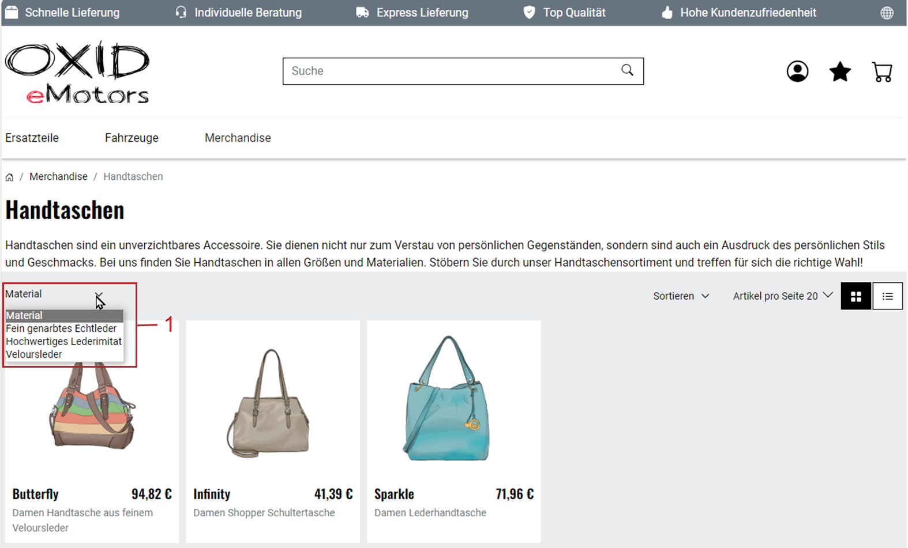

Um das Filtern von Produkten zu ermöglichen, blenden Sie in der Kategorie-Übersicht des Shops eine Dropdown-Liste aller Werte des Attributes ein (:ref:`oxbaff02`, Pos. 1).

|procedure|

1. Wenn Sie mehrere Filter verwenden wollen, überlegen Sie sich die Reihenfolge der anzuwendenden Filter.

   Die richtige Reihenfolge der Filter ist entscheidend, da sie die Produktauswahl Schritt für Schritt eingrenzt und so den Auswahlprozess optimiert.

   Angenommen, Ihre Zielgruppe besteht aus nutzenorientierten Käufern.

   Bei Kraftfahrzeugen könnte eine sinnvolle Reihenfolge der Filter von den wichtigsten zu den weniger wichtigen Kriterien folgendermaßen aussehen: Fahrzeugtyp (z.B. Nutzfahrzeug oder PKW), Karosserietyp, Kraftstoffart und schließlich die Farbe. So kann der Kunde gezielt ein passendes Fahrzeug finden.

#. Wählen Sie unter :menuselection:`Artikel verwalten --> Attribute` das erste Attribut, das Sie als Filter anzeigen wollen.
#. Wählen Sie auf der Registerkarte :guilabel:`Kategorien` die Schaltfläche :guilabel:`Kategorien zuordnen` und ordnen Sie die Produkt-Kategorie zu.
#. Tun Sie unter :menuselection:`Artikel verwalten --> Artikel` für jeden Artikel der Kategorie Folgendes:

   a. Wählen Sie auf der Registerkarte :guilabel:`Auswahl` die Schaltfläche :guilabel:`Attribute zuordnen`.
   #. Wählen Sie das Attribut.

      Ein Eingabefeld für den Wert erscheint (:ref:`oxbaff04`, Pos. 3).

   #. Geben Sie den Wert ein und speichern Sie Ihre Eingabe.

#. Wiederholen Sie die Schritte 2 bis 4 für alle weiteren Attribute, die Sie zum Filtern benutzen wollen.

   Sie möchten die Reihenfolge der Filter ändern?

   a. Entfernen Sie den Filter, indem Sie die Zuordnung der Kategorie aufheben:

      i. Wählen Sie unter :menuselection:`Artikel verwalten --> Attribute` das Attribut.
      ii. Wählen Sie auf der Registerkarte :guilabel:`Kategorien` die Schaltfläche :guilabel:`Kategorien zuordnen` und heben Sie die Zuordnung auf.

   b. Fügen Sie die Zuordnung der Kategorie wieder hinzu.

      Der Filter wird am Ende der Reihenfolge neu hinzugefügt.

#. Wenn Sie Ihren OXID eShop mehrsprachig betreiben, stellen Sie sicher, dass die Filter in allen Sprachen verfügbar sind.

   a. Wählen Sie :menuselection:`Artikel verwalten --> Artikel`.
   #. Wählen Sie die Sprache.
   #. Wählen Sie den Artikel.
   #. Wählen Sie auf der Registerkarte :guilabel:`Auswahl` die Schaltfläche :guilabel:`Attribute zuordnen`.
   #. Ordnen Sie jedem Attribut einen Wert in der entsprechenden Sprache zu (beispielsweise \"Size = large\").

|result|

In der Kategorieübersicht finden Ihre Kunden den oder die entsprechenden Filter (:ref:`oxbaff02`, Pos. 1).

.. _oxbaff02:

   Abb.: Filter mit Attributwerten anzeigen