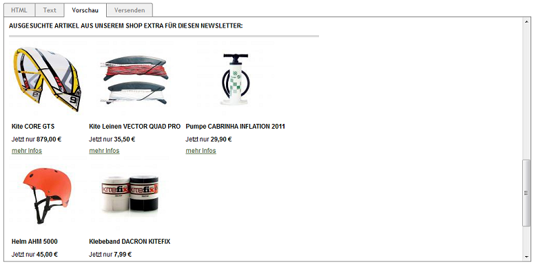

Aktion für Newsletter
=====================

Für den Versand von Newslettern ist die Aktion \"Newsletter\" wichtig. In dieser Aktion können Artikel zugeordnet werden, die so als ausgesuchte Artikel im Newsletter angezeigt werden. Ein Link :guilabel:`mehr Infos` führt direkt zur Detailseite eines beworbenen Artikels im OXID eShop.

Der obige Screenshot zeigt die Vorschau eines Newsletters, in dem ein Kite und zwei Leinen aus dem Warenkatalog des Shops vorgestellt werden. Die beiden Artikel wurden zuvor der Aktion "Newsletter" zugeordnet.

.. seealso:: :doc:`Aktionen <aktionen>` | :doc:`Newsletter <../newsletter/newsletter>`

.. Intern: oxbagx, Status: