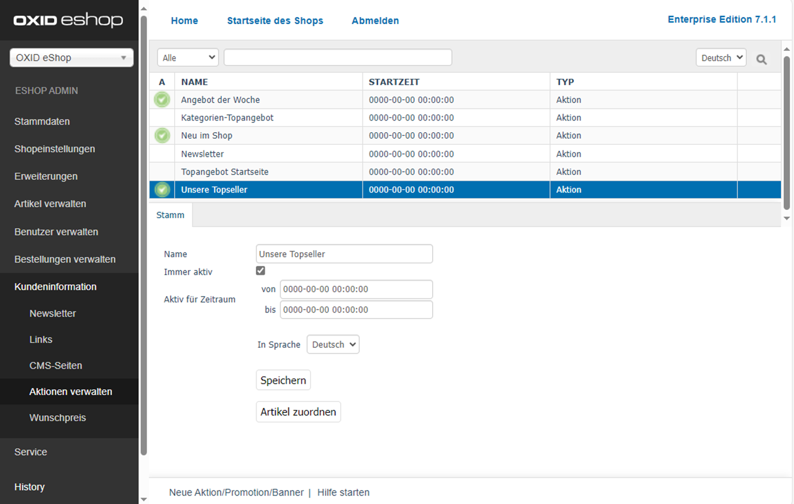

Aktionen konfigurieren
======================

.. todo: fasst aktionen-und-startseite und registerkarte stamm zusammen

.. todo: #SP: Kann ich Aktionen auch auf anderen Seiten verwenden?
.. todo: #SP: Werden die Widgets noch verwendet, dokumentieren wie man sie einbaut, wenn sie im Theme nicht mehr drin sind: SB: Doku für jedes Widget, wie man sie einbaut.; nix in DEV-Doku.
    Welche Controller es gibt es? Was ist ein Widget? Wann wird es verwendet? Siehe https://docs.oxid-esales.com/developer/en/latest/development/modules_components_themes/project/twig_template_engine/twig_extensions.html#includewidgetextension
    Folgende müssten dokuemntiert werden: Wozu gut, wo standarm. eingebunden, welchen Paraeter haben sie, z.B. Categorie tree wie tif? https://github.com/OXID-eSales/oxideshop_ce/tree/b-8.0.x/source/Application/Component/Widget
    Die Templates gibt es unter: https://github.com/OXID-eSales/apex-theme/tree/b-8.0.x/tpl/widget
    #HR: Wer liefert Beschreibung der Widgets? -- fehlt offenbar

Zeigen Sie Aktionen auf der Startseite des Shops an.

Aktionen sind neben Rabatten, Gutscheinen oder Newslettern ein wichtiges Marketinginstrument in Ihrem OXID eShop.

Es gibt drei Aktionstypen, mit denen Sie hauptsächlich das Aussehen der Startseite des Shops gestalten und aktualisieren können:

* Aktion
* Banner
* Promotion

.. todo: #SP: "hauptsächlich das Aussehen der Startseite": Wo noch?
.. todo: #SP: Funktionalität APEX klären; stimmt das noch und die folgenden Aussagen ? "Das Theme \"APEX\" unterstützt Aktion und Banner." -- woran merke ich das?

Das Theme \"APEX\" unterstützt nur den Aktionstyp \"Aktion\".

Die Aktionstypen Promotion und Banner, sowie die Aktionen \"Kategorien-Topangebot\" und \"Topangebot Startseite\" werden vom Theme \"APEX\" nicht verwendet.

.. todo: #SP: Wozu gibt es dann Banner und Promotion, bzw. wie lege ich sie an?
.. todo: #SP: Was ist eine Promotion, wie lege ich sie an: bei mir erscheint nichts.

.. todo: #SP: Was bedeutet der folgende Satz: Kann ich die beiden Aktionstypen in APEX einbinden? Was heißt "vom Standard-Theme nicht verwendet" -- gibt es ein Nicht-Standard-Theme mit Promo und Banner? Unter welchen Voraussetzungen kann ich diese Typen nutzen, warum werden sie überhaupt angeboten?

Die Aktionen \"Kategorien-Topangebot\" und \"Topangebot Startseite\" sind aber im Administrationsbereich vorhanden (:ref:`oxbagw00`), weil sie das Theme \"Azure\" nutzt. Sie könnten bei Bedarf in ein auf \"Flow\" basierendes Theme integriert werden.

.. todo: #SP: Kann ich Aktionen auch auf anderen Seiten verwenden?

.. _oxbagw00:

   Abb.: Aktionen verwalten

Generelles Vorgehen
-------------------

1. Damit Aktionen auf der Startseite angezeigt werden, markieren Sie unter :menuselection:`Stammdaten --> Grundeinstellungen` auf der Registerkarte :guilabel:`Perform.` das Kontrollkästchen :guilabel:`Aktionen laden`.

2. Konfigurieren Sie die jeweilige Aktion unter :menuselection:`Kundeninformation --> Aktionen verwalten --> <Aktion> --> Stamm`:

   * Ordnen Sie die betreffenden Artikel zu.
   * Legen Sie fest, wie lang die Aktion auf der Startseite erscheinen soll.
   * Legen Sie die Sprache fest.

   Konfigurieren Sie die Aktionen je nach Typ wie folgt:

    **Typ Aktion**

    .. figure:: ../../media/screenshots/oxbagy01.png
       :alt: Aktion konfigurieren
       :width: 650
       :class: with-shadow

       Abb.: Aktion konfigurieren

    :guilabel:`Name`
       Name der Aktion, wie er im Administrationsbereich und auf der Startseite des Shops angezeigt wird.

    :guilabel:`Immer aktiv`
       Aktivieren Sie dieses Kontrollkästchen, damit die Aktion ständig im Shop angezeigt wird. Stellen Sie sicher, dass das Kontrollkästchen :guilabel:`Aktionen laden` auf der Registerkarte :guilabel:`Perform.` unter :menuselection:`Stammdaten --> Grundeinstellungen` angehakt ist und achten Sie auf die Einstellung, welche die Aktionen \"Topseller\" und \"Frisch eingetroffen\" betreffen.

    :guilabel:`Aktiv für Zeitraum von` ... :guilabel:`bis` ...
       Legen Sie den Zeitraum fest, in dem die Aktion aktiv ist. Dieser wird nur berücksichtigt, wenn das Kontrollkästchen :guilabel:`Immer aktiv` nicht angehakt ist.

    :guilabel:`In Sprache`
       Die Aktion lässt sich auch in weiteren aktiven Sprachen des Shops bearbeiten. Wählen Sie eine Sprache aus der Liste aus.

        .. todo: #SP: "Die Aktion lässt sich auch in weiteren aktiven Sprachen des Shops bearbeiten." Das heißt doch nur: Ich konfiguriere den Namen der Aktion pro Sprache, korrekt? Oder hat es noch andere Auswirkungen?

    :guilabel:`Artikel zuordnen`
       Der Aktion kann ein Artikel, wie beispielsweise bei der Aktion \"Angebote der Woche\", oder können mehrere Artikel, wie bei den Aktionen \"Frisch eingetroffen\" und \"Topseller\", zugeordnet werden. Die Schaltfläche :guilabel:`Artikel zuordnen` öffnet ein neues Fenster. In diesem Zuordnungsfenster werden in der linken Liste alle Artikel angezeigt. Die Anzeige kann auf eine Kategorie beschränkt werden, indem diese aus einer Dropdown-Liste ausgewählt wird. Artikel können auch nach Artikelnummer, Titel und/oder EAN gefiltert und sortiert werden. Die Artikel werden per Drag \& Drop in die rechte Liste verschoben und damit der Aktion zugeordnet. Eine Mehrfachauswahl ist bei gedrückter Strg-Taste möglich.

    **Typ Banner**

.. todo: #SP: Was machen wir dait?

..  #SP: Banner ist nicht in APEX, korrekt?
        .. todo: #SP: Fehlt in Standard-Installation? Wie würde ich es einbinden?
        .. figure:: ../../media/screenshots/oxbagy02.png
           :alt: Banner konfigurieren
           :width: 650
           :class: with-shadow
           Abb.: Banner konfigurieren
        :guilabel:`Name`
           Name der Aktion vom Typ Banner, wie er im Administrationsbereich angezeigt wird. Auf der Startseite des Shops werden die Banner in einer wechselnden Folge ihrer Bilder ohne eine Überschrift angezeigt.
        :guilabel:`Immer aktiv`
           Aktivieren Sie dieses Kontrollkästchen, damit das Banner im Shop angezeigt wird. Stellen Sie sicher, dass das Kontrollkästchen :guilabel:`Aktionen laden` auf der Registerkarte :guilabel:`Perform.` unter :menuselection:`Stammdaten --> Grundeinstellungen` angehakt ist.
        :guilabel:`Aktiv für Zeitraum von` ... :guilabel:`bis` ...
           Definieren Sie hier einen Zeitraum, in dem das Banner aktiv ist. Dieser wird nur berücksichtigt, wenn das Kontrollkästchen :guilabel:`Immer aktiv` nicht angehakt ist. Auch zugeordnete Benutzergruppen beeinflussen die Anzeige des Banners auf der Startseite.
        :guilabel:`In Sprache`
           Das Banner lässt sich auch in weiteren aktiven Sprachen des Shops bearbeiten. Wählen Sie eine Sprache aus der Liste aus.
        :guilabel:`Sortierung`
           Legt die Reihenfolge fest, in der die Bilder der Banner auf der Startseite angezeigt werden. Im Eingabefeld wird eine Zahl zwischen 0 und 9999 erwartet. Das Banner mit der kleinsten Zahl stellt das erste Bild der Slideshow, das mit der größten Zahl das letzte. Ohne Vorgaben für die Sortierung werden die Namen der Banner in ihrer alphabetischen Reihenfolge herangezogen.
        :guilabel:`Benutzergruppen zuordnen`
           Banner können verschiedenen Benutzergruppen zugeordnet werden. Auf der Startseite können dadurch unterschiedliche Artikel und Kategorien beworben werden, je nachdem, welcher Benutzergruppe ein Kunde angehört. Ist das Banner beispielsweise der Benutzergruppe \"Händler\" zugeordnet, sieht ein normaler Kunde dessen Bild in der Slideshow nicht.
        :guilabel:`Bild auswählen (max. 2 MB, max. 1500*1500 px)`
           Laden Sie hier das Bild für das Banner hoch. Auf der Startseite wird dieses standardmäßig mit einer Größe von 940px × 220px angezeigt. Ist das Bild größer, wird es für die Anzeige angepasst. Die Bilder sollten allerdings maximal 2 MB groß sein oder eine Auflösung bis höchstens 1500*1500 Pixel haben.
           Die Schaltfläche :guilabel:`Durchsuchen...` öffnet einen Dateidialog, in dem Sie die entsprechende Datei auf Ihrem Rechner auswählen können. Wenn Sie nun die Schaltfläche :guilabel:`Öffnen` drücken, wird der Dateinamen direkt übernommen. Speichern startet das Hochladen des Bildes. Dabei wird ein bereits vorhandenes Bild ersetzt. Ein zugeordnetes Foto kann auch gelöscht werden.
        :guilabel:`Link hinter Banner`
           Für eine gezielte Werbung auf der Startseite kann ein Link für das Bild hinterlegt werden. Das kann eine URL in der Form ``http://www.meineurl.de`` sein oder ein relativer Pfad ausgehend von der Struktur der Kategorien.
           .. todo: #SP: Wie identifiziere ich den relativen Pfad? Wie gebe ich den Pfad an? z.B. /Autos/OX7-Coup.html ?
        :guilabel:`Zugeordnetes Produkt`
           Zeigt Artikelnummer und Titel eines Artikels an, der dem Banner zugeordnet wurde. Auf der Startseite werden über dem Banner der Preis und der Titel eingeblendet. Ein Klick darauf öffnet die Detailseite des beworbenen Artikels.
        :guilabel:`Produkt zuordnen`
           Der Aktion kann ein Artikel zugeordnet werden. Die Schaltfläche :guilabel:`Produkt zuordnen` öffnet ein neues Fenster. In diesem Zuordnungsfenster werden in einer Liste alle Artikel angezeigt. Die Anzeige kann auf eine Kategorie beschränkt werden, indem diese aus einer Dropdown-Liste ausgewählt wird. Artikel können auch nach Artikelnummer, Titel und/oder EAN gefiltert und sortiert werden.
        .. image:: ../../media/screenshots/oxbagy03.png
           :alt: Produkt zuordnen
           :height: 340
           :width: 400
        Mit der Schaltfläche :guilabel:`Produkt zuordnen` wird das Banner mit dem in der Liste markierten Artikel verbunden. Mit der Schaltfläche :guilabel:`Produktzuordnung löschen` wird eine bestehende Verbindung zwischen Banner und Artikel getrennt.

    **Typ Promotion**

    .. todo: #SP: Warum fehlt Typ Promotion?

3. Machen Sie zusätzliche Konfigurationseinstellungen, die spezifisch sind für den Aktionstyp.

Aktionen einer Standardinstallation konfigurieren
-------------------------------------------------

Wir beschreiben im Folgenden, wie die Aktionen auf der Startseite einer Standardinstallation des OXID eShop mit dem Theme \"APEX\" aussehen, und wie Sie sie im einzelnen konfigurieren.

    .. todo: #SP: Wie lege ich ein Banner an? Bei mir erscheint es nicht auf der Startseite

..  Banner
    ------
         Das Banner ist ein großer Bereich, der sich oben horizontal über die Startseite zieht. Darin können ein Bild oder auch mehrere Bilder angezeigt werden, die Artikel und Kategorien herausstellen.
             .. image:: ../../media/screenshots/oxbagw01.png
             :alt: Banner
             :height: 208
             :width: 650
             Wurden mehrere Bilder als Banner definiert, wechseln diese in einer Slideshow, einer Aneinanderreihung dieser Bilder.
             Ein Bild kann mit der Detailseite eines Artikels verbunden werden, so dass sich diese beim Anklicken des Bildes öffnet.
             Es ist auch möglich, den Titel und die Kurzbeschreibung des Artikels am unteren Bildrand anzuzeigen. Das muss in den Einstellungen für Bilder des Themes \"APEX\" aktiviert werden. Markieren Sie dazu unter :menuselection:`Erweiterungen --> Themes` auf der Registerkarte :guilabel:`Einstell.` unter :guilabel:`Bilder`das Kontrollkästchen :guilabel:`Bildunterschriften im Slider auf der Startseite aktivieren`.

Angebote der Woche
^^^^^^^^^^^^^^^^^^

Die Angebote der Woche werden auf der Startseite unterhalb des Banners angezeigt. Es werden Artikel mit Titel und Bild präsentiert, welche Sie der Aktion zugewiesen haben (:ref:`oxbagw02`).

Vom Angebot aus kann der Kunde die Detailseite eines beworbenen Artikels aufrufen. Er kann den Artikel aber auch über die Schaltfläche :guilabel:`In den Warenkorb` direkt in den Warenkorb legen.

.. _oxbagw02:

.. figure:: ../../media/screenshots/oxbagw02.png
   :alt: Aktionstyp Angebote der Woche
   :width: 650
   :class: with-shadow

   Abb.: Aktionstyp Angebote der Woche

|procedure|

Steuern Sie unter :menuselection:`Kundeninformation --> Aktionen verwalten --> <Aktion> --> Stamm`, ob die Angebote der Woche können immer oder nur für einen definierten Zeitraum aktiv sein sollen.

Über den Zeitraum lassen sich beispielsweise wöchentlich wechselnde Angebote steuern.

Unsere Marken
^^^^^^^^^^^^^

Der Slider \"Unsere Marken\" erscheint unter den Angeboten der Woche . Er präsentiert alle Hersteller mit ihren Logos in alphabetischer Reihenfolge (:ref:`oxbagw03`).

.. todo: #SP: Wie kann ich den Text "Wir präsentieren Ihnen hier unsere sorgsam ausgewählten Marken, deren Produkte Sie in unserem Shop finden."

.. _oxbagw03:

.. figure:: ../../media/screenshots/oxbagw03.png
   :alt: Aktionstyp Unsere Marken
   :width: 650
   :class: with-shadow

   Abb.: Aktionstyp Unsere Marken

|procedure|

Damit der Slider erschint, stellen Sie sicher, das die Anzeige unter der Überschrift \"Unsere Marken\" in den Anzeige-Einstellungen des Themes \"APEX\" aktiviert sein.

Markieren Sie dazu unter :menuselection:`Erweiterungen --> Themes --> APEX Theme` auf der Registerkarte :guilabel:`Einstell.` unter :guilabel:`Startseite` das Kontrollkästchen :guilabel:`Hersteller auf Startseite anzeigen`.

Frisch eingetroffen
^^^^^^^^^^^^^^^^^^^

.. todo: #SP: Was soll "Einen großen Teil der Startseite nehmen Artikel ein, die als Neuzugänge..." bedeuten?

Einen großen Teil der Startseite nehmen Artikel ein, die als Neuzugänge des Shops präsentiert werden.

Die Anzeige ist eine vierspaltige Artikelübersicht (:ref:`oxbagw04`).

Es werden Bild, Titel und optional der Preis der Artikel angezeigt.

Der Kunde kann die Detailseite des Artikels aufrufen oder den Artikel direkt in den Warenkorb legen.

.. _oxbagw04:

.. figure:: ../../media/screenshots/oxbagw04.png
   :alt: Aktionstyp Frisch eingetroffen
   :width: 650
   :class: with-shadow

   Abb.: Aktionstyp Frisch eingetroffen

|procedure|

1. Legen Sie fest, welche Artikel in der Rubrik angezeigt werden.

   Wählen Sie dazu unter unter :menuselection:`Stammdaten --> Grundeinstellungen` die Registerkarte :guilabel:`Perform.` Unter :guilabel:`Liste der neusten Artikel (Frisch eingetroffen!)` haben Sie folgende Optionen:

    * Artikel vom Shop automatisch bereitstellen lassen

      .. todo: #SB: Geht das nach irgendeinem Datum? Wie viele Artikel werden automatich bereitgestellt Die Liste der neusten Artikel wird automatisch berechnet.

    * Artikel bei der Aktion manuell zuordnen

      Legen Sie unter :menuselection:`Kundeninformationen --> Aktionen verwalten` in der Aktion :guilabel:`Neu im Shop` fest, welche Artikel in der Liste angezeigt werden.

       .. todo: #SB: Die Aktion :guilabel:`Frisch eingetroffen` heißt jetzt "Neu im Shop"

    * Damit der Shop keine Zeit verbraucht, um die Aktion aufzubereiten, können Sie die Aktion hier auch ganz abschalteten.

      .. todo: #SP: zusätzlich zu nicht aktiv?

2. Legen Sie unter unter :menuselection:`Stammdaten --> Grundeinstellungen` auf der Registerkarte :guilabel:`Perform.` mit dem Kontrollkästchen  :guilabel:`Preise anzeigen bei \"Top of the Shop\" und \"Frisch eingetroffen!\"` fest, ob die Preise angezeigt werden sollen.

Topseller
^^^^^^^^^

Weiter unten auf der Startseite können Sie die meistverkauften Artikel des Shops (Topseller) anzeigen.

.. todo: #SP: War das früher so: "Die Anzeige ist analog der zweispaltigen Galerie einer Artikelübersicht. "

Die Anzeige ist eine vierspaltige Artikelübersicht (:ref:`oxbagw05`).

Es werden Bild, Titel und optional der Preis der Artikel angezeigt.

Der Kunde kann die Detailseite des Artikels aufrufen oder den Artikel direkt in den Warenkorb legen.

.. _oxbagw05:

.. figure:: ../../media/screenshots/oxbagw05.png
   :alt: Aktionstyp Topseller anzeigen
   :width: 650
   :class: with-shadow

   Abb.: Aktionstyp Topseller anzeigen

|procedure|

1. Legen Sie fest, welche Artikel in der Rubrik angezeigt werden.

    Wählen Sie dazu unter unter :menuselection:`Stammdaten --> Grundeinstellungen` die Registerkarte :guilabel:`Perform.` Unter :guilabel:`Liste der meistverkauften Artikel (Top of the Shop)` haben Sie folgende Optionen:

        * Automatisch

          Lassen Sie die Artikel vom Shop automatisch bereitstellen

          .. todo: #SP: Geht das nach Umsatzahlen? Wie viele Artikel werden automatich bereitgestellt? Die Liste der neusten Artikel wird automatisch berechnet.

        * Manuell

          Legen Sie unter :menuselection:`Kundeninformationen --> Aktionen verwalten` in der Aktion :guilabel:`Unsre Topseller` fest, welche Artikel in der Liste angezeigt werden.

           .. todo: #SB: Die Aktion :guilabel:`Frisch eingetroffen` heißt jetzt "Neu im Shop"

        * Damit der Shop keine Zeit verbraucht, um die Aktion aufzubereiten, können Sie die Aktion hier auch ganz abschalteten.

            .. todo: #SP: zusätzlich zu nicht aktiv?

2. Legen Sie unter unter :menuselection:`Stammdaten --> Grundeinstellungen` auf der Registerkarte :guilabel:`Perform.` mit demnKontrollkästchen  :guilabel:`Preise anzeigen bei \"Top of the Shop\" und \"Frisch eingetroffen!\"` fest, ob die Preise angezeigt werden sollen.

Eigene Aktionen einbinden
-------------------------

.. todo: #SP: wie konfiguriere ich eigene Aktionen ein, die ich ja anlegen kann?
    #SP: Wie konfiguriere ich Banner?
    #SP: Wie konfiguriere ich Promotionen?

.. Intern: oxbagw, Status: