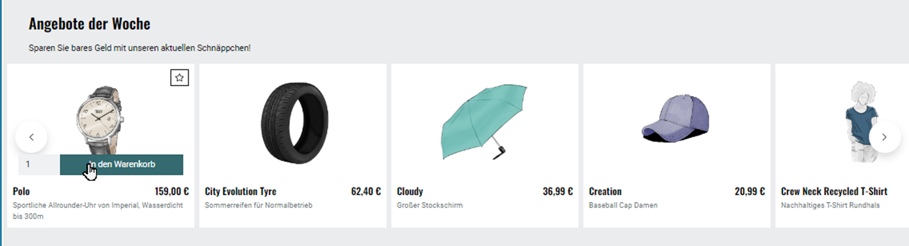

Aktionen und Startseite
=======================

Zeigen Sie Aktionen auf der Startseite des Shops an.

Markieren Sie dazu unter :menuselection:`Stammdaten --> Grundeinstellungen` auf der Registerkarte :guilabel:`Perform.` das Kontrollkästchen :guilabel:`Aktionen laden`.

Die Registerkarte enthält noch andere für Aktionen wichtige Einstellungen, auf die hier eingegangen wird.

Dieses Dokument beschreibt die Aktionen auf der Startseite einer Standardinstallation des OXID eShop mit dem Theme \"APEX\".

.. todo: #SP: Wie lege ich ein Banner an? Bei mir erscheint es nicht auf der Startseite
    Banner
    ------
    Das Banner ist ein großer Bereich, der sich oben horizontal über die Startseite zieht. Darin können ein Bild oder auch mehrere Bilder angezeigt werden, die Artikel und Kategorien herausstellen.
    .. image:: ../../media/screenshots/oxbagw01.png
       :alt: Banner
       :height: 208
       :width: 650
    Wurden mehrere Bilder als Banner definiert, wechseln diese in einer Slideshow, einer Aneinanderreihung dieser Bilder.
    Ein Bild kann mit der Detailseite eines Artikels verbunden werden, so dass sich diese beim Anklicken des Bildes öffnet.
    Es ist auch möglich, den Titel und die Kurzbeschreibung des Artikels am unteren Bildrand anzuzeigen. Das muss in den Einstellungen für Bilder des Themes \"APEX\" aktiviert werden. Markieren Sie dazu unter :menuselection:`Erweiterungen --> Themes` auf der Registerkarte :guilabel:`Einstell.` unter :guilabel:`Bilder`das Kontrollkästchen :guilabel:`Bildunterschriften im Slider auf der Startseite aktivieren`.

Angebote der Woche anzeigen
---------------------------

Die Angebote der Woche werden auf der Startseite unterhalb des Banners angezeigt. Es werden Artikel mit Titel und Bild präsentiert, welche der Aktion zugewiesen wurden (:ref:`oxbagw02`).

.. _oxbagw02:

   Abb.: Angebote der Woche anzeigen

Vom Angebot aus kann über einen Link und die Schaltfläche :guilabel:`Mehr Informationen` die Detailseite eines beworbenen Artikels aufgerufen werden. Er kann aber auch über eine Schaltfläche direkt in den Warenkorb gelegt werden. Die Angebote der Woche können immer oder nur für einen definierten Zeitraum aktiv sein. Über den Zeitraum lassen sich beispielsweise wöchentlich wechselnde Angebote steuern.

Unsere Marken anzeigen
----------------------

Ein weiterer Slider wird unter den Angeboten der Woche angezeigt. Er präsentiert alle Hersteller mit ihren Logos in alphabetischer Reihenfolge (:ref:`oxbagw03`).

Die Anzeige unter der Überschrift \"Unsere Marken\" muss in den Anzeige-Einstellungen des Themes \"Flow\" aktiviert sein.

Markieren Sie dazu unter :menuselection:`Erweiterungen --> Themes` auf der Registerkarte :guilabel:`Einstell.` unter :guilabel:`Startseite` das Kontrollkästchen :guilabel:`Hersteller auf Startseite anzeigen`.

.. todo: #SP: Wie kann ich den Text "Wir präsentieren Ihnen hier unsere sorgsam ausgewählten Marken, deren Produkte Sie in unserem Shop finden."

.. _oxbagw03:

.. figure:: ../../media/screenshots/oxbagw03.png
   :alt: Unsere Marken anzeigen
   :width: 650
   :class: with-shadow

   Abb.: Unsere Marken anzeigen

Frisch eingetroffen anzeigen
----------------------------

Einen großen Teil der Startseite nehmen Artikel ein, die als Neuzugänge des Shops präsentiert werden. Die Anzeige ist eine vierspaltige Artikelübersicht (:ref:`oxbagw04`).

Es werden Bild, Titel und Preis der Artikel angezeigt. Es lässt sich die Detailseite des Artikels aufrufen oder der Artikel direkt in den Warenkorb legen.

.. _oxbagw04:

.. figure:: ../../media/screenshots/oxbagw04.png
   :alt: Frisch eingetroffen anzeigen
   :width: 650
   :class: with-shadow

   Abb.: Frisch eingetroffen anzeigen

Um festzulegen, welche Artikel in der Rubrik angezeigt werden, wählen Sie unter unter :menuselection:`Stammdaten --> Grundeinstellungen` die Registerkarte :guilabel:`Perform.` Unter :guilabel:`Liste der neusten Artikel (Frisch eingetroffen!)` haben Sie folgende Optionen:

+ Artikel bei der Aktion manuell zuordnen

  Legen Sie unter :menuselection:`Kundeninformationen --> Aktionen verwalten` in der Aktion :guilabel:`Neu im Shop` fest, welche Artikel in der Liste angezeigt werden.

  .. todo: #SB: Die Aktion :guilabel:`Frisch eingetroffen` heißt jetzt "Neu im Shop"

* Artikel vom Shop automatisch bereitstellen lassen.

  .. todo: #SB: Geht das nach irgendeinem Datum? Kann ich es manipulieren? Die Liste der neusten Artikel wird automatisch berechnet.

* Sie können die Aktion hier auch ganz abschalteten, so dass der Shop keine Zeit verbraucht, um die Aktion aufzubereiten.

Die zusätzliche Einstellung :guilabel:`Preise anzeigen bei \"Top of the Shop\" und \"Frisch eingetroffen!\"` auf der Registerkarte :guilabel:`Perform.` beeinflusst die Anzeige der Artikelpreise für diese und eine weitere Aktion.

Topseller
---------

Weiter unten auf der Startseite werden dem Kunden die meistverkauften Artikel des Shops angezeigt. Die Anzeige ist analog der zweispaltigen Galerie einer Artikelübersicht. Es kann die Detailseite eines Artikels aufgerufen oder ein Artikel direkt in den Warenkorb gelegt werden (:ref:`oxbagw05`).

.. _oxbagw05:

.. figure:: ../../media/screenshots/oxbagw05.png
   :alt: Topseller anzeigen
   :width: 650
   :class: with-shadow

   Abb.: Topseller anzeigen

Welche Artikel als \"Topseller\" präsentiert werden, wird über eine Einstellung auf der Registerkarte :guilabel:`Perform.` unter :menuselection:`Stammdaten --> Grundeinstellungen` gesteuert. Die :guilabel:`Liste der meistverkauften Artikel (Top of the Shop)` bietet :guilabel:`manuell`, :guilabel:`automatisch` und :guilabel:`ausgeschaltet` zur Auswahl an. Die Artikel können bei der Aktion \"Topseller\" zugeordnet oder vom Shop ermittelt werden. Die Aktion kann hier auch abgeschaltet werden und wird so weder aufbereitet, noch auf der Startseite angezeigt.

Die zusätzliche Einstellung :guilabel:`Preise anzeigen bei \"Top of the Shop\" und \"Frisch eingetroffen!\"` bestimmt die Anzeige der Artikelpreise für diese und eine weitere Aktion.

.. seealso:: :doc:`Aktionen <aktionen>` | :doc:`Registerkarte Stamm <registerkarte-stamm>`

.. Intern: oxbagw, Status: