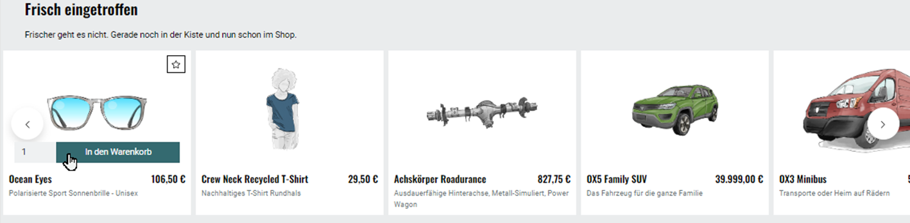

Aktionen und Startseite
=======================

Damit Aktionen auf der Startseite des Shops angezeigt werden, muss das Kontrollkästchen :guilabel:`Aktionen laden` auf der Registerkarte :guilabel:`Perform.` unter :menuselection:`Stammdaten --> Grundeinstellungen` angehakt sein. Die Registerkarte enthält noch andere für Aktionen wichtige Einstellungen, auf die hier eingegangen wird.

Dieses Dokument beschreibt die Aktionen auf der Startseite einer Standardinstallation des OXID eShop mit dem Theme \"Flow\".

Banner
------
Das Banner ist ein großer Bereich, der sich oben horizontal über die Startseite zieht. Darin können ein Bild oder auch mehrere Bilder angezeigt werden, die Artikel und Kategorien herausstellen.

.. image:: ../../media/screenshots/oxbagw01.png
   :alt: Banner
   :class: with-shadow
   :height: 208
   :width: 650

Wurden mehrere Bilder als Banner definiert, wechseln diese in einer Slideshow, einer Aneinanderreihung dieser Bilder. Ein Bild kann mit der Detailseite eines Artikels verbunden werden, so dass sich diese beim Anklicken des Bildes öffnet. Es ist auch möglich, den Titel und die Kurzbeschreibung des Artikels am unteren Bildrand anzuzeigen. Das muss in den Einstellungen für Bilder des Themes \"Flow\" aktiviert werden. Setzen Sie ein Häkchen in das Kontrollkästchen :guilabel:`Bildunterschriften im Slider auf der Startseite aktivieren` auf der Registerkarte :guilabel:`Einstell.` unter :menuselection:`Erweiterungen --> Themes`.

Angebote der Woche
------------------
Die Angebote der Woche werden auf der Startseite unterhalb des Banners angezeigt. Es werden Artikel mit Titel und Bild präsentiert, welche der Aktion zugewiesen wurden.

.. image:: ../../media/screenshots/oxbagw02.png
   :alt: Angebot der Woche
   :class: with-shadow
   :height: 270
   :width: 650

Vom Angebot aus kann über einen Link und die Schaltfläche :guilabel:`Mehr Informationen` die Detailseite eines beworbenen Artikels aufgerufen werden. Er kann aber auch über eine Schaltfläche direkt in den Warenkorb gelegt werden. Die Angebote der Woche können immer oder nur für einen definierten Zeitraum aktiv sein. Über den Zeitraum lassen sich beispielsweise wöchentlich wechselnde Angebote steuern.

Unsere Marken
-------------

Ein weiterer Slider wird unter den Angeboten der Woche angezeigt. Er präsentiert alle Hersteller mit ihren Logos in alphabetischer Reihenfolge. Die Anzeige unter der Überschrift \"Unsere Marken\" muss in den Anzeige-Einstellungen des Themes \"Flow\" aktiviert sein. Setzen Sie dafür ein Häkchen in das Kontrollkästchen :guilabel:`Hersteller-Slider auf der Startseite anzeigen` auf der Registerkarte :guilabel:`Einstell.` unter :menuselection:`Erweiterungen --> Themes`.

Frisch eingetroffen
-------------------

Einen großen Teil der Startseite nehmen Artikel ein, die als Neuzugänge des Shops präsentiert werden. Die Anzeige ist eine vierspaltige Artikelübersicht. Es werden Bild, Titel und Preis der Artikel angezeigt. Es lässt sich die Detailseite des Artikels aufrufen oder der Artikel direkt in den Warenkorb legen.

Welche Artikel in der Rubrik angezeigt werden, wird über eine Einstellung auf der Registerkarte :guilabel:`Perform.` unter :menuselection:`Stammdaten --> Grundeinstellungen` gesteuert. Aus der :guilabel:`Liste der neusten Artikel (Frisch eingetroffen!)` kann ausgewählt werden, ob die Artikel bei der Aktion manuell zugeordnet oder vom Shop automatisch bereitgestellt werden. Die Aktion kann hier auch ganz abgeschaltet werden, so dass der Shop keine Zeit verbraucht, um die Aktion aufzubereiten.

Die zusätzliche Einstellung :guilabel:`Preise anzeigen bei \"Top of the Shop\" und \"Frisch eingetroffen!\"` auf der Registerkarte :guilabel:`Perform.` beeinflusst die Anzeige der Artikelpreise für diese und eine weitere Aktion.

Topseller
---------
Weiter unten auf der Startseite werden dem Kunden die meistverkauften Artikel des Shops angezeigt. Die Anzeige ist analog der zweispaltigen Galerie einer Artikelübersicht. Es kann die Detailseite eines Artikels aufgerufen oder ein Artikel direkt in den Warenkorb gelegt werden.

.. image:: ../../media/screenshots/oxbagw05.png
   :alt: Topseller
   :class: with-shadow
   :height: 222
   :width: 650

Welche Artikel als \"Topseller\" präsentiert werden, wird über eine Einstellung auf der Registerkarte :guilabel:`Perform.` unter :menuselection:`Stammdaten --> Grundeinstellungen` gesteuert. Die :guilabel:`Liste der meistverkauften Artikel (Top of the Shop)` bietet :guilabel:`manuell`, :guilabel:`automatisch` und :guilabel:`ausgeschaltet` zur Auswahl an. Die Artikel können bei der Aktion \"Topseller\" zugeordnet oder vom Shop ermittelt werden. Die Aktion kann hier auch abgeschaltet werden und wird so weder aufbereitet, noch auf der Startseite angezeigt.

Die zusätzliche Einstellung :guilabel:`Preise anzeigen bei \"Top of the Shop\" und \"Frisch eingetroffen!\"` bestimmt die Anzeige der Artikelpreise für diese und eine weitere Aktion.

.. seealso:: :doc:`Aktionen <aktionen>` | :doc:`Aktion für Newsletter <aktion-fuer-newsletter>` | :doc:`Registerkarte Stamm <registerkarte-stamm>`

.. Intern: oxbagw, Status: