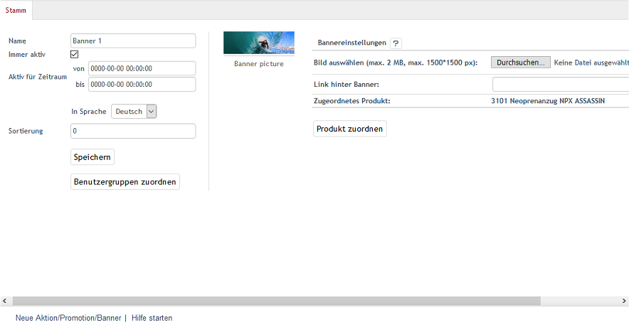
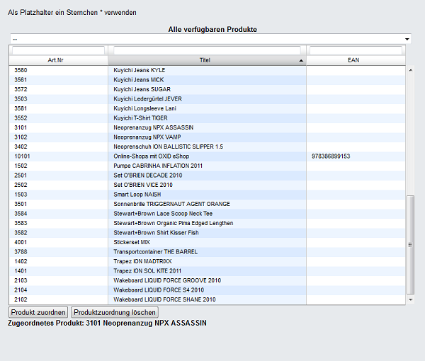

Registerkarte Stamm
*******************
Auf der Registerkarte :guilabel:`Stamm` werden die wenigen Einstellungen zur Aktion vorgenommen. Erstellen oder bearbeiten Sie hier die Aktion. Beim Anlegen einer Aktion muss deren Typ festgelegt werden. Je nachdem, ob Aktion, Promotion oder Banner ausgewählt wurde, unterscheiden sich die Einstellungen auf der Registerkarte mehr oder weniger voneinander.

Bitte beachten Sie, dass das Theme \"Azure\" den Typ Promotion und einige Möglichkeiten vom Typ Aktion nicht auf der Startseite anzeigt. Siehe: :doc:`Aktionen und Startseite <aktionen-und-startseite>`

Typ Aktion
----------
.. image:: ../../media/screenshots-de/oxbagy01.png
   :alt: Aktionen - Registerkarte Stamm, Typ Aktion
   :height: 317
   :width: 650

:guilabel:`Name`

Name der Aktion, wie er im Administrationsbereich und auch teilweise auf der Startseite des Shops angezeigt wird. So trägt die Aktion \"Topseller\" auf der Startseite die Überschrift \"Top Of The Shop\" oder die Aktion \"Kategorien-Topangebot\" den Namen der beworbenen Kategorie.

:guilabel:`Immer aktiv`

Aktivieren Sie dieses Kontrollkästchen, damit die Aktion ständig im Shop angezeigt wird. Stellen Sie sicher, dass das Kontrollkästchen :guilabel:`Aktionen laden` auf der Registerkarte :guilabel:`Perform.` unter :menuselection:`Stammdaten --> Grundeinstellungen` angehakt ist und achten Sie auf die Einstellung, welche die Aktionen \"Topseller\" und \"Frisch eingetroffen!\" betreffen.

:guilabel:`Aktiv für Zeitraum von` ... :guilabel:`bis` ...

Es kann ein Zeitraum definiert werden, in dem die Aktion aktiv ist. Dieser wird nur berücksichtigt, wenn das Kontrollkästchen :guilabel:`Immer aktiv` nicht angehakt ist.

:guilabel:`In Sprache`

Die Aktion lässt sich auch in weiteren aktiven Sprachen des Shops bearbeiten. Wählen Sie eine Sprache aus der Liste aus.

:guilabel:`Artikel zuordnen`

Der Aktion kann ein Artikel, wie beispielsweise bei der Aktion \"Angebot der Woche\", oder können mehrere Artikel, wie bei den Aktionen \"Frisch eingetroffen!\" und \"Topseller\", zugeordnet werden. Die Schaltfläche :guilabel:`Artikel zuordnen` öffnet ein neues Fenster. In diesem Zuordnungsfenster werden in der linken Liste alle Artikel angezeigt. Die Anzeige kann auf eine Kategorie beschränkt werden, indem diese aus einer Dropdown-Liste ausgewählt wird. Artikel können auch nach Artikelnummer, Titel und/oder EAN gefiltert und sortiert werden. Die Artikel werden per Drag \& Drop in die rechte Liste verschoben und damit der Aktion zugeordnet. Eine Mehrfachauswahl ist bei gedrückter Strg-Taste möglich.

Typ Banner
----------

:guilabel:`Name`

Name der Aktion vom Typ Banner, wie er im Administrationsbereich angezeigt wird. Auf der Startseite des Shops werden die Banner in einer wechselnden Folge ihrer Bilder ohne eine Überschrift angezeigt.

:guilabel:`Immer aktiv`

Aktivieren Sie dieses Kontrollkästchen, damit das Banner im Shop angezeigt wird. Stellen Sie sicher, dass das Kontrollkästchen :guilabel:`Aktionen laden` auf der Registerkarte:guilabel:` Perform.` unter :menuselection:`Stammdaten --> Grundeinstellungen` angehakt ist.

:guilabel:`Aktiv für Zeitraum von` ... :guilabel:`bis` ...

Definieren Sie hier einen Zeitraum, in dem das Banner aktiv ist. Dieser wird nur berücksichtigt, wenn das Kontrollkästchen :guilabel:`Immer aktiv` nicht angehakt ist. Auch zugeordnete Benutzergruppen beeinflussen die Anzeige des Banners auf der Startseite.

:guilabel:`In Sprache`

Das Banner lässt sich auch in weiteren aktiven Sprachen des Shops bearbeiten. Wählen Sie eine Sprache aus der Liste aus.

:guilabel:`Sortierung`

Legt die Reihenfolge fest, in der die Bilder der Banner auf der Startseite angezeigt werden. Im Eingabefeld wird eine Zahl zwischen 0 und 9999 erwartet. Das Banner mit der kleinsten Zahl stellt das erste Bild der Slideshow, das mit der größten Zahl das letzte. Ohne Vorgaben für die Sortierung werden die Namen der Banner in ihrer alphabetischen Reihenfolge herangezogen.

:guilabel:`Benutzergruppen zuordnen`

Banner können verschiedenen Benutzergruppen zugeordnet werden. Auf der Startseite können dadurch unterschiedliche Artikel und Kategorien beworben werden, je nachdem, welcher Benutzergruppe ein Kunde angehört. Ist das Banner beispielsweise der Benutzergruppe \"Händler\" zugeordnet, sieht ein normaler Kunde dessen Bild in der Slideshow nicht.

:guilabel:`Bild auswählen (max. 2 MB, max. 1500*1500 px)`

Laden Sie hier das Bild für das Banner hoch. Auf der Startseite wird dieses standardmäßig mit einer Größe von 940px × 220px angezeigt. Ist das Bild größer, wird es für die Anzeige angepasst. Die Bilder sollten allerdings maximal 2 MB groß sein oder eine Auflösung bis höchstens 1500*1500 Pixel haben.

Die Schaltfläche :guilabel:`Durchsuchen...` öffnet einen Dateidialog, in dem Sie die entsprechende Datei auf Ihrem Rechner auswählen können. Wenn Sie nun die Schaltfläche :guilabel:`Öffnen` drücken, wird der Dateinamen direkt übernommen. Speichern startet das Hochladen des Bildes. Dabei wird ein bereits vorhandenes Bild ersetzt. Ein zugeordnetes Foto kann auch gelöscht werden.

:guilabel:`Link hinter Banner`

Für eine gezielte Werbung auf der Startseite kann ein Link für das Bild hinterlegt werden. Das kann eine URL in der Form ``http://www.meineurl.de`` sein oder ein relativer Pfad ausgehend von der Struktur der Kategorien. Die Aktion \"Banner 4\" verlinkt beispielsweise zu einer Kategorie \"Wakeboards\" mit dem Link Wakeboarding/Wakeboards/.

:guilabel:`Zugeordnetes Produkt`

Zeigt Artikelnummer und Titel eines Artikels an, der dem Banner zugeordnet wurde. Auf der Startseite werden über dem Banner der Preis und der Titel eingeblendet. Ein Klick darauf öffnet die Detailseite des beworbenen Artikels.

:guilabel:`Produkt zuordnen`

Der Aktion kann ein Artikel zugeordnet werden. Die Schaltfläche :guilabel:`Produkt zuordnen` öffnet ein neues Fenster. In diesem Zuordnungsfenster werden in einer Liste alle Artikel angezeigt. Die Anzeige kann auf eine Kategorie beschränkt werden, indem diese aus einer Dropdown-Liste ausgewählt wird. Artikel können auch nach Artikelnummer, Titel und/oder EAN gefiltert und sortiert werden.

Mit der Schaltfläche :guilabel:`Produkt zuordnen` wird das Banner mit dem in der Liste markierten Artikel verbunden. Mit der Schaltfläche :guilabel:`Produktzuordnung löschen` wird eine bestehende Verbindung zwischen Banner und Artikel getrennt.

.. seealso:: :doc:`Aktionen <aktionen>` | :doc:`Aktionen und Startseite <aktionen-und-startseite>` | :doc:`Aktion für Newsletter <aktion-fuer-newsletter>`

.. Intern: oxbagy, Status:, F1: actions_main.html