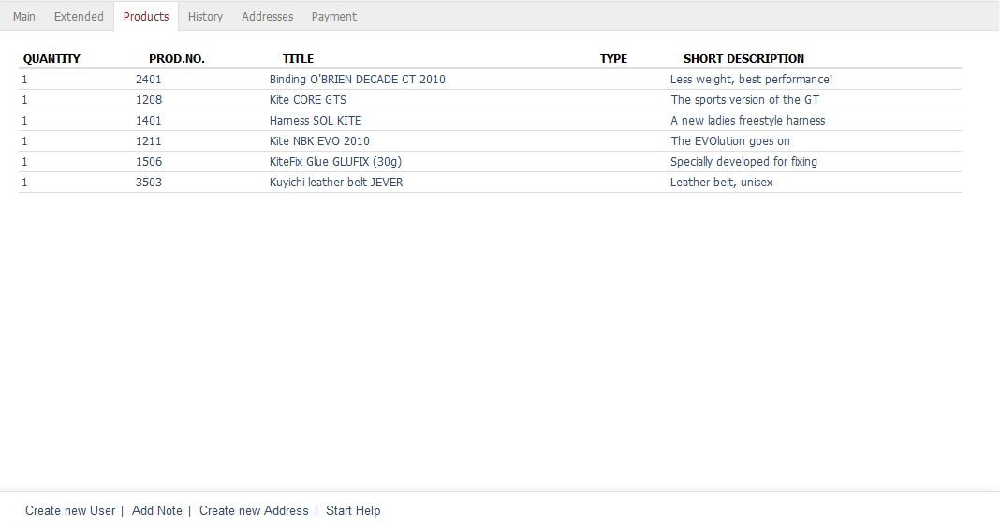

Products tab
=====================
All products purchased by the user will be listed in the :guilabel:`Products` tab. You will see the quantity, number, title, type and brief description of the product.

The :guilabel:`Type` column will only contain values if the purchased product is a variant. In this case, you will see the selected variant, for example \"W 32/L 32 | Blue\" for the garment’s size and colour.

.. Intern: oxbadt, Status:, F1: user_article.html