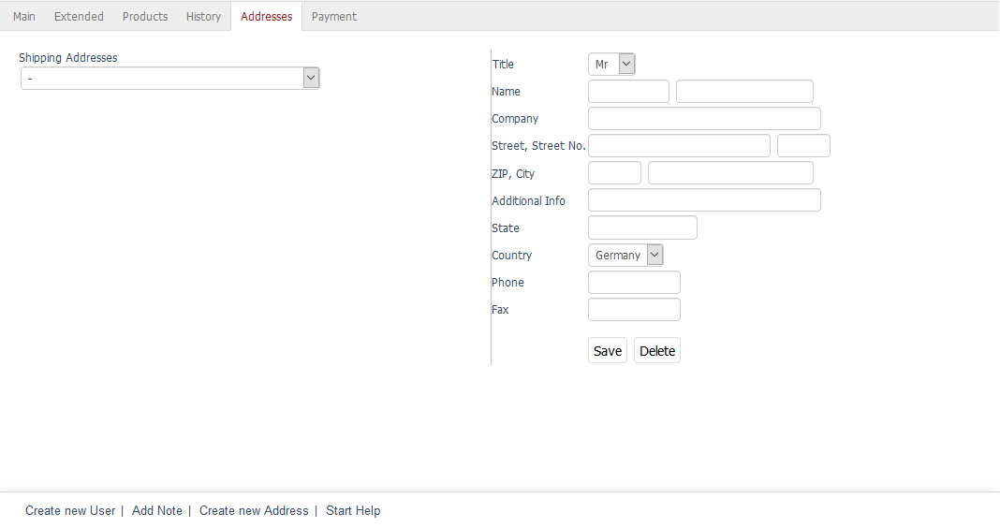

Registerkarte Adressen
======================

Bei Bestellungen in einem Online-Shop kommt es häufig vor, dass die bestellte Ware an eine andere Adresse geschickt werden soll als die Rechnung. Der Kunde kann eine oder mehrere Lieferadressen bei einer Bestellung oder in den Rechnungs- und Liefereinstellungen seines Kontos erstellen. Alle Lieferadressen eines Kunden können auf der Registerkarte :guilabel:`Adressen` eingesehen und geändert werden. Es ist auch möglich, neue Lieferadressen hinzuzufügen. Diese stehen dann bei einer neuen Bestellung mit allen anderen in einer Dropdown-Liste zur Auswahl.

Um eine neue Lieferadresse hinzuzufügen, klicken Sie auf den Link :guilabel:`Neue Adresse` in der Fußzeile des Eingabebereichs. Füllen Sie die Eingabefelder aus und betätigen Sie die Schaltfläche :guilabel:`Speichern`. Die neue Lieferadresse ist nun in der Dropdown-Liste auswählbar und kann bei Bestellungen vom Kunden verwendet werden.

.. Intern: oxbadv, Status:, F1: user_address.html