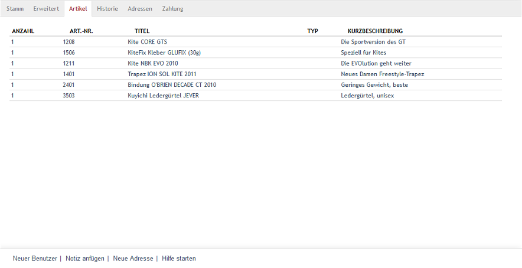

Registerkarte Artikel
*********************
Alle Artikel, die vom Benutzer gekauft wurden, werden auf der Registerkarte :guilabel:`Artikel` aufgelistet. Es werden dabei Anzahl, Artikelnummer, Titel, Typ und Kurzbeschreibung des Artikels ausgegeben.

Die Spalte :guilabel:`Typ` enthält nur Werte, wenn es sich bei dem gekauften Artikel um eine Variante handelt. In dem Fall wird die Variantenauswahl angezeigt, beispielsweise \"W 32/L 32 | Blau\" für die Auswahl von Größe und Farbe eines Bekleidungsstückes.