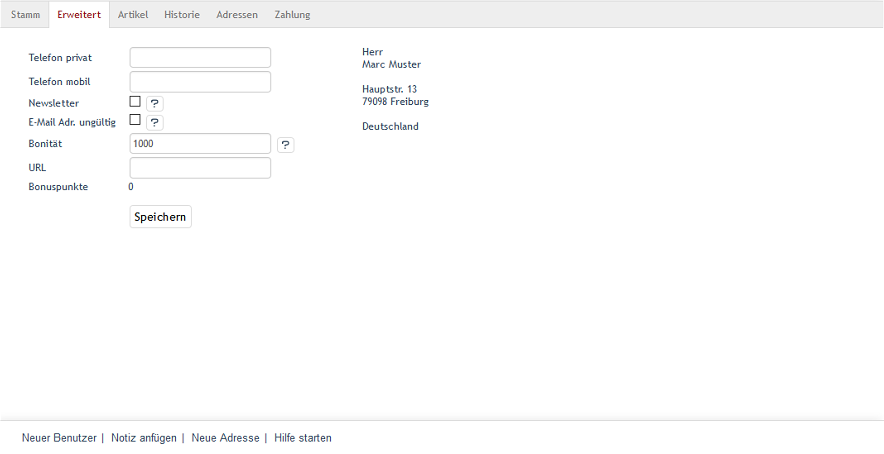

Registerkarte Erweitert
=======================
Auf der Registerkarte :guilabel:`Erweitert` können ergänzende Informationen zum Benutzer gespeichert werden. Zusätzlich wird die Rechnungsanschrift des Benutzers angezeigt. Diese kann nur auf der Registerkarte Stamm geändert werden.

:guilabel:`Telefon privat` |br|
Telefonnummer, unter welcher der Kunde privat zu erreichen ist.

:guilabel:`Telefon mobil` |br|
Handynummer des Kunden.

:guilabel:`Newsletter` |br|
Wenn der Kunde Newsletter vom Shop erhalten möchte, kann er das beim Kauf oder bei der Registrierung auswählen. Nachdem der Newsletter durch das sogenannte Double-Opt-in freigeschaltet wurde, indem der Kunde einen per E-Mail erhaltenen Link zur Bestätigung angeklickt hat, ist dieses Kontrollkästchen aktiviert. Der Newsletter wird an die in der Registerkarte Stamm hinterlegte E-Mail-Adresse geschickt. Die Einstellung zum Abonnement des Newsletters kann hier vom Shopbetreiber bei Bedarf geändert werden. Auch wenn der Kunde den Newsletter abbestellt, wird die Funktion deaktiviert.

:guilabel:`E-Mail Adr. ungültig` |br|
Hat der Kunde beim Kauf oder bei der Registrierung seine E-Mail-Adresse fehlerhaft eingegeben, kann der Newsletter nicht versandt werden. Der Shopbetreiber erhält eine entsprechende Fehlermeldung vom Mailsystem und kann hier das Verschicken des Newsletters deaktivieren. Für andere E-Mails, beispielsweise eine Versandbestätigung, wird weiterhin die bekannte E-Mail-Adresse verwendet.

:guilabel:`Bonität` |br|
Dieser Wert steht für die Kreditwürdigkeit des Kunden und bestimmt, welche Zahlungsarten dieser im Shop verwenden kann. Damit kann der Shopbetreiber Zahlungsarten, wie Rechnung oder Lastschrift, nur für bestimmte Kunden zulassen. Standardmäßig werden Benutzer mit einem Bonitätswert von 1000 angelegt.

:guilabel:`URL` |br|
In diesem Feld kann eine Webadresse, beispielsweise die der Webseite eines Geschäftskunden, die einer privaten Webseite oder eines Blogs, gespeichert werden.

:guilabel:`Bonuspunkte` |br|
Dem Benutzer können Bonuspunkte gutgeschrieben werden, wenn er Kunden für den Shop geworben hat. Auch ein geworbener Kunde kann Bonuspunkte erhalten, wenn er sich im Shop registriert. Die Funktion muss in :menuselection:`Stammdaten --> Grundeinstellungen`, Registerkarte :guilabel:`Einstell.` unter :guilabel:`Einladungen` aktiviert worden sein. Hier wird auch die Anzahl der Bonuspunkte für Neukunden und Registrierung festgelegt. Der Shopbetreiber bestimmt selbst, wie er die Bonuspunkte der Benutzer im Rahmen seines Geschäftsmodells einsetzt.

:guilabel:`Keine automatische Benutzergruppen-Zuordnung` |br|
Benutzer werden auf Grund von Bedingungen automatisch bestimmten Benutzergruppen zugeordnet. Abonniert ein Benutzer beispielsweise den Newsletter, wird er in die Benutzergruppe \"Newsletter-Abonnent\" aufgenommen. Beim Einkauf entscheidet das Bestellvolumen, ob der Benutzer zukünfig zur Benutzergruppe \"Kleiner Umsatz\", \"Mittlerer Umsatz\" oder \"Großer Umsatz\" gehört. Mehr Informationen dazu unter Benutzergruppen.

Soll keine automatische Zuordnung des Benutzers zu Benutzergruppen erfolgen, deaktivieren Sie diese Funktion hier.

.. seealso:: :doc:`Benutzergruppen <../benutzergruppen/benutzergruppen>`

.. Intern: oxbaku, Status:, F1: user_extend.html