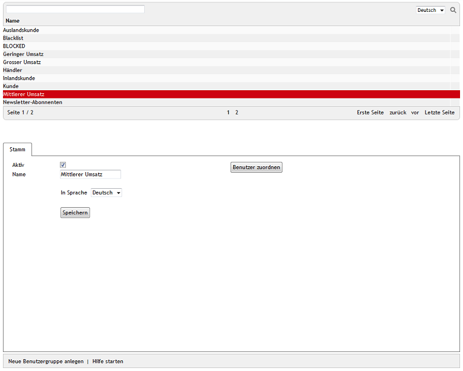

Benutzergruppen
===============

Benutzergruppen dienen dazu, Benutzer mit bestimmten Eigenschaften zusammenzufassen. Solche Eigenschaften können beispielsweise der Status des Benutzers, der bisherigen Umsatz im Shop, die Anmeldung für den Newsletter oder spezielle Preise für bestimmte Artikel sein. Benutzer, die einer Benutzergruppe angehören, lassen sich an anderer Stelle komfortabel zuordnen. Mit nur wenigen Mausklicks können Zahlungs- und Versandarten, Versandkostenregeln, Rabatte, Gutscheinserien etc. zugewiesen werden.

Benutzergruppen können Sie im Administrationsbereich unter :menuselection:`Benutzer verwalten --> Benutzergruppen` bearbeiten. Es werden eine Liste der Benutzergruppen und darunter der Eingabebereich für die Benutzergruppe angezeigt. In der Liste kann nach dem Namen der Benutzergruppe gesucht werden. Verwenden Sie dafür das vorhandene Suchfeld. Wenn Sie beispielsweise \"a\" eingeben, werden alle Benutzergruppen angezeigt, die diesen Buchstaben in ihrem Namen haben.

Benutzergruppen lassen sich durch einen Klick auf das Löschsymbol am Ende der Zeile endgültig aus der Datenbank entfernen. Eine Ausnahme stellen die 16 vordefinierten Benutzergruppen dar, mit denen der OXID eShop ausgeliefert wird.

Wird eine Benutzergruppe aus der Benutzergruppenliste gewählt, werden deren Informationen in den Eingabebereich geladen. Zum Erstellen einer neuen Benutzergruppe klicken Sie am unteren Bildschirmrand auf :guilabel:`Neue Benutzergruppe anlegen.`

Vordefinierte Benutzergruppen und automatische Zuordnung
--------------------------------------------------------
OXID eShop wird mit 16 Benutzergruppen ausgeliefert. Wenn sich Kunden im Shop registrieren und einkaufen, werden sie automatisch bestimmten Benutzergruppen zugewiesen.

Inlandskunde/Auslandskunde
^^^^^^^^^^^^^^^^^^^^^^^^^^
Benutzer werden automatisch einer dieser Benutzergruppen zugeordnet, wenn sie im Shop bestellen. Entscheidend dafür ist die angegebene Rechnungsadresse. Die beiden Benutzergruppen können beispielsweise für die Zuweisung zu unterschiedlichen Versandkosten verwendet werden.

Welche der aktiven Länder des Shops als Inland gelten sollen, kann im Abschnitt :guilabel:`Global` unter :menuselection:`Stammdaten --> Grundeinstellungen`, Registerkarte :guilabel:`Einstell.` definiert werden.

Kunde
^^^^^
In dieser Benutzergruppe finden sich alle Benutzer, die im Shop eingekauft haben. Der Shop ordnet die Benutzer automatisch zu.

Händler
^^^^^^^
Diese Benutzergruppe können Sie für Ihre gewerblichen Kunden verwenden. Es erfolgt keine automatische Zuordnung.

Geringer Umsatz/Mittlerer Umsatz/Grosser Umsatz
^^^^^^^^^^^^^^^^^^^^^^^^^^^^^^^^^^^^^^^^^^^^^^^
Benutzer werden einer dieser umsatzbezogenen Benutzergruppen zugeordnet, wenn sie im Shop bestellen. Die automatische Zuordnung erfolgt anhand des Einkaufswertes der Bestellung. Registrierte Benutzer können mit einer neuen Bestellung in eine weitere, auch in eine weniger umsatzstarke Benutzergruppe gelangen.

Die für einen mittleren und großen Umsatz relevanten Einkaufswerte können unter :menuselection:`Stammdaten --> Grundeinstellungen --> Einstell.` im Abschnitt :guilabel:`Bestellungen` vorgegeben werden.

Powershopper
^^^^^^^^^^^^
In dieser Benutzergruppe können Sie besonders umsatzstarke Benutzer zusammenfassen. Es erfolgt keine automatische Zuordnung.

Noch nicht gekauft
^^^^^^^^^^^^^^^^^^
Benutzer, die sich in Ihrem Shop registriert ohne bestellt zu haben, kommen in diese Benutzergruppe. Nach der ersten Bestellung wird die Zugehörigkeit zu dieser Benutzergruppe aufgehoben. Der Shop ordnet die Benutzer automatisch zu.

Newsletter-Abonnenten
^^^^^^^^^^^^^^^^^^^^^
Wird bei einer Bestellung oder Registrierung das Kontrollkästchen :guilabel:`Newsletter abonnieren` angehakt, ist der Benutzer als Newsletter-Abonnent vorgemerkt. Bestätigt der Benutzer einen speziellen Link, den er per E-Mail erhalten hat, wird er für den Newsletter freigeschaltet und in diese Benutzergruppe übernommen. Diese explizite Bestätigung wird auch Double-Opt-in genannt. Meldet sich ein Benutzer später vom Newsletter ab, bleibt er in dieser Benutzergruppe. Der eigentliche Versand des Newsletters wird beim Benutzer auf der :doc:`Registerkarte Erweitert <../benutzer/registerkarte-erweitert>` deaktiviert.

Preis A/Preis B/Preis C
^^^^^^^^^^^^^^^^^^^^^^^
Diese Benutzergruppen ermöglichen es, ihren Benutzern besondere Artikelpreise anzuzeigen. Die Benutzer müssen der jeweiligen Benutzergruppe manuell zugeordnet werden. Bei den Artikeln können auf der :doc:`Registerkarte Stamm <../../einrichtung/artikel/registerkarte-stamm>` alternative Preise definiert werden (A, B und/oder C), welche die Benutzer der jeweiligen Benutzergruppe (Preis A/Preis B oder Preis C) anstelle des regulären Preises nach Anmeldung im Shop sehen.

.. hint::Es kann zu Problemen bei solchen Artikeln kommen, für die keine alternativen Preise definiert wurden. Benutzer aus einer der Benutzergruppen mit den alternativen Preisen bekämen dann 0,00 € angezeigt. Um dies zu vermeiden, aktivieren Sie die Einstellung :guilabel:`Den normalen Artikelpreis verwenden, wenn keine A, B, C Preise vorhanden sind` im Abschnitt :guilabel:`Artikel` unter :menuselection:`Stammdaten --> Grundeinstellungen`, Registerkarte :guilabel:`Einstell.`

Shop-Admin
^^^^^^^^^^
Die Benutzergruppe nimmt die Benutzer auf, welche den Shop administrieren dürfen. Der erste Administrator wird während der Installation des Shops angelegt und gelangt damit direkt in diese Benutzergruppe. Weitere Administratoren können nur im Administrationsbereich unter :menuselection:`Benutzer verwalten --> Benutzer` erstellt werden. Sie werden nicht automatisch Benutzer dieser Benutzergruppe, sondern müssen manuell hinzugefügt werden.

Blacklist
^^^^^^^^^
Diese Benutzergruppe ist für Benutzer, mit denen Sie Probleme in irgendeiner Form haben. Die \"schwarzen Schafe\" ordnen Sie dieser Benutzergruppe zu und können so beispielsweise nur bestimmte Zahlungs- und Versandarten zulassen. Die betreffenden Benutzer erfahren von dieser Kategorisierung nichts.

BLOCKED
^^^^^^^
Benutzern, die Sie dieser Benutzergruppe zugewiesen haben, wird der Zugang zum Shop verweigert. Nach der Anmeldung wird ein solcher Benutzer mit einem Stop-Schild und der Meldung \"Der Zugang wurde Ihnen verweigert!\" auf seinen Status hingewiesen.

-----------------------------------------------------------------------------------------

Registerkarte Stamm
-------------------
**Inhalte**: aktive Benutzergruppe, Name der Benutzergruppe, Sprache, Benutzer zuordnen |br|
:doc:`Artikel lesen <registerkarte-stamm>` |link|

.. seealso:: :doc:`Benutzer <../benutzer/benutzer>` | :doc:`Zahlungsarten <../../einrichtung/zahlungsarten/zahlungsarten>` | :doc:`Versandarten <../../einrichtung/versandarten/versandarten>` | :doc:`Versandkostenregeln <../../einrichtung/versandkostenregeln/versandkostenregeln>`

.. Intern: oxbadz, Status: