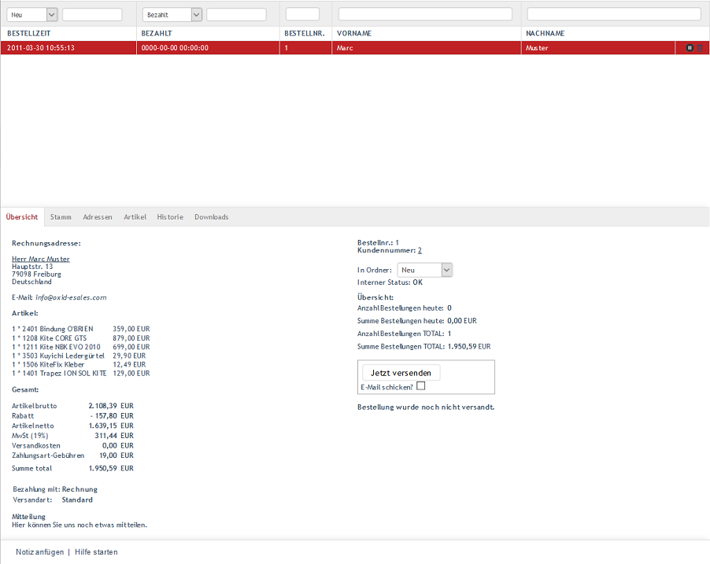

Bestellungen
************
Schließt der Kunde seinen Einkauf im Online-Shop ab, indem er zahlungspflichtig bestellt, wird eine Bestellung angelegt. Auf einer Seite wird dem Kunden für dessen Einkauf gedankt und er wird sogleich über die Bestellnummer informiert. Gleichzeitig verschickt der Shop eine Bestellbestätigung per E-Mail, die alle wichtigen Informationen, wie beispielsweise eine Liste der bestellten Artikel, den Gesamtpreis mit allen Einzelpositionen, die gewählte Zahlungsart, die Rechnungsadresse und die Versandart beinhaltet. Auch der Shopbetreiber wird per E-Mail über die neue Bestellung benachrichtigt.

:alt: Bestellungen
   :height: 513
       :width: 650

    Im Abschnitt \"Bestellungen\" erfahren Sie alles über die Bearbeitung von Bestellungen. Die beim Einkauf im Online-Shop erstellte Bestellung kann nachträglich geändert werden, um beispielsweise eine andere Zahlungs- oder Versandart zuzuweisen. Der Zahlungseingang kann ebenso dokumentiert werden, wie der Versand der Artikel. Rechnung und Lieferschein lassen sich aus der Bestellung heraus erstellen. Um Bestellungen zu bearbeiten, gehen Sie im Administrationsbereich des Shops zu :menuselection:`Bestellungen verwalten --> Bestellungen`. Es werden eine Liste der Bestellungen und darunter der Eingabebereich für die Bestellung angezeigt.

Bestellungen können gefiltert und gesucht werden. Eine Filtermöglichkeit sind die Ordner, in die sich Bestellungen verschieben lassen. In einer Dropdown-Liste direkt links über der Liste der Bestellungen lassen sich die Ordner \"Neu\", \"Bearbeitet\" oder \"Probleme\" auswählen. Diese Ordner sind standardmäßig vorhanden und erlauben eine einfache Klassifizierung der Bestellungen. Für den ausgewählten Ordner kann zusätzlich im daneben liegenden Feld ein Datum im Format JJJJ-MM-TT angegeben werden. Auch Teilformate, wie JJJJ-MM, sind möglich.

Eine weitere Filtermöglichkeit erlaubt die Anzeige von bezahlten Bestellungen, Bestellungen mit bestimmten Artikeln oder Zahlungsarten. Wird \"Bezahlt\" aus der Dropdown-Liste gewählt, lassen sich Bestellungen eines vorgegebenen Bezahldatums im Format JJJJ-MM-TT anzeigen. Auch hier sind Teilformate möglich. Bei der Filterung der Bestellungen mit bestimmten Artikeln wird der Artikeltitel oder die Artikelnummer berücksichtigt. Auch hier genügt bereits die Angabe weniger Zeichen. Die Suche nach Bestellnummer, Vorname und Nachname des Käufers kann gesetzte Filter noch verfeinern, aber auch separat verwendet werden.

Bestellungen lassen sich stornieren und löschen. Verwenden Sie dafür die Symbole am Ende der Zeile einer Bestellung. Wichtiger Hinweis: Beachten Sie bitte, dass eine Stornierung nicht rückgängig gemacht werden kann und dass ein Löschen die Bestellung endgültig aus der Datenbank entfernt.

Wird eine Bestellung aus der Liste der Bestellungen gewählt, werden deren Informationen in den Eingabebereich geladen. In der Fußzeile finden Sie die Funktionen: :guilabel:`Notiz anfügen` und :guilabel:`Hilfe starten`.

Bestellübersicht
----------------
Unter :menuselection:`Bestellungen verwalten --> Bestellübersicht` werden alle bestellten Artikel angezeigt. Wurden bei einem Einkauf mehrere Artikel in den Warenkorb gelegt, gibt es für jeden einzelnen Artikel eine separate Zeile in der Bestellübersicht. Es kann nach Datum, Artikelnummer und Artikeltitel gesucht werden. Der Klick auf ein beliebiges Feld in der Liste öffnet die dazugehörige Bestellung zur Bearbeitung.

.. image:: ../../media/screenshots-de/oxbaeb02.png
:alt: Bestellübersicht
   :height: 288
       :width: 650

Packliste
---------
Für die noch nicht versendeten Artikel kann eine Packliste unter :menuselection:`Bestellungen verwalten --> Packliste` aufgerufen und ausgedruckt werden. Sie listet die einzelnen Bestellungen mit Rechnungs- und Lieferanschrift auf und enthält auch eine Zusammenstellung der jeweils bestellten Artikel. Wurden diese verpackt, können sie auf der Packliste abgehakt werden.

.. image:: ../../media/screenshots-de/oxbaeb03.png
:alt: Packliste
   :height: 288
       :width: 650

    -----------------------------------------------------------------------------------------

.. |link| image:: ../../media/icons-de/link.png
.. |br| raw:: html 

    
   
Registerkarte Übersicht
+++++++++++++++++++++++
**Inhalte**: Bestellübersicht, Rechnungsadresse, Lieferadresse, bestellte Artikel, Gesamtpreis mit einzelnen Positionen, Zahlungsart, Versandart, Mitteilung zur Bestellung, Bestellnummer, Kundennummer, Ordner für Bestellungen, Neu, Bearbeitet, Probleme, Bestellungen des aktuellen Tages, Bestellungen total, Bestellung versenden, Versandbestätigung, XML Export, Rechnung und Lieferschein als PDF |br|
`Artikel lesen <registerkarte-uebersicht.html>`_ |link|

Registerkarte Stamm
+++++++++++++++++++
**Inhalte**: IP-Adresse und Bestellung, Trusted Shops, Bestellnummer, Rechnungsnummer, Rabatt, Bezahlinformationen, Bezahldatum, Zahlungsart, Versandinformationen, Versandart, Versandkosten, Bestellung versenden, Versandbestätigung, Links zu Download-Artikeln |br|
`Artikel lesen <registerkarte-stamm.html>`_ |link|

Registerkarte Adressen
++++++++++++++++++++++
**Inhalte**: Rechnungsadresse, Lieferadresse, Benutzer, Konto, Rechnungs- und Liefereinstellungen |br|
`Artikel lesen <registerkarte-adressen.html>`_ |link|

Registerkarte Artikel
+++++++++++++++++++++
**Inhalte**: Artikel einer Bestellung, Anzahl der Artikel ändern, bestellte Artikel stornieren, Artikel aus Bestellung löschen, Artikel suchen, Artikel zur Bestellung hinzufügen, Gesamtpreis mit einzelnen Positionen |br|
`Artikel lesen <registerkarte-artikel.html>`_ |link|

Registerkarte Historie
++++++++++++++++++++++
**Inhalte**: Notiz, Protokoll, Kundenaktionen, Kundeninformationen |br|
`Artikel lesen <registerkarte-historie.html>`_ |link|

Registerkarte Downloads
+++++++++++++++++++++++
**Inhalte**: Download-Artikel einer Bestellung, herunterladbare Dateien, erster und letzter Download, Anzahl erfolgter Downloads, maximal mögliche Downloads, Gültigkeit der Download-Links, Reset, Downloads zurücksetzen |br|
`Artikel lesen <registerkarte-downloads.html>`_ |link|