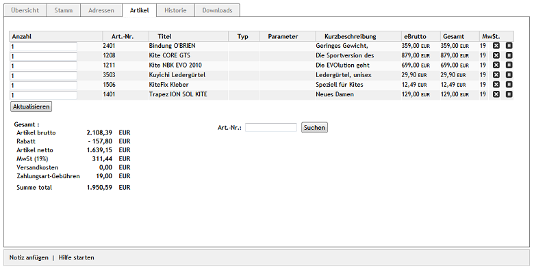

Registerkarte Artikel
*********************
Alle zu einer Bestellung gehörenden Artikel werden im Detail auf der Registerkarte :guilabel:`Artikel` aufgelistet.

Die Menge der bestellten Artikel lässt sich im Nachhinein ändern und aktualisieren. Dabei wird der Gesamtpreis eines Artikels neu berechnet, aber auch die Versandkosten oder der gewährte Rabatt können sich dadurch ändern.

Artikel einer Bestellung lassen sich stornieren oder gar komplett löschen. Dazu dienen die beiden Symbole am Ende einer jeden Zeile. Mit dem Symbol ganz rechts entfernen Sie die jeweiligen Artikel aus der Bestellung. Nach dem Bestätigen einer Sicherheitsabfrage wird die Zeile ausgegraut und die Gesamtsumme der Bestellung neu berechnet. Durch ein erneutes Klicken auf das Symbol kann die Stornierung rückgängig gemacht werden. Haben Sie Artikel mit Klick auf das Kreuzsymbol aus der Bestellung gelöscht, ist das unwiderruflich.

Eine Funktion erlaubt Ihnen allerdings auch, neue Artikel in die Bestellung aufzunehmen. Unter Angabe der Artikelnummer kann nach einem bestimmten Artikel gesucht werden. Legen Sie die Menge für den gefundenen Artikel fest und betätigen Sie die Schaltfläche :guilabel:`Artikel hinzufügen`. Der Artikel wird in der eingetragenen Menge zu einer neuen Bestellposition.

Eine Tabelle enthält alle zu einer Bestellung gehörenden Artikel.

:guilabel:`Anzahl`

Anzahl des bestellten Artikels. Im Eingabefeld kann dieser Wert geändert werden. Mit der Schaltfläche :guilabel:`Aktualisieren` werden der Preis des Artikels und der Gesamtpreis der Bestellung neu berechnet.

:guilabel:`Art.-Nr.`

Eindeutige Artikelnummer des Artikels.

:guilabel:`Titel.`

Der auf ca. zwanzig Zeichen gekürzte Artikeltitel wird angezeigt.

:guilabel:`Typ`

Auswahl einer Variante. Ist der bestellte Artikel eine Variante, wird hier deren Auswahl ausgegeben. Beispiel für Größe und Farbe einer Jeans: W 32/L 34 | Blau.

:guilabel:`Parameter`

Beschriftung des Artikels. Bei einem individualisierbaren Artikel kann während der Bestellung eine Beschriftung in ein dafür eingeblendetes Textfeld eingegeben werden.

:guilabel:`Kurzbeschreibung`

Kurzbeschreibung des Artikels.

:guilabel:`eBrutto`

Einzelpreis des Artikels.

:guilabel:`Gesamt`

Gesamtpreis des Artikels.

:guilabel:`MwSt.`

Im Preis enthaltene Mehrwertsteuer in Prozent.

Am Ende jeder Tabellenzeile befinden sich kleine Schaltflächen zum Löschen und Stornieren von Artikeln. Unter der Tabelle dient die Schaltfläche :guilabel:`Aktualisieren` der Neuberechnung der Preise und der Bestellsumme nach einer Änderung.

:guilabel:`Gesamt`

Unter :guilabel:`Gesamt` findet sich der Gesamtpreis der Bestellung mit seinen einzelnen Positionen. Der Artikelpreis wird brutto und netto angezeigt, ein gewährter Rabatt und die Mehrwertsteuer werden ausgewiesen. Hinzu kommen die Versandkosten und eine mögliche Gebühr für die Zahlungsart.

:guilabel:`Art.-Nr.`

Artikelnummer, nach der gesucht werden soll.

Das Drücken der Schaltfläche :guilabel:`Suchen` startet die Suche nach einem Artikel mit der eingetragenen Artikelnummer. Wird dieser gefunden, erscheint dessen Kurzbezeichnung in einer Dropdown-Liste und ein Eingabefeld für die Artikelanzahl. Mit der Schaltfläche :guilabel:`Artikel hinzufügen` wird der Artikel der Bestellung hinzugefügt.