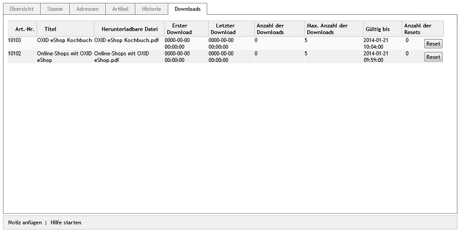

Registerkarte Downloads
***********************
Alle zu einer Bestellung gehörenden Downloads werden auf der gleichnamigen Registerkarte aufgelistet. Für jeden Download gibt es eine Zeile, die neben der Artikelnummer, dem Artikeltitel und dem Namen der herunterladbaren Datei auch Informationen enthält, die durch den eigentlichen Download aktualisiert werden.

Nach der Bestellung finden sich die Downloadlinks unter :guilabel:`Konto --> Meine Downloads`. Die Dateien können heruntergeladen werden, sobald die Zahlung erfolgt ist. Wurde die Bestellung noch nicht als bezahlt markiert, weist eine entsprechende Meldung darauf hin. Werden beispielsweise Lastschrift oder Kreditkartenzahlung als Zahlungsart verwendet, ist das Herunterladen sofort möglich. Die E-Mail, welche die Bestellung bestätigt, enthält ebenfalls die Downloadlinks zu den bestellten Dateien, wenn die Bezahlung abgeschlossen ist.

Eine Tabelle enthält alle zu einer Bestellung gehörenden Downloads.

:guilabel:`Art.-Nr.`

Eindeutige Artikelnummer des Download-Artikels.

:guilabel:`Titel`

Titel des Download-Artikels.

:guilabel:`Herunterladbare Datei`

Datei, die zum Download-Artikel gehört und vom Kunden heruntergeladen werden kann. Für jede herunterladbare Datei eines Download-Artikels wird eine Tabellenzeile erstellt.

:guilabel:`Erster Download`

Datum und Uhrzeit des ersten Downloads.

:guilabel:`Letzter Download`

Datum und Uhrzeit des letzten Downloads.

:guilabel:`Anzahl der Downloads`

Anzahl der bisher erfolgten Downloads.

:guilabel:`Max. Anzahl der Downloads`

Anzahl der Downloads, die maximal erlaubt sind. Die Zahl Null steht für eine unbegrenzte Anzahl von Downloads. Der Wert wurde als Standardeinstellung auf der Registerkarte :guilabel:`Einstell.` unter :menuselection:`Stammdaten --> Grundeinstellungen` festgelegt oder per Definition beim jeweiligen Download-Artikel überschrieben.

:guilabel:`Gültig bis`

Zeitpunkt, bis zu dem Dateien des Download-Artikels heruntergeladen werden können. Auch hier gelten die Standardeinstellungen oder die beim Download-Artikel definierten Werte.

:guilabel:`Anzahl der Resets`

Es wird angezeigt, wie oft die Informationen zu den Downloads zurückgesetzt wurden.

:guilabel:`Reset`

Der Shopbetreiber hat die Möglichkeit, bereits erfolgte Downloads zurückzusetzen, solange sie gültig sind. Durch Drücken der Schaltfläche werden der Zeitpunkt des ersten und letzten Downloads sowie die Anzahl der Downloads zurückgesetzt. Auch die die Gültigkeit der Downloads wird ensprechend ihrer Definition neu berechnet.

.. seealso:: :doc:`Registerkarten Downloads <../../einrichtung/artikel/registerkarte-downloads>`

.. Intern: oxaaeh, Status:, F1: order_downloads.html