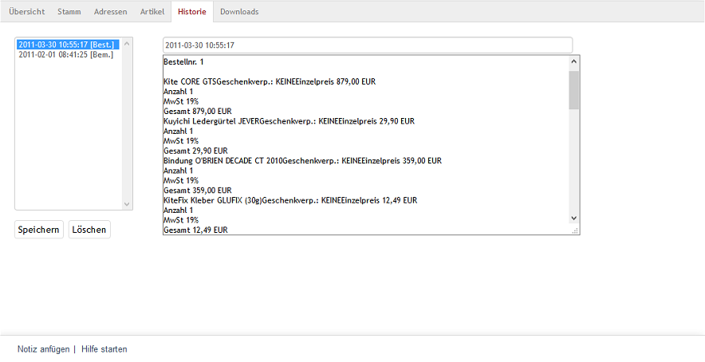

Registerkarte Historie
**********************
Alle Bestellungen eines Kunden werden auf der Registerkarte :guilabel:`Historie` protokolliert. Darüber hinaus gibt es Einträge zur erfolgreichen Registrierung, zu versandten Newslettern und verschickten E-Mails. Jeder Eintrag wird mit einem Zeitstempel und einem Kürzel in eckigen Klammern gespeichert. Das Kürzel \"Best.\" steht dabei für Bestellung und \"Bem.\" für Bemerkung. Markiert man einen Eintrag in der linken Spalte per Mausklick, wird dessen Inhalt im großen Eingabefeld auf der rechten Seite angezeigt.

Neben den vom Shop automatisch generierten Einträgen lassen sich auch eigene anlegen. Damit können beispielsweise individuelle Absprachen mit dem Kunden zu einer Bestellung dokumentiert werden. Klicken Sie dazu auf den Link :guilabel:`Notiz anfügen` in der Fußzeile des Eingabebereichs. Schreiben Sie die gewünschten Informationen in das Eingabefeld und drücken Sie die Schaltfläche :guilabel:`Speichern`. Der Eintrag wird zusammen mit Datum und sekundengenauer Zeitangabe gespeichert. Bestehende Einträge können später geändert, ergänzt und sogar gelöscht werden. Löschen Sie Einträge nur, wenn unbedingt notwendig, damit die Historie zum Kunden möglichst lückenlos bleibt.

.. Intern: oxbaeg, Status:, F1: order_remark.html