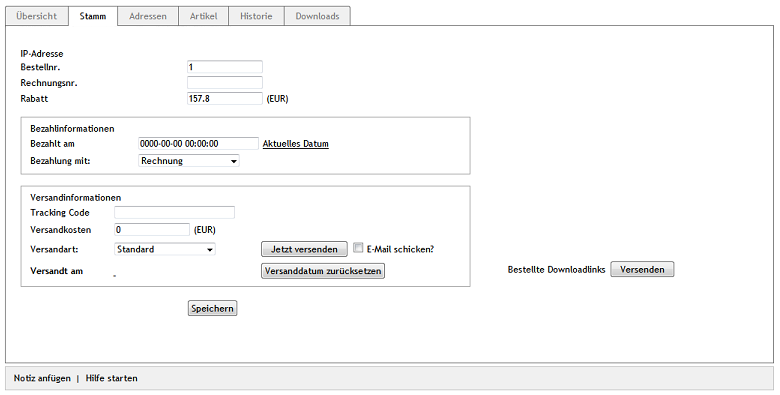

Registerkarte Stamm
===================
Auf der Registerkarte :guilabel:`Stamm` können Bestellinformationen hinzugefügt oder verändert werden. Das betrifft Bestell- und Rechnungsnummern ebenso, wie Bezahl- und Versandinformationen. Handelt es sich bei den bestellten Artikeln um Download-Artikel, kann eine E-Mail mit den Downloadlinks an den Kunden verschickt werden.

:guilabel:`IP-Adresse` |br|
Hier kann die IP-Adresse angezeigt werden, von der aus der Kunde die Bestellung abgeschlossen hat. Voraussetzung dafür ist, dass dies global aktiviert wurde. Auf der Registerkarte :guilabel:`System` unter :menuselection:`Stammdaten --> Grundeinstellungen` finden Sie bei :guilabel:`Bestellungen` die Einstellung :guilabel:`IP-Adressen speichern`. :guilabel:`Dies ist u.U. ein Verstoß gegen den Datenschutz`.

Worauf die Beschriftung schon aufmerksam macht ist die Tatsache, dass das Speichern von IP-Adressen datenschutzrechtlich bedenklich sein kann. In Deutschland ist es eindeutige Rechtslage, dass ein Verstoß gegen die Datenschutzbestimmungen vorliegt, wenn Shopbetreiber die IP-Adresse eines Kunden zusammen mit dessen Bestelldaten speichern. In anderen Ländern hingegen, wie beispielsweise in den Vereinigten Staaten, dürfen IP-Adressen problemlos erfasst werden.

:guilabel:`Bestellnr.` |br|
Der Shop vergibt bei jeder Bestellung eine fortlaufende Bestellnummer. Diese kann hier geändert werden, wenn der Shop ab der nächsten Bestellung mit der darauffolgenden Bestellnummer weiterzählen soll.

:guilabel:`Rechnungsnr.` |br|
Tragen Sie hier Ihre benutzerdefinierte Rechnungsnummer ein. Wenn Sie nichts eintragen, ist die Bestellnummer auch gleichzeitig die Rechnungsnummer.

:guilabel:`Rabatt` ... :guilabel:`(EUR)` |br|
Wurde für die bestellten Artikel ein Rabatt wirksam, wird dieser hier angezeigt. Es kann auch nachträglich ein Rabatt geändert oder gewährt werden. Tragen Sie den Wert in das Eingabefeld ein und speichern Sie die Änderungen. Der Gesamtpreis der Bestellung wird neu berechnet.

:guilabel:`Bezahlinformationen` |br|
Der Shopbetreiber hat hier die Möglichkeit, den Zahlungseingang zur Bestellung zu dokumentieren. Im Feld :guilabel:`Bezahlt am` kann das Bezahldatum im Format JJJJ-MM-TT HH:MM:SS gesetzt werden. Nach dem Speichern erscheint eine neue Zeile mit dem Hinweis :guilabel:`Bestellung wurde bezahlt` und der Datums- und Zeitangabe. Soll für die Bestellungen das aktuelle Datum verwendet werden, genügt ein Klick auf den gleichnamigen Link und es wird in das Eingabefeld eingetragen.

:guilabel:`Bezahlung mit` |br|
In der Dropdown-Liste ist ausgewählt, mit welcher Zahlungsart der Kunde die Bestellung abgeschlossen hat. Falls notwendig, kann dieser Bestellung eine andere aktive Zahlungsart zugewiesen werden. Wählen Sie eine andere Zahlungsart aus der Dropdown-Liste aus und speichern Sie die Änderung.

:guilabel:`Versandinformationen` |br|
Bei der Bestellung hat der Kunde eine Versandart gewählt, die zusammen mit den Versandkosten übersichtlich angeordnet angezeigt wird. Der Shopbetreiber kann diese Angaben, falls notwendig, ändern.

Damit Kunden den Versand ihrer bestellten Ware verfolgen können, kann die Tracking-URL des Versanddienstleisters im Administrationsbereich unter :menuselection:`Stammdaten --> Grundeinstellungen --> Einstell. --> Weitere Einstellungen` eingetragen werden. Tracking-URL und die Paket-ID der Bestellung (je nach Versanddienstleister Tracking Code, Paketscheinnummer, Paketreferenz usw.) werden dem Kunden als Link zur Sendungsverfolgung mit der E-Mail zugeschickt, mit der ihm der Versand der Ware mitgeteilt wird. Standardmäßig ist die Sendungsverfolgung für den Versanddienstleister DPD (Dynamic Parcel Distribution) konfiguriert.

Die Schaltflächen :guilabel:`Jetzt versenden` und :guilabel:`Versanddatum zurücksetzen`, ebenso wie das Kontrollkästchen :guilabel:`E-Mail schicken?` erfüllen die gleiche Funktion, wie auf der Registerkarte :guilabel:`Übersicht`. Das Versanddatum kann gesetzt und der Kunde per E-Mail über den Versand der Ware informiert werden. Es wird die Zeile :guilabel:`Versandt am` mit der Datums- und Zeitangabe vervollständigt.

:guilabel:`Bestellte Downloadlinks` |br|
Mit OXID eShop 4.6.0 wurde mit Download-Artikel ein neuer Artikeltyp eingeführt. Mit Download-Artikeln kann der Shopbetreiber beispielsweise Software, Fotos, Musikdateien oder Dokumentvorlagen anbieten. Legt der Kunde einen Download-Artikel in den Warenkorb, erwirbt er alle dazugehörigen Dateien, die er sich im Shop herunterladen kann. Mit einem Klick auf die Schaltfläche :guilabel:`Versenden` erhält der Kunde eine E-Mail mit seinen Downloadlinks zugeschickt.

.. seealso:: `Datenschutz: Dürfen Online-Händler IP-Adressen ihrer Kunden speichern? <http://shop.trustedshops.com/de/rechtstipps/datenschutz-duerfen-online-haendler-ip-adressen-ihrer-kunden-speichern>`_ (Trusted Shops)\ `Features/oxCounter implementation <http://oxidforge.org/en/oxcounter-implementation.html>`_ (OXIDforge, englischsprachig)

.. Intern: oxaaed, Status:, F1: order_main.html