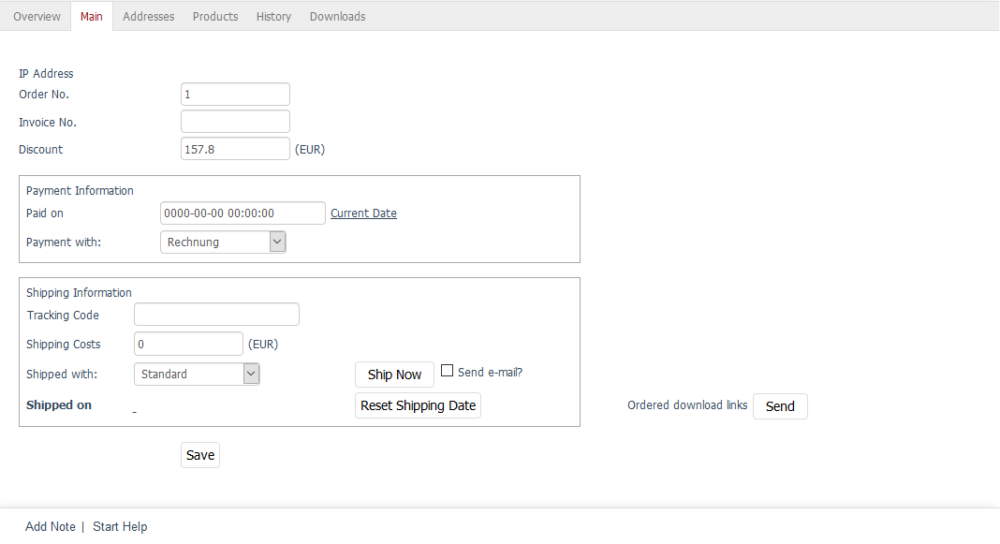

Registerkarte Stamm
===================

Auf der Registerkarte :guilabel:`Stamm` können Sie Bestellinformationen hinzufügen oder ändern.

Das betrifft Bestell- und Rechnungsnummern ebenso wie Bezahl- und Versandinformationen.

Handelt es sich bei den bestellten Artikeln um Download-Artikel, können Sie eine E-Mail mit den Downloadlinks an den Kunden senden.

:guilabel:`IP-Adresse`
   Hier kann die IP-Adresse angezeigt werden, von der aus der Kunde die Bestellung abgeschlossen hat. Voraussetzung dafür ist, dass dies global aktiviert wurde. Auf der Registerkarte :guilabel:`System` unter :menuselection:`Stammdaten --> Grundeinstellungen` finden Sie bei :guilabel:`Bestellungen` die Einstellung :guilabel:`IP-Adressen speichern`. :guilabel:`Dies ist u.U. ein Verstoß gegen den Datenschutz`.

   Worauf die Beschriftung schon aufmerksam macht ist die Tatsache, dass das Speichern von IP-Adressen datenschutzrechtlich bedenklich sein kann. In Deutschland ist es eindeutige Rechtslage, dass ein Verstoß gegen die Datenschutzbestimmungen vorliegt, wenn Shopbetreiber die IP-Adresse eines Kunden zusammen mit dessen Bestelldaten speichern. In anderen Ländern hingegen, wie beispielsweise in den Vereinigten Staaten, dürfen IP-Adressen problemlos erfasst werden.

:guilabel:`Bestellnr.`
   Der Shop vergibt bei jeder Bestellung eine fortlaufende Bestellnummer. Diese kann hier geändert werden, wenn der Shop ab der nächsten Bestellung mit der darauffolgenden Bestellnummer weiterzählen soll.

:guilabel:`Rechnungsnr.`
   Tragen Sie hier Ihre benutzerdefinierte Rechnungsnummer ein. Wenn Sie nichts eintragen, ist die Bestellnummer auch gleichzeitig die Rechnungsnummer.

:guilabel:`Rabatt` ... :guilabel:`(EUR)`
   Wurde für die bestellten Artikel ein Rabatt wirksam, wird dieser hier angezeigt. Es kann auch nachträglich ein Rabatt geändert oder gewährt werden. Tragen Sie den Wert in das Eingabefeld ein und speichern Sie die Änderungen. Der Gesamtpreis der Bestellung wird neu berechnet.

:guilabel:`Bezahlinformationen`
   Dokumentieren Sie den Zahlungseingang zur Bestellung. Im Feld :guilabel:`Bezahlt am` kann das Bezahldatum im Format JJJJ-MM-TT HH:MM:SS gesetzt werden. Nach dem Speichern erscheint eine neue Zeile mit dem Hinweis :guilabel:`Bestellung wurde bezahlt` und der Datums- und Zeitangabe. Soll für die Bestellungen das aktuelle Datum verwendet werden, genügt ein Klick auf den gleichnamigen Link und es wird in das Eingabefeld eingetragen.

:guilabel:`Bezahlung mit`
   In der Dropdown-Liste ist ausgewählt, mit welcher Zahlungsart der Kunde die Bestellung abgeschlossen hat. Falls notwendig, kann dieser Bestellung eine andere aktive Zahlungsart zugewiesen werden. Wählen Sie eine andere Zahlungsart aus der Dropdown-Liste aus und speichern Sie die Änderung.

:guilabel:`Versandinformationen`
   Bei der Bestellung hat der Kunde eine Versandart gewählt, die zusammen mit den Versandkosten angezeigt wird. Der Shopbetreiber kann diese Angaben, falls notwendig, ändern.

.. _tracking-url-orders:

:guilabel:`Tracking-Code`
   Tragen Sie die Paket-ID der Bestellung (je nach Versanddienstleister Tracking Code, Paketscheinnummer, Paketreferenz usw.) ein.

   Der Tracking-Link, bestehend aus der Tracking-URL und der Paket-ID der Bestellung, wird generiert und Ihrem Kunden zur Sendungsverfolgung mit der E-Mail zugeschickt, mit der ihm der Versand der Ware mitgeteilt wird.

   In der Bestellhistorie des Kunden im Frontend wird der Tracking-Link ebenfalls angezeigt.

   Die Tracking-URL können Sie für jede einzelne Versandart separat definieren.
   |br|
   Wie das geht, finden Sie unter :ref:`Tracking-URL <tracking-url-shipping-method>`.

   Wenn Sie für eine Versandart keine spezielle Tracking-URL festgelegt haben, verwendet das System die Tracking-URL, die Sie im Administrationsbereich unter :menuselection:`Stammdaten --> Grundeinstellungen --> Einstell. --> Weitere Einstellungen` eingetragen haben.

   .. todo: :ref:`Tracking-URL <Tracking-URL>` Weitere Einstellungen

   Die Schaltflächen :guilabel:`Jetzt versenden` und :guilabel:`Versanddatum zurücksetzen`, ebenso wie das Kontrollkästchen :guilabel:`E-Mail schicken?` erfüllen die gleiche Funktion, wie auf der Registerkarte :guilabel:`Übersicht`. Das Versanddatum kann gesetzt und der Kunde per E-Mail über den Versand der Ware informiert werden. Es wird die Zeile :guilabel:`Versandt am` mit der Datums- und Zeitangabe vervollständigt.

:guilabel:`Bestellte Downloadlinks`
   Mit Download-Artikeln kann der Shopbetreiber beispielsweise Software, Fotos, Musikdateien oder Dokumentvorlagen anbieten.

   Legt der Kunde einen Download-Artikel in den Warenkorb, erwirbt er alle dazugehörigen Dateien, die er sich im Shop herunterladen kann.

   Mit einem Klick auf die Schaltfläche :guilabel:`Versenden` erhält der Kunde eine E-Mail mit seinen Downloadlinks zugeschickt.

.. Intern: oxbaed, Status:, F1: order_main.html