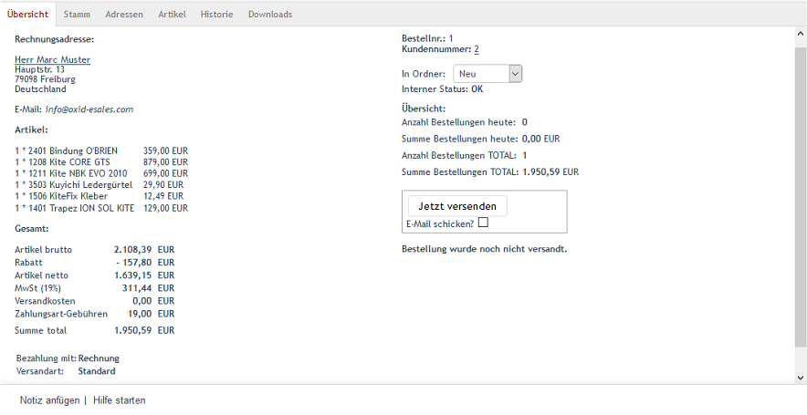

Registerkarte Übersicht
=======================
Die Registerkarte :guilabel:`Übersicht` zeigt alle wichtigen Informationen einer Bestellung an. Dazu gehören beispielsweise die Rechnungsadresse, eine davon abweichende Lieferadresse, die bestellten Artikel, der Gesamtpreis mit seinen einzelnen Positionen, die Zahlungsart und die Versandart. Die Bestellung erhält eine Bestellnummer, der Kunde eine Kundennummer, sofern es sich um eine Erstbestellung handelt.

Darüber hinaus wird eine kurze Zusammenfassung der Bestellungen des Tages und aller Bestellungen im Shop ausgegeben. Für die Bestellung kann eine Rechnung oder ein Lieferschein im PDF-Format generiert werden. Bestellungen lassen sich zur weiteren Verarbeitung in anderen Systemen im XML-Format exportieren.

:guilabel:`Rechnungsadresse`

Es wird die Adresse angezeigt, an die die Rechnung für die Bestellung geschickt werden soll. Der Kunde hat diese Anschrift während der Registrierung im Shop oder beim Einkauf ohne Registrierung angegeben. Zusätzlich wird die E-Mail-Adresse des Kunden als Link angezeigt, so dass ein Klick darauf eine neue E-Mail öffnet, mit der dem Kunden beispielsweise eine Rechnung zugeschickt werden kann.

:guilabel:`Lieferadresse`

Sollen die Artikel an eine andere als die Rechnungsadresse versendet werden, kann bei der Bestellung eine Lieferadresse angegeben bzw. ausgewählt werden. In diesem Fall wird die Lieferadresse neben der Rechnungsadresse angezeigt.

:guilabel:`Artikel`

Hier werden alle Artikel dieser Bestellung mit Anzahl, Artikelnummer, Artikeltitel und Preis aufgelistet. Auf der Registerkarte :guilabel:`Artikel` kann die Anzahl der bestellten Artikel nachträglich geändert werden. Es ist auch möglich, Artikel der Bestellung zu stornieren und zu löschen.

:guilabel:`Gesamt`

Unter :guilabel:`Gesamt` findet sich der Gesamtpreis der Bestellung mit seinen einzelnen Positionen. Der Artikelpreis wird brutto und netto angezeigt, ein gewährter Rabatt und die Mehrwertsteuer werden ausgewiesen. Hinzu kommen die Versandkosten und eine mögliche Gebühr für die Zahlungsart.

:guilabel:`Bezahlung mit`

Zahlungsart, die bei der Bestellung durch den Kunden gewählt wurde. Die Zahlungsart kann bei Bedarf durch den Shopbetreiber auf der Registerkarte :guilabel:`Stamm` geändert werden.

:guilabel:`Versandart`

Versandart, die bei der Bestellung durch den Kunden gewählt wurde. Auch die Versandart lässt sich, wenn notwendig, auf der Registerkarte :guilabel:`Stamm` ändern.

:guilabel:`Mitteilung`

Im zweiten Schritt des Bestellprozesses kann der Kunde eine Mitteilung für den Shopbetreiber in ein dafür vorgesehenes Eingabefeld eintragen. Die Mitteilung wird hier angezeigt. Nutzt der Kunde diese Möglichkeit nicht, ist an dieser Stelle der Standardtext \"Hier können Sie uns noch etwas mitteilen.\" zu sehen.

:guilabel:`Bestellnr.`

Der Shop vergibt eine fortlaufende Bestellnummer. Die erste Bestellung, die im Shop eingeht, hat die Bestellnummer 1. Manchmal soll ein Shop aber mit einer höheren Bestellnummer starten. Shopbetreiber finden das oft professioneller. Eventuell macht auch ein eingesetztes Warenwirtschaftssystem eine höhere Nummerierung notwendig. Dafür müssen Sie lediglich die Bestellnummer der letzten Bestellung erhöhen. Von nun an zählt der Shop ab dieser Bestellnummer weiter.

:guilabel:`Kundennummer`

Kauft ein Kunde zum ersten Mal im Onlineshop ein, wird er als Benutzer angelegt und erhält eine Kundennummer. Diese wird fortlaufend vergeben, kann aber auch verändert werden, indem die Kundennummer des zuletzt angelegten Benutzers geändert wird. Gehen Sie dafür zu :menuselection:`Benutzer verwalten --> Benutzer`, ändern Sie die Kundennummer auf der Registerkarte :guilabel:`Stamm` und speichern Sie Ihre Änderungen. Der Shop zählt danach ab der neuen Kundennummer weiter.

:guilabel:`In Ordner`

Wurden im Shop Artikel bestellt, wird eine Bestellung dazu angelegt und im Ordner \"Neu\" abgelegt. Standardmäßig gibt es drei Ordner für Bestellungen: \"Neu\", \"Bearbeitet\" und \"Probleme\". Sie können Bestellungen in einen anderen Ordner verschieben, beispielsweise in den Ordner \"Bearbeitet\". Das erleichtert das Auffinden von Bestellungen über das Filtern und Suchen.

Es lassen sich weitere Ordner anlegen, um die Klassifizierung von Bestellungen zu verfeinern und an Ihre speziellen Erfordernisse anzupassen. Neue Ordner werden auf der Registerkarte :guilabel:`Einstell.` unter :menuselection:`Stammdaten --> Grundeinstellungen` definiert. Klicken Sie auf :guilabel:`Administrationsbereich`, um die Einstellungen anzuzeigen. Jeder Ordner der Bestellverwaltung hat einen Eintrag mit folgender Syntax: ``Sprachkonstante Ordnername\=\>hexadezimale Farbdefinition``. Eine Sprachkonstante wird verwendet, damit die Ordner sprachabhängig angezeigt werden können. Die Übersetzung für die Standardordner ist in der jeweiligen Sprachdatei :file:`/application/views/admin/{locale}/lang.php` zu finden. Für neue Ordner sollte die benutzerdefinierte Sprachdatei :file:`cust_lang.php` verwendet werden. Die Schriftfarbe, in welcher der Ordner angezeigt werden soll, wird nach dem Schema #RRGGBB definiert. Beispiel: Ordner\"Storno\"in dunkelblauer Beschriftung - ORDERFOLDER_STORNO =\>#000088

:guilabel:`Interner Status`

Falls bei der Verarbeitung einer Bestellung ein Fehler auftrat, wird dieser angezeigt.

:guilabel:`Übersicht`

Die Übersicht zeigt die Anzahl der Bestellungen und die Bestellsumme des aktuellen Tages an. Diese Information wird ergänzt durch die Anzahl aller Bestellungen im Shop und der gesamten Bestellsumme.

:guilabel:`Jetzt versenden`

Werden die Artikel an den Käufer versendet, kann der Shopbetreiber das bei der Bestellung dokumentieren. Ein Klick auf die Schaltfläche :guilabel:`Jetzt versenden` ändert den Bestellstatus und den Hinweis :guilabel:`Bestellung wurde noch nicht versandt`. Stattdessen wird nun ein Hinweis ausgegeben, der den Versand mit Datum und Uhrzeit bestätigt. Zusätzlich wird die Schaltfläche :guilabel:`Versendedatum zurücksetzen` eingeblendet. Damit kann das bisherige Datum des Versandes zurückgesetzt und die Ware mit aktuellem Datum erneut verschickt werden.

:guilabel:`E-Mail schicken?`

Ist das Kontrollkästchen :guilabel:`E-Mail schicken?` angehakt, wird der Kunde per E-Mail über den Versand informiert. Die E-Mail enthält die Lieferadresse, die Bestellnummer und eine Auflistung der versendeten Artikel mit Link zur Artikelbewertung. Wurde auf der Registerkarte :guilabel:`Stamm` ein Tracking Code bei den Versandinformationen eingetragen, führt ein Link zur Sendungsverfolgung direkt auf die Webseite von DPD Deutschland.

:guilabel:`XML Export`

Bestellungen können im XML-Format (Extensible Markup Language) exportiert werden, welches den Austausch mit anderen Systemen, wie einer Warenwirtschaft oder mit einem Versanddienstleister, ermöglicht. Ohne Vorgabe einer Bestellnummer werden sämtliche Bestellungen für den Export aufbereitet. Je nach verwendetem Browser wird die Exportdatei heruntergeladen, zum Öffnen oder zum Speichern angeboten. Mit der Eingabe von Bestellnummern in den Eingabefeldern :guilabel:`ab Bestellnr.` und :guilabel:`bis Bestellnr.` können die zu exportierenden Bestellungen eingeschränkt werden.

.. hint:: Diese Funktion wurde nicht in die Enterprise Edition implementiert.

:guilabel:`PDF`

Zu einer Bestellung kann deren Rechnung und Lieferschein im Format PDF (Portable Document Format) erstellt werden. Rechnung oder Lieferschein sind aus einer Dropdown-Liste auswählbar. Ein Klick auf die Schaltfläche :guilabel:`PDF ausgeben` erstellt die .pdf-Datei und bietet diese je nach verwendetem Browser zum Öffnen oder Speichern an. Wurde der Shop mehrsprachig realisiert, kann die Sprache für Rechnung und Lieferschein ausgewählt werden.

Für das Erzeugen der Rechnung und des Lieferscheins ist die Datei :guilabel:`myorder.php` aus dem Verzeichnis :file:`/modules/invoicepdf` zuständig. Programmierkenntnisse vorausgesetzt, können Inhalt und Aufbau der Dokumente an eigene Erfordernisse angepasst werden.

.. hint:: Diese Funktion wurde nicht in die Enterprise Edition implementiert.

Darüber hinaus konnten in der Community und der Professional Edition Bestellungen mit der Zahlungsart \"Bankeinzug/Lastschrift\" für eine Verarbeitung bei Banken und Geldinstituten exportiert werden. Mit OXID eShop 4.9.0 wurde diese Möglichkeit zum Erstellen von Lastschrifteinzugssätzen für die elektronische Verarbeitung im Datenträgeraustauschverfahren (DTAUS) entfernt. Dieses Verfahren wird seit August 2014 von den Banken nicht mehr unterstützt.

.. seealso:: :doc:`Registerkarte Stamm <../benutzer/registerkarte-stamm>` | `Hexadezimale Farbdefinition (Wikipedia) <http://de.wikipedia.org/wiki/Hexadezimale_Farbdefinition>`_ | `Farben definieren in HTML (SELFHTML) <http://de.selfhtml.org/html/allgemein/farben.htm>`_ | `Extensible Markup Language, XML (Wikipedia) <http://de.wikipedia.org/wiki/Extensible_Markup_Language>`_ | `Portable Document Format, PDF (Wikipedia) <http://de.wikipedia.org/wiki/PDF>`_

.. Intern: oxbaec, Status:, F1: order_overwiew.html