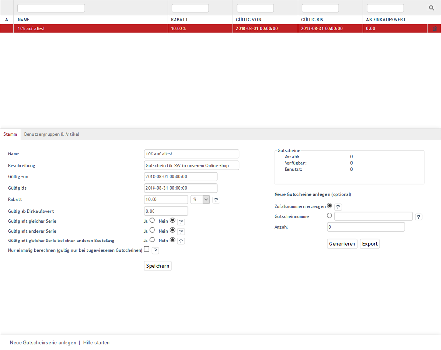
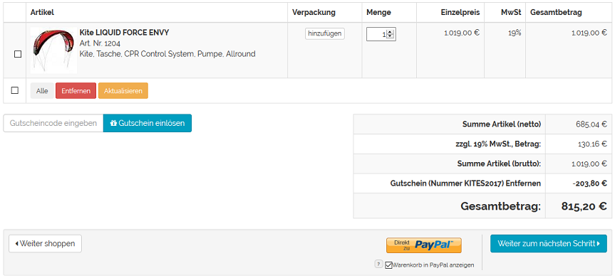

Gutscheinserien
***************
Gutscheinserien sind eine definierte Anzahl von Gutscheinen mit identischer Gültigkeit und den selben Bedingungen zum Einlösen. Die Gutscheine können nach dem Anlegen einer Gutscheinserie mit gleichem Gutscheincode oder individuellen Gutscheinnummern generiert werden. Nachdem die Gutscheine den Weg zum Kunden gefunden haben, beispielsweise über einen verschickten Newsletter, kann der Gutscheincode beim Onlinekauf verwendet werden. Der Kunde gibt seinen Gutscheincode im ersten Bestellschritt ein und erhält einen relativen oder absoluten Rabatt auf bestimmte Artikel oder den gesamten Warenkorb. Dabei wird der gesamte Wert des Gutscheins verbraucht. Es können nicht, wie bei Geschenkgutscheinen üblich, nur Anteile eines vorhandenen Guthabens verwendet werden.

Gutscheine sind neben Aktionen, Rabatten und Newslettern ein weiteres Marketinginstrument in Ihrem OXID eShop. Sie können Gutscheine einsetzen, um Kaufanreize zu schaffen und neue Kunden zu gewinnen.

:alt: Gutscheinserien
   :height: 503
       :width: 650

    Nachdem der Kunde Artikel in den Warenkorb gelegt und diesen angezeigt hat, kann er im ersten Bestellschritt einen Gutscheincode oder eine Gutscheinnummer in das entsprechende Feld eingeben. Je nach den Einstellungen bei der Gutscheinserie können mehrere Gutscheine für eine Bestellung oder ein Gutschein für mehrere Bestellungen verwendet werden. Sind mehrere Gutscheine für eine Bestellung möglich, werden diese nur akzeptiert, solange der Gesamtbetrag der Bestellung größer 0,00 € ist. Beim Absenden des Gutscheins überprüft der Shop dessen Gültigkeit, schreibt diesen gut oder lehnt ihn mit einem entsprechenden Hinweis ab.

    Wurde der Gutscheincode vom Shop akzeptiert, wird der Gutschein in der Datenbank als reserviert markiert. Beim Abschluss der Bestellung wird der Gutschein als verwendet markiert und erhält Verweise auf die Bestellung, den Kunden und einen Zeitstempel.

    Ein angegebener Gutschein kann auch wieder aus der Warenkorbübersicht entfernt werden.

:alt: Verwendung eines Gutscheins im Warenkorb
   :height: 316
       :width: 650

    Im Abschnitt \"Gutscheinserien\" wird erläutert, wie Gutscheinserien erstellt und eingerichtet sowie die dazugehörigen Gutscheine generiert und exportiert werden.

Gutscheinserien werden im Administrationsbereich unter :menuselection:`Shopeinstellungen --> Gutscheinserien` erstellt. Es werden eine Liste mit bereits vorhandenen Gutscheinserien und darunter der Eingabebereich für die Gutscheinserien angezeigt.

In der Liste der Gutscheinserien symbolisiert ein kleines grünes Quadrat am Anfang der Zeile eine aktive Gutscheinserie. Trifft für eine Gutscheinserie der Gültigkeitszeitraum nicht zu, fehlt dieses Symbol. Die Gutscheinserie ist ungültig und damit nicht aktiv. Die Liste zeigt den Namen der Gutscheinserie, den gewährten Nachlass, den Zeitraum ihrer Gültigkeit und einen vorgegebenen Mindesteinkaufswert. Nach Gutscheinserien kann gesucht werden, indem Zeichen in die Suchfelder eingegeben werden. Die Suche startet, sobald die Eingabe mit einem Enter abgeschlossen oder das Lupen-Symbol angeklickt wurde. Die Spaltenüberschriften der Liste sind Links. Ein Klick darauf sortiert die Gutscheinserien aufsteigend nach Name, Rabatt, Gültigkeit usw.

Gutscheinserien lassen sich durch einen Klick auf das Löschsymbol am Ende der Zeile endgültig aus der Datenbank entfernen. Soll die Gutscheinserie nur nicht aktiv sein, tragen Sie einen nicht gültigen Zeitraum ein.

Wird eine Gutscheinserie aus der Liste der Gutscheinserien gewählt, werden deren Informationen in den Eingabebereich geladen. Zum Erstellen einer neuen Gutscheinserie klicken Sie am unteren Bildschirmrand auf :guilabel:`Neue Gutscheinserie anlegen`.

-----------------------------------------------------------------------------------------

.. |link| image:: ../../media/icons-de/link.png
.. |br| raw:: html 

    

Registerkarte Stamm
+++++++++++++++++++
**Inhalte**: Gültige Gutscheinserie, gültig im Zeitraum, gültig mit gleicher Serie, gültig mit anderer Serie, Gutscheinwert, Rabatt, absolut und prozentual, Gutscheine gerieren und exportieren, Zufallsnummern, Gutscheinnummer, Gutscheincode |br|
`Artikel lesen <registerkarte-stamm.html>`_ |link|

Registerkarte Benutzergruppen \& Artikel
++++++++++++++++++++++++++++++++++++++++
**Inhalte**: Gutscheine für Benutzergruppen, Benutzergruppen zuordnen, Gutscheine für Kategorien, Kategorien zuordnen, Gutscheine für Artikel, Artikel zuordnen |br|
`Artikel lesen <registerkarte-benutzergruppen-artikel.html>`_ |link|

Registerkarte Mall
++++++++++++++++++
Nur in der Enterprise Edition vorhanden |br|
**Inhalte**: Gutscheinserien vererben, Gutscheinserien verknüpfen, Elternshop, Subshop, Supershop, Multishop, Mall |br|
`Artikel lesen <registerkarte-mall.html>`_ |link|