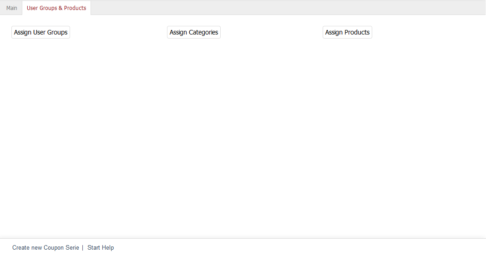

User Groups & Products tab
========================================

Coupon series can apply to user groups, categories or individual products, or any combination thereof. The :guilabel:`User Groups & Products` tab allows you to assign user groups, categories and/or products to the coupon series. Without such an assignment, the coupons in a series will apply to all users and the complete product catalogue.

If categories and/or products have been assigned, you will need to consider the option :guilabel:`Calculate only once (valid only for assigned vouchers)` in the :guilabel:`Main` tab. This setting controls whether a coupon will be applied just once or to all assigned products in the shopping cart.

:guilabel:`Assign User Groups` |br|
Clicking on this button will open the assignment window which displays the two lists - :guilabel:`All User Groups` and :guilabel:`Available for User Groups`. User groups can be filtered and sorted by title. Drag the desired user groups from the left-hand list into the right-hand list using the mouse. Hold down the Ctrl key to select multiple user groups. The assignment is now completed.

:guilabel:`Assign Categories` |br|
A coupon series can apply to one or more categories. Clicking on :guilabel:`Assign Categories` opens a new window. All available categories will be displayed in the left-hand list. Categories can be filtered and sorted by title and description. Drag and drop the desired categories into the right-hand list of the assignment window. Hold down the Ctrl key to select multiple categories. The assignment is now completed.

:guilabel:`Assign Products` |br|

The coupon series can also have individual products assigned to it. Clicking on :guilabel:`Assign Products` opens a new window. All available products will be displayed in the left-hand list. Select a category from the drop-down list if you only want to display products from this category. You can also filter and sort products by product number, title and/or EAN. Drag and drop the products into the right-hand list to assign them to the category. Hold down the Ctrl key to select multiple products. The assignment is now completed.

.. Intern: oxbaht, Status:, F1: voucherserie_groups.html