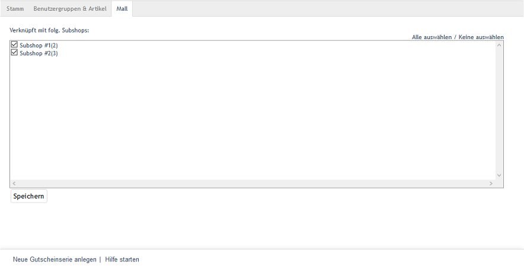

Registerkarte Mall
==================
Die Registerkarte :guilabel:`Mall` ist bei Gutscheinserien nur in der Enterprise Edition vorhanden.

Gutscheinserien können beim Erstellen von Shops an diese vererbt werden. Wird diese Option gewählt, enthält ein neuer Shop alle Gutscheinserien des Elternshops. Die Eigenschaften dieser Gutscheinserien sind nicht änderbar.

Auf der Registerkarte :guilabel:`Mall` werden die Verknüpfungen einer Gutscheinserie zu Subshops und Supershops verwaltet. Bei Multishops ist die Anzeige leer, da sie ohne eine derartige Verknüpfung Gutscheinserien aus allen Shops übernehmen und anzeigen.

Es ist möglich, die Vererbung aller Gutscheinserien für einen Shop rückgängig zu machen. Dazu muss in der Registerkarte :guilabel:`Mall` des Subshops oder Supershops unter :menuselection:`Stammdaten --> Grundeinstellungen` das Häkchen aus den Vererbungseinstellungen entfernt werden.

:guilabel:`Verknüpft mit folg. Subshops` |br|
Die Verknüpfung einer Gutscheinserie mit Subshops und Supershops kann hinzugefügt oder entfernt werden, indem das entsprechende Kontrollkästchen angehakt wird oder nicht. Bei nicht aktiviertem Kontrollkästchen ist die Gutscheinserie im Elternshop vorhanden, aber nicht im jeweiligen Subshop oder Supershop.

Über die Links :guilabel:`Alle auswählen` und :guilabel:`Keine auswählen` auf der rechten Seite des Fensters können alle Shops verknüpft oder alle Verknüpfungen zu den Shops entfernt werden. Vorgenommene Änderungen müssen gespeichert werden und sind für die Subshops oder Supershops sofort wirksam.

.. Intern: oxbahu, Status:, F1: voucherserie_mall.html