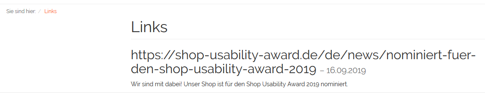

Links
=====

Shopbetreiber können Kunden ihres Onlineshops interessante Links mit einem ergänzenden Text empfehlen. Diese Links können auf externe Internetadressen verweisen oder auch Seiten des Onlineshops selbst aufrufen. Eine Seite, die über :guilabel:`Links` im Fußbereich des Frontends aufgerufen werden kann, listet alle aktiven Links und ihre Beschreibung auf. Der neueste Link wird dabei ganz oben, ältere Links werden darunter angezeigt.

Der Abschnitt "Links" informiert Sie über das Erstellen und Verwalten von Links.

Um Links zu bearbeiten, gehen Sie im Administrationsbereich des Shops zu :menuselection:`Kundeninformation --> Links`. Es werden die Liste der Links und darunter der Eingabebereich für die Links angezeigt.

.. image:: ../../media/screenshots/oxbajf02.png
   :alt: Links
   :height: 541
   :width: 650

In der Linkliste symbolisiert ein kleines grünes Quadrat am Anfang der Zeile einen aktiven Link. Wurde ein Link nicht aktiviert, fehlt dieses Symbol.

Die Liste zeigt das Datum und die URL des Links. Nach Links kann gesucht werden, indem Suchfelder für Datum und URL verwendet werden. Links lassen sich durch einen Klick auf das Löschsymbol am Ende der Zeile endgültig aus der Datenbank entfernen.

Wird ein Link aus der Liste gewählt, werden dessen Informationen in den Eingabebereich geladen. Zum Erstellen eines neuen Links klicken Sie am unteren Bildschirmrand auf :guilabel:`Neuen Link anlegen`.

-----------------------------------------------------------------------------------------

Registerkarte Stamm
-------------------
**Inhalte**: aktiver Link, Veröffentlichungsdatum, URL, in Sprache bearbeiten, Text zum Link, Editor Summernote, WYSIWYG |br|
:doc:`Artikel lesen <registerkarte-stamm>` |link|

Registerkarte Mall
------------------
Nur in der Enterprise Edition vorhanden |br|
**Inhalte**: Links vererben, Links verknüpfen, Elternshop, Subshop, Supershop, Multishop, Mall |br|
:doc:`Artikel lesen <registerkarte-mall>` |link|

.. Intern: oxbajf, Status: