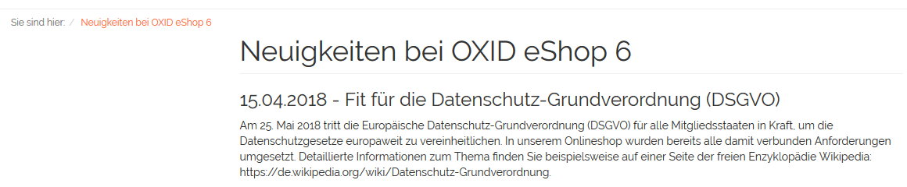

Nachrichten
===========

Mit Nachrichten können Kunden direkt im Onlineshop über aktuelle Themen informiert werden. Sie eignen sich für kurze und kompakte Informationen, die beispielsweise für einen definierten Zeitraum aktiv sind oder aber nur bestimmten Benutzergruppen angezeigt werden können. Im Theme "Azure" wurden Nachrichten in einer Nachrichten-Box im Seitenbereich des Frontends angezeigt. Mit "Flow", Standard-Theme seit OXID eShop 6.0.0, sind die Nachrichten nur über den Link :guilabel:`News` im Fußbereich aufrufbar. Eine Seite listet alle aktiven Nachrichten auf, für die der Kunde berechtigt ist. Die neueste Nachricht wird dabei als erste, ältere Nachrichten werden darunter angezeigt.

Der Abschnitt "Nachrichten" informiert Sie über das Erstellen und Verwalten von Nachrichten. Im Administrationsbereich finden sich ein paar Einstellungen für Nachrichten, beispielsweise unter :menuselection:`Stammdaten --> Grundeinstellungen` auf der Registerkarte  :guilabel:`Perform.` oder :menuselection:`Stammdaten --> Grundeinstellungen` auf der Registerkarte  :guilabel:`Einstell.`, die aber für das Theme "Flow" nicht mehr relevant sind. Sie beziehen sich auf die Anzeige von Nachrichten in einer Box, wie sie in den Themes "Basic" und "Azure" implementiert war. Im Theme "Flow" ist der Link :guilabel:`News` im Fußbereich hingegen immer sichtbar. Denkbar aber wäre eine benutzerdefinierte Anzeige von Nachrichten, welche die noch vorhandenen Einstellungen nutzt.

Um Nachrichten zu bearbeiten, gehen Sie im Administrationsbereich des Shops zu :menuselection:`Kundeninformation --> Nachrichten`. Es werden die Liste der Nachrichten und darunter der Eingabebereich für die Nachrichten angezeigt.

.. image:: ../../media/screenshots/oxbajb02.png
   :alt: Nachrichten, Neuigkeiten, News
   :height: 541
   :width: 650

In der Liste symbolisiert ein kleines grünes Quadrat am Anfang der Zeile eine aktive Nachricht. Wurde eine Nachricht nicht aktiviert oder liegt das aktuelle Datum nicht in einem definierten Aktivierungszeitraum, fehlt dieses Symbol. Die Liste zeigt das Datum und den Titel der Nachricht. Nach Nachrichten kann gesucht werden, indem Suchfelder für Datum und Titel verwendet werden. Nachrichten lassen sich durch einen Klick auf das Löschsymbol am Ende der Zeile endgültig aus der Datenbank entfernen.

Wird eine Nachricht aus der Liste gewählt, werden deren Informationen in den Eingabebereich geladen. Zum Erstellen einer neuen Nachricht klicken Sie am unteren Bildschirmrand auf :guilabel:`Neue Nachricht` anlegen.

-----------------------------------------------------------------------------------------

Registerkarte Stamm
-------------------
**Inhalte**: aktive Nachricht, immer aktiv, aktiv für Zeitraum, Veröffentlichungsdatum, Nachrichtentitel, in Sprache bearbeiten, Benutzergruppen zuordnen |br|
:doc:`Artikel lesen <registerkarte-stamm>` |link|

Registerkarte Text
------------------
**Inhalte**: Text der Nachricht, Editor Summernote, WYSIWYG, Textformatierung und -ausrichtung, Schriftarten und -farbe, Aufzählungen und Listen, Tabellen, Links, Bilder, Videos, HTML-Code |br|
:doc:`Artikel lesen <registerkarte-text>` |link|

Registerkarte Mall
------------------
Nur in der Enterprise Edition vorhanden |br|
**Inhalte**: Nachrichten vererben, Nachrichten verknüpfen, Elternshop, Subshop, Supershop, Multishop, Mall  |br|
:doc:`Artikel lesen <registerkarte-mall>` |link|

.. Intern: oxbajb, Status: