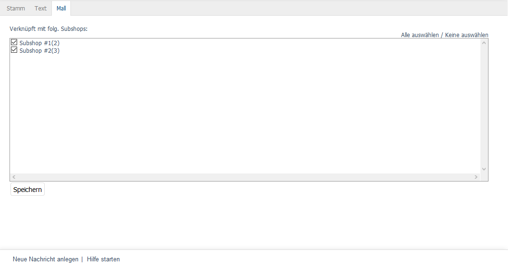

Registerkarte Mall
==================

Die Registerkarte :guilabel:`Mall` ist bei Nachrichten nur in der Enterprise Edition vorhanden.

Nachrichten können beim Erstellen von Shops an diese vererbt werden. Wird die Option :guilabel:`Dieser Shop erbt alle Artikel und Einstellungen vom Elternshop` gewählt, enthält ein neuer Shop auch alle Nachrichten des Elternshops. Die vererbten Nachrichten sind nicht änderbar.

Auf der Registerkarte :guilabel:`Mall` werden die Verknüpfungen einer Nachricht zu Subshops und Supershops verwaltet. Bei Multishops ist die Anzeige leer, da sie ohne eine derartige Verknüpfung Nachrichten aus allen Shops übernehmen und anzeigen.

Es ist möglich, die Vererbung aller Nachrichten für einen Shop rückgängig zu machen. Dazu muss in der Registerkarte :guilabel:`Mall` des Subshops oder Supershops unter :menuselection:`Stammdaten --> Grundeinstellungen` das Häkchen aus den Vererbungseinstellungen entfernt werden.

:guilabel:`Verknüpft mit folg. Subshops`
   Die Verknüpfung einer Nachricht mit Subshops und Supershops kann hinzugefügt oder entfernt werden, indem das entsprechende Kontrollkästchen angehakt wird oder nicht. Bei nicht aktiviertem Kontrollkästchen ist die Nachricht im Elternshop vorhanden, aber nicht im jeweiligen Subshop oder Supershop.

Über die Links :guilabel:`Alle auswählen` und :guilabel:`Keine auswählen` auf der rechten Seite des Fensters können alle Shops verknüpft oder alle Verknüpfungen zu den Shops entfernt werden. Vorgenommene Änderungen müssen gespeichert werden und sind für die Subshops oder Supershops sofort wirksam.

.. Intern: oxbaje, Status:, F1: news_mall.html