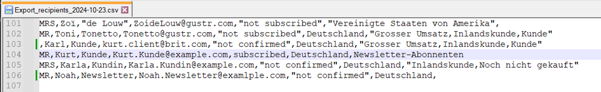

Newsletter
==========

Informieren Sie die Kunden Ihres OXID eShops mit einem Newsletter über aktuelle Themen. Geben Sie Tipps, kündigen Sie Aktionen an und bewerben Sie Artikel.

Newsletter dienen der Kundeninformation und tragen zugleich zur Kundenbindung bei.

Newsletter aus Kundensicht
--------------------------

Kunden abonnieren den Newsletter entweder bei der Registrierung oder indem sie das Newsletter-Formular ausfüllen und absenden.

Die Kunden erhalten eine Bestätigungs-E-Mail und müssen dem Versand von Newslettern explizit zustimmen. Dieses Verfahren wird als Double-Opt-In bezeichnet und stellt sicher, dass kein Unbefugter jemanden für den Newsletter einträgt.

.. _oxbaie01:

.. figure:: ../../media/screenshots/oxbaie01.png
   :alt: Newsletter abonnieren
   :width: 650
   :class: with-shadow

   Abb.: Newsletter abonnieren

Kunden können den Newsletter abbestellen, indem sie das Newsletter-Formular ausfüllen und :guilabel:`Abmelden` wählen (:ref:`oxbaie02`).

.. _oxbaie02:

.. figure:: ../../media/screenshots/oxbaie02.png
   :alt: Newsletter-Formular bearbeiten
   :width: 650
   :class: with-shadow

   Abb.: Newsletter-Formular bearbeiten

Newsletter-Funktion nutzen
--------------------------

Newsletter-Abonnenten anzeigen
^^^^^^^^^^^^^^^^^^^^^^^^^^^^^^

Benutzer, die den Newsletter abonniert haben (und den Opt-in-Status `subscribed` haben, siehe :ref:`oxbaie03`), sind automatisch der Benutzergruppe "Newsletter-Abonnenten" zugeordnet.

|procedure|

Um die Newsletter-Abonnenten anzuzeigen, tun Sie folgendes:

1. Wählen Sie im Administrationsbereich unter :menuselection:`Benutzer verwalten --> Benutzergruppen`.
#. Wählen Sie :guilabel:`Benutzer zuordnen`.

   Die Mitglieder der Benutzergruppe werden angezeigt.

Newsletter senden
^^^^^^^^^^^^^^^^^

Newsletter werden in regelmäßigen oder unregelmäßigen Abständen als E-Mail an Kunden versandt.

Nutzen Sie dazu einen der vielen Anbieter von Newsletter-Diensten, cloudbasierte Newsletter-Tools oder Newsletter-Software.

Exportieren Sie eine Liste der Newsletter-Abonnenten, die Sie dem externen Anbieter übergeben.

|procedure|

1. Wählen Sie im Administrationsbereich des Shops :menuselection:`Kundeninformation --> Newsletter`.
#. Wählen Sie die Schaltfläche :guilabel:`Benutzer exportieren`.

   Die Datensätze :emphasis:`aller` Benutzer werden in eine CSV-Datei geschrieben, deren Dateinamen aus :file:`Export_user_recipient_status_`, einem angehängten Datum im Format JJJJ-MM-TT und der Dateiendung :file:`.csv` besteht.

   Die Datei enthält für jeden Benutzer: Anrede, Vorname, Nachname, E-Mail-Adresse, Opt-in-Status, Land und zugeordnete Benutzergruppen (:ref:`oxbaie03`).

   Der Opt-in-Status kann sein:

   * `not subscribed`: Registrierte Kunden, die keinen Newsletter abonnieren
   * `not confirmed`: Interessenten, die das Newsletter-Formular ausgefüllt haben, aber die Bestätigungs-Email noch nicht bestätigt haben
   * `subscribed`: Newsletter-Abonnenten

#. Öffnen Sie die CSV-Datei beispielsweise in MS Excel mit dem Textimport-Tool und filtern Sie auf die Benutzer, die den Opt-in-Status `subscribed` haben.

.. _oxbaie03:

   Abb.: Benutzer als CSV-Datei exportieren

.. Intern: oxbaie, Status: