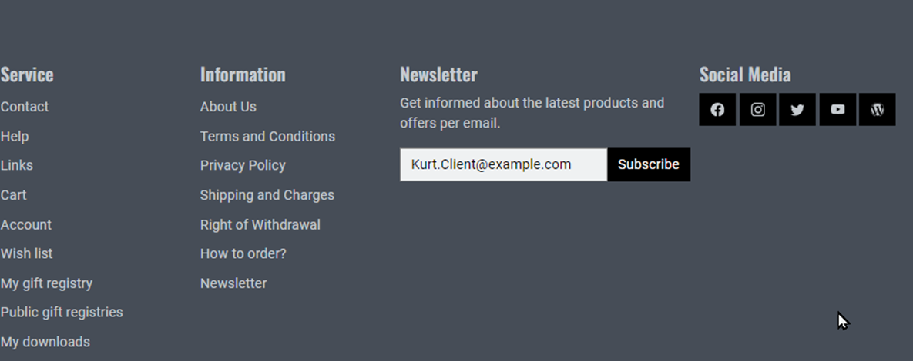

Newsletter
==========

Newsletter stellen eine unkomplizierte und schnelle Möglichkeit dar, die Kunden des Onlineshops über aktuelle Themen zu informieren, Tipps zu geben, Aktionen anzukündigen und Artikel zu bewerben. Sie dienen damit der Kundeninformation und stellen zugleich Kundenbindung her. Newsletter können in regelmäßigen oder unregelmäßigen Abständen als E-Mail an Kunden versandt werden. Diese müssen den Newsletter abonniert haben, indem sie dies beispielsweise bei der Registrierung bestätigt oder das Newsletter-Formular ausgefüllt und abgeschickt haben. Darüber hinaus müssen die Kunden dem Versand von Newslettern an die eigene E-Mail-Adresse nochmals explizit zustimmen. Dieses Verfahren wird als Double-Opt-In bezeichnet und stellt sicher, dass kein Unbefugter jemanden für den Newsletter einträgt.

Benutzer, die den Newsletter abonniert haben, werden automatisch der Benutzergruppe "Newsletter-Abonnenten" zugeordnet. Sie können im Administrationsbereich unter :menuselection:`Benutzer verwalten --> Benutzergruppen` eingesehen werden. Kunden können den Newsletter abbestellen, indem sie das Newsletter-Formular ausfüllen und :guilabel:`Stornieren` wählen.

Der Abschnitt "Newsletter" informiert Sie über das Erstellen und Verwalten von Newslettern. Um Newsletter zu bearbeiten, gehen Sie im Administrationsbereich des Shops zu :menuselection:`Kundeninformation --> Newsletter`. Es werden die Liste der Newsletter und darunter der Eingabebereich für die Newsletter angezeigt. Wird ein Newsletter aus der Liste gewählt, werden dessen Informationen in den Eingabebereich geladen. Zum Erstellen eines neuen Newsletters klicken Sie am unteren Bildschirmrand auf :guilabel:`Neue Newslettervorlage`.

Nach Newslettern kann gesucht werden, indem eine Zeichenfolge in das Suchfeld eingegeben und die Suche über das Lupensymbol gestartet wird. Dadurch werden in der Liste nur noch die Newsletter angezeigt, deren Titel diese Zeichenfolge enthält. Newsletter lassen sich durch einen Klick auf das Löschsymbol am Ende der Zeile aus der Datenbank entfernen. Der Beispiel-Newsletter kann nicht gelöscht werden.

.. Intern: oxbaie, Status: