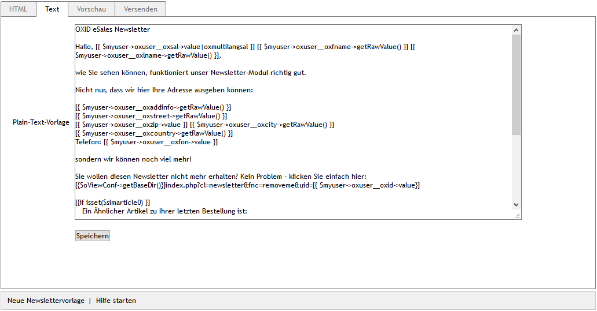

Registerkarte Text
==================

Der OXID eShop verschickt Newsletter immer in zwei Formaten: als Nur-Text-Mail und als HTML-Mail. Dadurch wird sichergestellt, dass der Newsletter von allen Mail-Programmen und Webmailern korrekt angezeigt wird. Auf der Registerkarte :guilabel:`Text` wird der Newsletter im Nur-Text-Format erstellt.

Der Text des Newsletters wird in das große Eingabefeld dieser Registerkarte eingetragen. Wie in der HTML-Mail kann der Text Platzhalter für dynamische Inhalte enthalten. An dafür vorgesehenen Textstellen können Inhalte aus dem Onlineshop, wie beispielsweise die Anrede, der Vor- und Zuname eines Benutzers, die Adresse des Shops oder Informationen zu bestimmten Artikeln, ausgegeben werden.

Die dynamischen Inhalte werden mit der einer Template-Engine *Smarty*  umgesetzt. Der bereitgestellte Standard wurde mit speziellen, für den Onlineshop benötigten Funktionen erweitert. Die dazugehörigen Dateien befinden sich im Ordner :file:`/core/smarty/plugins`.

Aus dem Beispiel-Newsletter stammen die folgenden Zeilen, welche die Funktionsweise der Smarty-Anweisungen verdeutlicht. Beim Versenden des Newsletters werden die Smarty-Anweisungen, die wie Platzhalter fungieren, durch reale Daten aus dem Shop ersetzt.

.. code:: html

   [{if isset($articlelist) }]
      Ausgesuchte Artikel aus unserem Shop extra für diesen Newsletter:
      [{foreach from=$articlelist item=product}]
         [{ $product->oxarticles__oxtitle->getRawValue() }]   Jetzt nur [{ $product->getFPrice() }] [{ $mycurrency->name}]
      [{/foreach}]
   [{/if}]

Zunächst wird geprüft, ob es eine Liste mit Artikeln gibt. Ist diese vorhanden, wird eine Schleife durchlaufen, um alle Artikel aus dieser Liste mit ihrem Preis aufzulisten. Das Ergebnis kann auf der Registerkarte :guilabel:`Vorschau` eingesehen werden. Eine Liste mit Artikeln ist dann vorhanden, wenn der Aktion \"Newsletter\" Artikel zugeordnet wurden.

.. seealso:: `Smarty Template Engine <https://www.smarty.net>`_ | :doc:`Registerkarte Vorschau <registerkarte-vorschau>` | :doc:`Aktion für Newsletter <../aktionen/aktion-fuer-newsletter>`

.. Intern: oxaaif, Status:, F1: newsletter_plain
