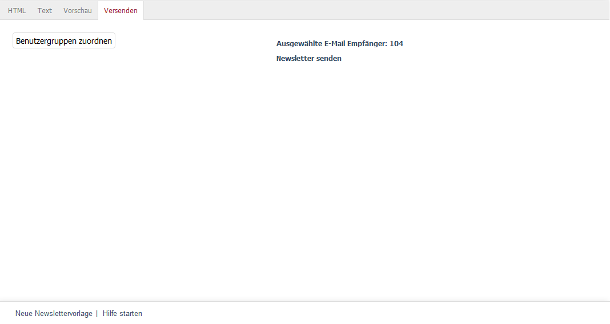

Registerkarte Versenden
=======================

Newsletter können auf der Registerkarte :guilabel:`Versenden` an die Abonnenten verschickt werden.

Zuerst werden die Benutzergruppen zugewiesen. Damit kann der Newsletter beispielsweise zunächst an eine Testgruppe geschickt werden, bevor er später an die eigentliche Benutzergruppe "Newsletter-Abonnenten" geht. Nach der Zuordnung wird angezeigt, an wie viele Empfänger der Newsletter versendet wird. Mit einem Klick auf den Link :guilabel:`Newsletter senden` beginnt der Versand.

Der Newsletter wird nicht auf einmal an alle Empfänger versandt. In sogenannten Ticks wird eine definierte Anzahl von Mails verschickt. Die Standardeinstellung sind zwanzig E-Mails pro Tick. Dies kann im Administrationsbereich unter :menuselection:`Stammdaten --> Grundeinstellungen` unter :menuselection:`Weitere Einstellungen` geändert werden. Wie viele E-Mails ohne Probleme versendet werden können, hängt auch vom Hosting Provider ab.

Bevor Sie den finalen Newsletter verschicken, sollten Sie testen, wie dieser in den gängigen Mail-Programmen und Browsern dargestellt wird. Dabei gilt es auch, Besonderheiten zu beachten. Oft blockieren Benutzer die Anzeige von Bildern oder schauen sich den Newsletter nur in einer Vorschau an. Immer mehr hat auch das Smartphone an Bedeutung gewonnen, auf denen schnell mal die Mails durchgesehen werden.

Wenn Sie Konten und Mailadressen bei diversen Webmail-Dienstleistern und verschiedene Mail-Programme installiert haben, können Sie den vorbereiteten Newsletter an die speziellen Benutzer einer Testgruppe schicken. Im Internet finden sich aber auch Lösungen, welche diese Tests erleichtern. Newletter werden dabei in vielen wichtigen Mail-Clients, wie beispielsweise Microsoft Outlook, Apple Mail, Gmail oder Thunderbird angezeigt, aber auch für die Darstellung in mobilen und Web-Clients aufbereitet.

.. Intern: oxbaii, Status:, F1: newsletter_selection
