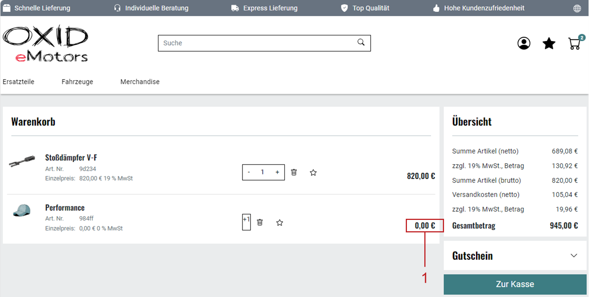

Gratisartikel als Rabatt anlegen
================================

Neben dem absoluten und relativen Preisnachlass bietet der OXID eShop eine dritte Rabattmöglichkeit: einen Gratisartikel.

Erfüllt ein Kauf die Bedingungen für den Rabatt, wird der vorgesehene Artikel automatisch als kostenlose Zugabe in den Warenkorb gelegt.

So können Sie Rabattaktionen für bestimmte Einkaufswerte oder Mengen erstellen, so dass Kunden Gratisartikel erhalten.

Sobald der Artikel als Zugabe in den Warenkorb gelegt wird, setzt das System seinen Preis automatisch auf Null. Der ursprüngliche Preis in der Artikelverwaltung bleibt unverändert.

|procedure|

1. Wählen Sie :menuselection:`Shopeinstellungen --> Rabatte`.
#. Legen Sie einen neuen Rabatt an, vergeben Sie einen aussagekräftigen Namen und wählen Sie aus der Dropdown-Liste :guilabel:`Rabatt` den Eintrag :guilabel:`itm`.
#. Wählen Sie :guilabel:`Speichern`.
#. Wählen Sie die Schaltfläche :guilabel:`Artikel auswählen` auf der Registerkarte :guilabel:`Stamm`.
#. Verschieben Sie den Artikel, der als Gratisartikel dienen soll, per Drag \& Drop in die rechte Liste des Zuordnungsfensters und schließen Sie das Zuordnungsfenster.
#. Stellen Sie im Feld :guilabel:`Menge` sicher, dass der Artikel mindestens 1 Mal in den Warenkorb gelegt wird.
#. Optional: Um die Anzahl der Gratisartikel von der Menge der gekauften Artikel abhängig zu machen, aktivieren Sie die Option :guilabel:`Multiplizieren`.
#. Wählen Sie :guilabel:`Speichern`.
#. Legen Sie fest, wo der Rabatt angezeigt werden soll: in der Artikelübersicht oder Detailansicht oder erst im Warenkorb.

   Typischerweise wollen Sie, dass der Gratisartikel erst im Warenkorb erscheint.

   Um das umzusetzen, folgen Sie der Anleitung im Schritt :ref:`Plazierung bestimmen <Rabatt-Plazierung-bestimmen>` (unter :ref:`betrieb/rabatte/rabatte:Anlegen und Verwalten von Rabatten`).

#. Stellen Sie sicher, dass der Rabatt aktiv ist.
#. Speichern Sie die Einstellungen.
#. Ordnen Sie auf der Registerkarte :guilabel:`Artikel` die Artikel oder Kategorien zu, bei denen Sie den Rabatt gewähren wollen.

|result|

Die Anzahl der kostenfreien Zugaben wird im Warenkorb berechnet. Der oder die Gratisartikel werden angezeigt (:ref:`oxbahi03`, Pos. 1).

Die Anzahl der Gratisartikel ergibt sich aus der Formel: (gekaufte Artikel / Mindesteinkaufsmenge) × eingetragene Menge.

Beispiel: Ein Kunde kauft 10 Artikel, für die der Rabatt gilt.

Mindesteinkaufsmenge: 3
|br|
Menge der Zugabe: 1
|br|
→ Berechnung: (10/3) × 1 = 3 Gratisartikel

Ist die Menge der Zugabe 2, verdoppelt sich die Anzahl der Gratisartikel auf 6.

.. _oxbahi03:

   Abb.: Beispiel eines Artikels mit einem Gratisartikel im Warenkorb

.. Intern: oxbahq, Status: