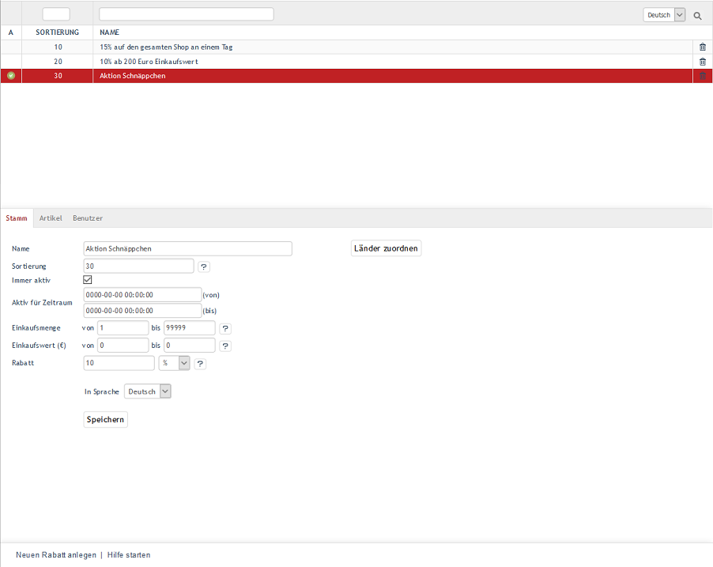

Rabatte
*******
Rabattangebote sind neben Gutscheinserien, Newslettern oder Aktionen ein wichtiges Marketinginstrument in Ihrem OXID eShop. Mit einem Rabatt gewähren Sie einen Nachlass auf den sonst üblichen Preis eines Artikels, wenn bestimmte Bedingungen erfüllt sind. Günstigere Artikelpreise können für bestimmte Artikel, Kategorien, Benutzer, Benutzergruppen, Einkaufswerte oder -mengen festgelegt werden. Mit den vielfältigen Möglichkeiten der Rabatte bieten Sie Ihren Kunden Einkaufsvorteile und fördern so die Kundenbindung.

Rabatte lassen sich für einen bestimmten Zeitraum oder gar länderspezifisch definieren. Sie können so eingestellt werden, dass das Angebot direkt mit den ermäßigten Preisen angezeigt wird. Es ist aber auch möglich, dass der Rabatt erst im Warenkorb berechnet und ausgewiesen wird. Rabatte können prozentual oder absolut zum Artikelpreis vergeben werden. Neben der Ermäßigung des Artikelpreises gibt es auch die Möglichkeit, bei jedem Kauf, der den Rabattkriterien entspricht, einen Gratisartikel in den Warenkorb zu legen.

Mengennachlass oder Staffelrabatt können mit Staffelpreisen bei den Artikeln umgesetzt werden. Damit kann definiert werden, dass ein Artikel günstiger wird, sobald eine bestimmte Menge dieses Artikels gekauft wird. Siehe: :doc:`Artikel - Registerkarte Lager <../../einrichtung/artikel/registerkarte-lager>`

Ein beim Kauf gewährter Rabatt lässt sich nachträglich in der Bestellverwaltung ändern. Ebenso kann ein Rabatt nach erfolgter Bestellung auf den Warenkorbwert gegeben werden. Siehe: :doc:`Bestellungen - Registerkarte Stamm <../bestellungen/registerkarte-stamm>`

Im OXID eShop können natürlich verschiedene Rabatte aktiv sein, so dass unter bestimmten Bedingungen mehrere Rabatte beim Einkauf berücksichtigt und im Warenkorb ausgewiesen werden. Dabei werden Rabatte, die für bestimmte Artikel gelten, im Warenkorb durch den jetzt gültigen rabattierten Preis und den durchgestrichenen, ursprünglichen Artikelpreis kenntlich gemacht. Rabatte, die für den gesamten Warenkatalog gelten, werden als jeweils eine Zeile bei der Auflistung des Gesamtbetrages für den Warenkorb angezeigt.

.. image:: ../../media/screenshots-de/oxbahh02.png
   :alt: Kite mit 2 Rabatten im Warenkorb
   :height: 317
   :width: 650

Der Abschnitt \"Rabatte\" informiert Sie darüber, wie Rabatte erstellt und mit welchen Einstellungen sie individualisiert und für bestimmte Kundengruppen genutzt werden können. In ihm werden auch einige typische Beispiele für Rabatte aufgezeigt.

Rabatte können im Administrationsbereich unter :menuselection:`Shopeinstellungen --> Rabatte` bearbeitet werden. Es werden eine Liste mit den vorhandenen Rabatten und darunter der Eingabebereich für die Rabatte angezeigt.

In der Liste der Rabatte symbolisiert ein kleines grünes Quadrat am Anfang der Zeile einen aktiven Rabatt. Wurde ein Rabatt nicht aktiviert, fehlt dieses Symbol. Die Liste zeigt ausschließlich den Namen des Rabattes an. Nach Rabatten kann gesucht werden, indem Zeichen in das Suchfeld eingegeben werden. Die Namen der Rabatte werden nach diesen Zeichen durchsucht, sobald die Eingabe mit einem Enter abgeschlossen oder das Lupen-Symbol angeklickt wurde.

Rabatte lassen sich durch einen Klick auf das Löschsymbol am Ende der Zeile endgültig aus der Datenbank entfernen. Soll der Rabatt nur nicht aktiv sein, entfernen Sie das Häkchen bei :guilabel:`Immer aktiv` und achten Sie darauf, dass kein Zeitraum eingetragen ist. Ein Eintrag würde den Rabatt ansonsten für den angegebenen Zeitraum aktivieren.

Wird ein Rabatt aus der Liste der Rabatte gewählt, werden dessen Informationen in den Eingabebereich geladen. Zum Erstellen eines neuen Rabattes klicken Sie am unteren Bildschirmrand auf :guilabel:`Neuen Rabatt anlegen`.

-----------------------------------------------------------------------------------------

Registerkarte Stamm
+++++++++++++++++++ 
**Inhalte**: aktiver Rabatt, immer aktiv, aktiv für Zeitraum, Einkaufsmenge, Einkaufswert, absoluter Rabatt, prozentualer Rabatt, Dreingabe, Zugabe, kostenfreier Artikel |br|
:doc:`Artikel lesen <registerkarte-stamm>` |link|

Registerkarte Artikel
+++++++++++++++++++++
**Inhalte**: Artikel und Kategorien zuordnen |br|
:doc:`Artikel lesen <registerkarte-artikel>` |link|

Registerkarte Benutzer
++++++++++++++++++++++
**Inhalte**: Benutzer und Benutzergruppen zuordnen |br|
:doc:`Artikel lesen <registerkarte-benutzer>` |link|

Registerkarte Mall
++++++++++++++++++
Nur in der Enterprise Edition vorhanden |br|
**Inhalte**: Rabatte vererben, Rabatte verknüpfen, Elternshop, Subshop, Supershop, Multishop, Mall |br|
:doc:`Artikel lesen <registerkarte-mall>` |link|

.. Intern: oxbahh, Status: