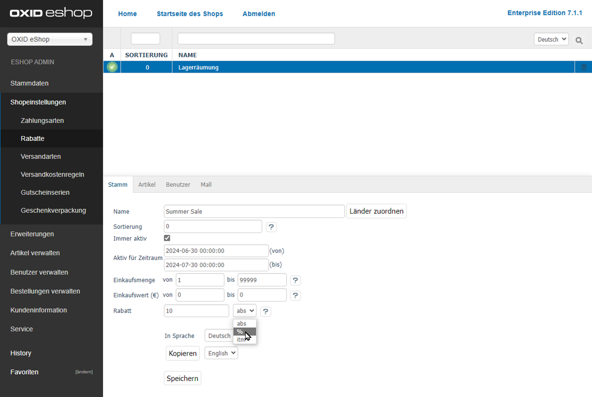

Rabatte: Übersicht
==================

Rabattangebote sind neben Gutscheinserien, Newslettern oder Aktionen ein wichtiges Marketinginstrument in Ihrem OXID eShop.

Mit einem Rabatt gewähren Sie einen Nachlass auf den sonst üblichen Preis eines Artikels, wenn bestimmte Bedingungen erfüllt sind.

Günstigere Artikelpreise können Sie für bestimmte Artikel, Kategorien, Benutzer, Benutzergruppen, Einkaufswerte oder -mengen festlegen.

Mit den vielfältigen Möglichkeiten der Rabatte bieten Sie Ihren Kunden Einkaufsvorteile und fördern so die Kundenbindung.

Arten von Rabatten
------------------

* Den Wert des Rabatts können Sie wie folgt festlegen:

  * prozentual zum Artikelpreis
  * absolut
  * als Gratisartikel, der automatisch in den Warenkorb gelegt wird

* Schränken Sie die Gültigkeit ein

  * nach Kategorien oder Artikeln
  * nach Benutzern oder Benutzergruppen
  * für einen bestimmten Zeitraum
  * länderspezifisch

* Einen Mengennachlass oder Staffelrabatt können Sie mit Staffelpreisen bei den Artikeln umsetzen.

  Damit können Sie definieren, dass ein Artikel günstiger wird, sobald eine bestimmte Menge dieses Artikels gekauft wird.

  Weitere Informationen finden Sie unter :doc:`Artikel - Registerkarte Lager <../../einrichtung/artikel/registerkarte-lager>`

.. _oxbahh01:

   Abb.: Beispiel: Zeitlich begrenzten Rabatt von 10% anlegen

Anzeigen von Rabatten
---------------------

.. todo: #SB: OXDEV-tbd Wie geht das Folgende: Siehe unten, ich kriegs nicht hin.
.. todo: #SB: OXDEV-tbd: Wenn es geht, was sind typische USe Cases? : k.A., evtl. techn. Gründe, zu klären
.. todo: #SB: OXDEV-?Das Folgende funktioniert nicht richtig: Rabatte Einkaufswert und oder Menge = 0 OX5: kein Rabatt im Shop, OK: Einkaufswert in Warenkorb von 1 Achskörper Roadurance

   .. todo: alter Text:
    * Steht in beiden Feldern 0, werden alle Artikel, für die dieser Rabatt gilt, im Shop direkt mit dem rabattierten Preis angezeigt.
    * Beginnt die Einkaufsmenge und/oder der Einkaufswert mit 1, wird der Rabatt erst im Warenkorb ausgewiesen.

* Bestimmen Sie die Plazierung:

  * Zeigen Sie das Angebot direkt mit den ermäßigten Preisen an.
  * Weisen Sie den Rabatt erst im Warenkorb aus.

    Beispiel: Sie wollen, dass die Rabattart Zugabe im Warenkorb angezeigt wird und nicht in der Artikelübersicht oder auf der Detailseite (siehe :ref:`betrieb/rabatte/artikel-als-zugabe:Gratisartikel als Rabatt anlegen`).

  Weitere Informationen finden Sie im Schritt :ref:`Plazierung bestimmen <Rabatt-Plazierung-bestimmen>` (unter :ref:`betrieb/rabatte/rabatte:Anlegen und Verwalten von Rabatten`).

* Aktivieren Sie in Ihrem OXID eShop bei Bedarf verschiedene Rabatte gleichzeitig, so dass unter bestimmten Bedingungen mehrere Rabatte beim Einkauf berücksichtigt und im Warenkorb ausgewiesen werden.

  Dabei werden Rabatte, die für bestimmte Artikel gelten, im Warenkorb durch den jetzt gültigen rabattierten Preis und den durchgestrichenen, ursprünglichen Artikelpreis kenntlich gemacht.

  .. todo: #SB: Multiple Rabatte werden nicht aufgeschlüsselt: https://oxid-esales.atlassian.net/browse/OXDEV-8435?focusedCommentId=168711 "Dabei werden Rabatte, die für bestimmte Artikel gelten" -- Wie mache ich das? Z.B. Lagerräumungsrabatt 5000 € für OX7 Coupé zeigt an durchgestrichen, falsch: 115.000,00 €statt 120k, rabattierter Pries korrekt 115.000,00 €

  Rabatte, die für den gesamten Warenkatalog gelten, werden als jeweils eine Zeile bei der Auflistung des Gesamtbetrages für den Warenkorb angezeigt.

.. todo: "eine Zeile bei der Auflistung": OK: in meinem Fall "Rabatt 5% ab 500 € Einkaufswert"
.. todo: #SB: OXDEV-? Sonnenbrille Ocean Eyes 95,85: Summer Sale 10% : rabattierter Preis 95,85: kein Rabatt angewendet, unabhängig von Sortierreihenfolge -- geht -- Bug ist: Rabattierter Preis wird nicht in Übersicht angezeigt

.. todo: #tbd: Bild neu, sobald APEX-Bugs gefixt: 2 Rabatte
    .. _oxbahh02:
    .. figure:: ../../media/screenshots/oxbahh02.png
       :alt: Beispiel: Artikel mit 2 Rabatten im Warenkorb
       :width: 650
       :class: with-shadow
       Abb.: Beispiel: Artikel mit 2 Rabatten im Warenkorb

.. Verwalten von Rabatten in der Bestellverwaltung
.. -----------------------------------------------
.. todo: #SB: Kann ich das Folgende einfach so machen, z.B. Rabatt streichen. Was ist der USe CAse? -- Geht nicht juristisch, höchsetens neue Ordner machen , alte Order als annulliert markieren; löschen! In Bestellverwaltung prüfen, ob es technisch überhaupt ginge; system speicher nur Gesamtsumme, aber nicht Rabatte und Gutscheine
.. todo: #SB: Neun, das geht offenbar gar nicht:
.. todo: #SB: Was auch auffällt: Endpreis mit Rabatt wird richtig berechnet, z.B. Cpoupé: Artikel brutto	108.000,00	  EUR, aber angezeigt als "Rabatt  	- 0,00	  EUR"

.. Ein beim Kauf gewährter Rabatt lässt sich nachträglich in der Bestellverwaltung ändern. Ebenso kann ein Rabatt nach erfolgter Bestellung auf den Warenkorbwert gegeben werden. Siehe: :doc:`Bestellungen - Registerkarte Stamm <../bestellungen/registerkarte-stamm>`

Anlegen und Verwalten von Rabatten
----------------------------------

Erstellen und bearbeiten Sie Rabatte Administrationsbereich unter :menuselection:`Shopeinstellungen --> Rabatte`.

|procedure|

1. Wenn Sie die Oxid eShop Enterprise Edition haben: Pflegen Sie Rabatte zentral und vererben Sie sie alle oder einzeln an Subshops.

   Weitere Informationen finden Sie unter :doc:`Registerkarte Mall: Rabatte an Subshops vererben <registerkarte-mall>`.

#. Legen Sie den Rabatt an.

   Sie haben folgende Möglichkeiten:

   * Optional: Begrenzen Sie Rabatte zeitlich.

     Weitere Informationenfinden Sie unter :doc:`Rabatte zeitlich begrenzen <zeitlich-begrenzte-rabatte>`.
   * Optional: Legen Sie statt einem absoluten oder relativen Preisnachlass einen Gratisartikel als Rabatt an.

     Weitere Informationenfinden Sie unter :doc:`Gratisartikel als Rabatt anlegen <artikel-als-zugabe>`.
   * Bestimmen Sie die Plazierung.

     .. _Rabatt-Plazierung-bestimmen:

     Legen Sie im Eingabefeld :guilabel:`Einkaufswert` oder :guilabel:`Einkaufmenge` fest, wann der Rabatt vom Preis abgezogen werden soll:

     .. todo: #SB: OXDEV-OXDEV-8435, https://oxid-esales.atlassian.net/browse/OXDEV-8435?focusedCommentId=168704  Das Folgende funktioniert nicht, siehe Rabatte Einkaufswert von 0 OX5, Einkaufswert von 1 Achskörper Roadurance

     * Um den Artikel bereits im Online-Shop mit dem rabattierten Preis anzuzeigen, geben Sie den Wert im Feld :guilabel:`Von` mit ``0`` an.
     * Um den Rabatt erst im Warenkorb auszuweisen, geben Sie den Wert im Feld :guilabel:`Von` mit ``1`` an.

#. Ordnen Sie die betreffenden Kategorien oder Artikel zu.

   Weitere Informationenfinden Sie unter :doc:`Registerkarte Artikel: Kategorie oder Artikel zuordnen <registerkarte-artikel>`.
#. Optional: Schränken Sie den Rabatt auf bestimmte Benutzergruppen ein.

   Weitere Informationenfinden Sie unter :doc:`Registerkarte Benutzer: Rabatte auf Benutzer oder Gruppen einschränken <registerkarte-benutzer>`.

|result|

In der Liste der Rabatte symbolisiert ein kleiner grüner Kreis mit Häkchen am Anfang der Zeile einen immer aktiven Rabatt.

 .. note::

    :emphasis:`Zeitgesteuerte` Rabatte sind :emphasis:`nicht` markiert.

    .. todo: #SB: Wird evtl. feature request: https://oxid-esales.atlassian.net/browse/OXDEV-8435?focusedCommentId=168679

Deaktivieren von Rabatten
-------------------------

Um einen Rabatt zu deaktivieren, tun Sie Folgendes:

* Entfernen Sie das Häkchen bei :guilabel:`Immer aktiv`.
* Stellen Sie sicher, dass kein Zeitraum eingetragen ist. Ein Eintrag würde den Rabatt ansonsten für den angegebenen Zeitraum aktivieren.

.. Intern: oxbahh, Status: