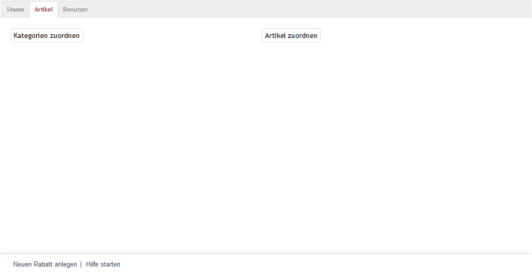

Registerkarte Artikel
*********************
Rabatte können für Kategorien und/oder Artikel gelten. Auf der Registerkarte :guilabel:`Artikel` kann die dafür notwendige Zuordnung vorgenommen werden. Der Rabatt wird nur gewährt, wenn zugewiesene Artikel oder Artikel aus zugewiesenen Kategorien in den Warenkorb gelegt werden. Ohne Zuordnung von Kategorien und/oder Artikel gilt der Rabatt global für den gesamten Warenkatalog.

:alt: Rabatte - Registerkarte Artikel
   :height: 315
       :width: 650

:guilabel:`Kategorien zuordnen`

Das Zuordnungsfenster, welches über diese Schaltfläche geöffnet wird, zeigt die beiden Listen :guilabel:`Alle Kategorien` und :guilabel:`Zugeordnete Kategorien`. Die Kategorien können nach Titel und Kurzbeschreibung gefiltert und sortiert werden. Ziehen Sie die gewünschten Kategorien mit der Maus von der linken in die rechte Liste. Eine Mehrfachauswahl ist bei gedrückter Strg-Taste möglich. Die Zuordnung ist abgeschlossen.

:guilabel:`Artikel zuordnen`

Um einzelne Artikel für den Rabatt festzulegen, betätigen Sie die Schaltfläche :guilabel:`Artikel zuordnen`. Im Zuordnungsfenster, welches sich öffnet, werden die beiden Listen :guilabel:`Alle Artikel` und :guilabel:`Zugeordnete Artikel` angezeigt. Die Anzeige kann auf eine Kategorie beschränkt werden, indem diese aus einer Dropdown-Liste ausgewählt wird. Artikel können auch nach Artikelnummer, Titel und/oder EAN gefiltert und sortiert werden. Die Artikel werden per Drag \& Drop in die rechte Liste verschoben und damit dem Rabatt zugeordnet. Eine Mehrfachauswahl ist bei gedrückter Strg-Taste möglich.

.. seealso:: `Rabatte auf ausgewählte Artikel <rabatte-auf-ausgewaehlte-artikel>`_