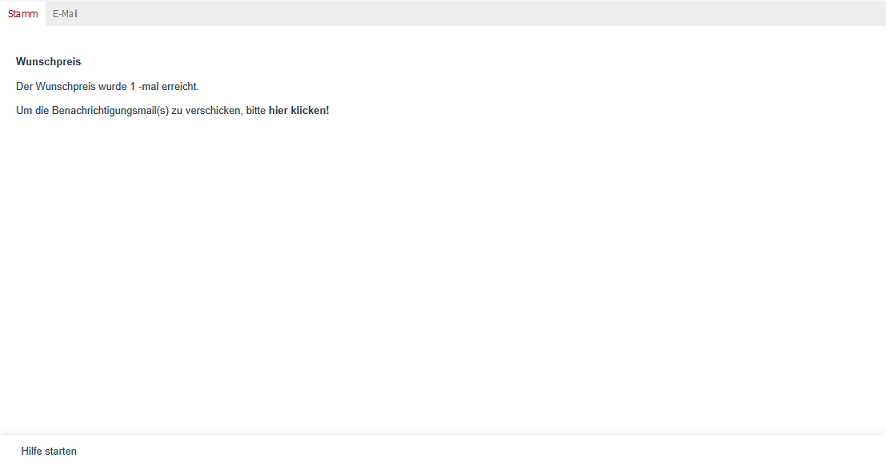

Registerkarte E-Mail
====================

Sobald zur Registerkarte :guilabel:`E-Mail` gewechselt wird, prüft der Shop für alle offenen Wunschpreis-Eingänge, ob bei den Artikeln der Wunschpreis erreicht oder gar unterschritten wurde. Die Anzahl der erreichten Wunschpreise wird angezeigt.

Ist die Anzahl der erreichten Wunschpreise größer null, wird zusätzlich ein Hinweis eingeblendet, dass jetzt die Benachrichtigungsmails versendet werden können. Mit einem Klick auf den dazugehörigen Link beginnt der Versand der E-Mails.

.. Intern: oxbajo, Status: Latitute-images