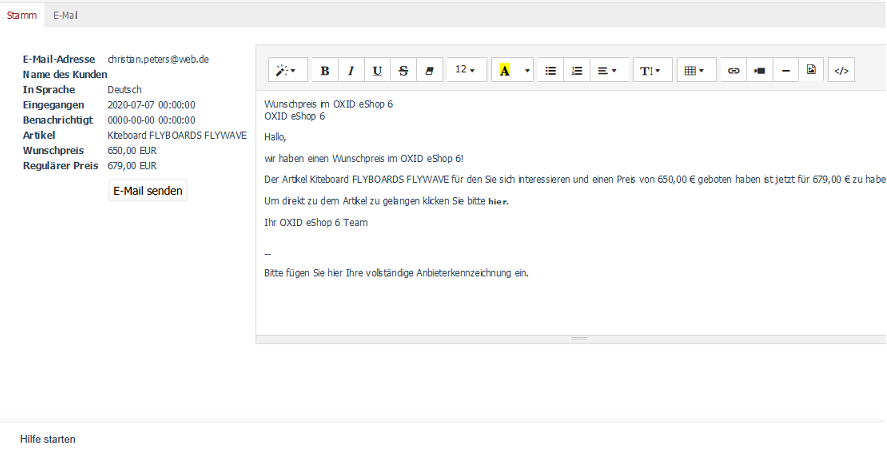

Registerkarte Stamm
===================

Die Registerkarte :guilabel:`Stamm` listet alle für den Wunschpreis relevanten Informationen, wie beispielsweise die E-Mail-Adresse, den Namen des Kunden, den ausgewählten Artikel, den Wunschpreis und den regulären Preis auf. Im Editor wird zusätzlich ein vorgefertigter Text für die E-Mail angezeigt, die beim Erreichen des Wunschpreises an den Kunden verschickt werden kann. Dieser Text kann für den Kunden individuell angepasst werden. Die Textbausteine sind in den Sprachdateien des Administrationsbereiches definiert (EMAIL_PRICEALARM_CUSTOMER_*).

E-Mail-Adresse
   E-Mail-Adresse, welche der Kunde beim Absenden seines Wunschpreises angegeben hatte.

Name des Kunden
   Vor- und Zuname des Kunden, der nur angezeigt wird, wenn der Kunde auch als Benutzer im Shop registriert ist.

In Sprache
   Es wird die Sprache angezeigt, mit welcher der Kunde das Frontend nutzte und den Wunschpreis abschickte.

Eingegangen
   Datum, an dem der Kunde seinen Wunschpreis für einen Artikel abschickte.

Benachrichtigt
   Datum und Uhrzeit, an dem der Shopbetreiber die Benachrichtigungsmail an den Kunden schickte, dass der Wunschpreis erreicht wurde.

Artikel
   Name des Artikels, für den der Wunschpreis gilt.

Wunschpreis
   Preis, zu dem der Kunde einen Artikel gern kaufen würde.

Regulärer Preis
   Preis, zu dem der Artikel normalerweise im Shop verkauft wird.

Text der Benachrichtigungsmail
------------------------------
Die rechte Seite der Registerkarte :guilabel:`Stamm` nimmt ein Editor ein, der nach dem Prinzip WYSIWYG (What You See Is What You Get) funktioniert. Er zeigt also den Text so an, wie er später in der Benachrichtigungsmail zu sehen sein wird. Der Editor bietet die Möglichkeit der Textformatierung, des Einfügens von Links, Bildern und Videos. Für spezielle und darüber hinausgehende Anforderungen kann der HTML-Code angezeigt und bearbeitet werden.

Mit der Benachrichtigungsmail wird der Kunde darüber informiert, dass sein Wunschpreis erreicht oder sogar unterschritten wurde. Deren Text kann inhaltlich angepasst und individuell formatiert werden.

.. Intern: oxbajn, Status: Latitute-images
