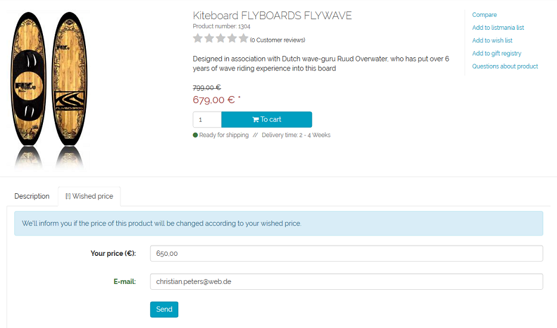
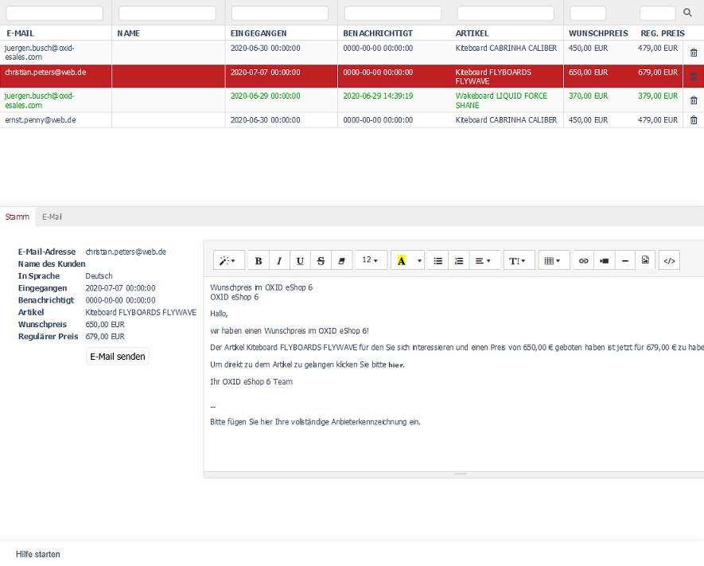
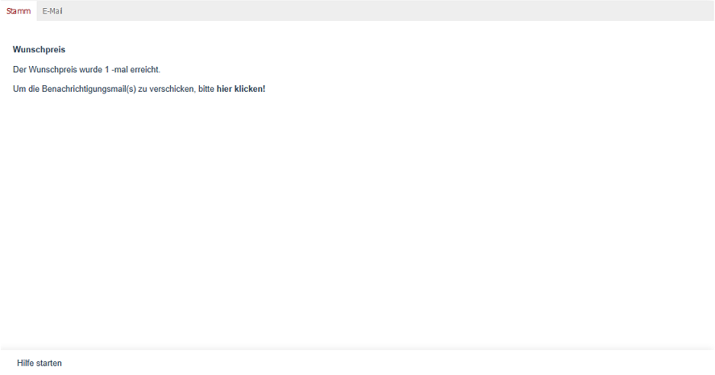

Wunschpreis verwenden
=====================

Mit der Wunschpreis-Funktion können Kunden einen Preis angeben, zu dem sie ein Produkt gerne kaufen würden. Wird dieser Preis erreicht oder unterschritten, kann eine automatische Benachrichtigung per E-Mail erfolgen.

.. attention::

   Die Wunschpreis-Funktion ist im APEX-Theme standardmäßig deaktiviert.

   Um sie zu verwenden, wenden Sie sich an Ihren Implementierungspartner.

Funktion konfigurieren
----------------------

Funktion global aktivieren
^^^^^^^^^^^^^^^^^^^^^^^^^^

|procedure|

1. Öffnen Sie die Einstellungen des verwendeten Themes.
2. Aktivieren Sie unter :guilabel:`Funktionen` das Kontrollkästchen für Wunschpreis.

Funktion für einzelne Produkte deaktivieren
^^^^^^^^^^^^^^^^^^^^^^^^^^^^^^^^^^^^^^^^^^^

|procedure|

1. Wählen Sie :menuselection:`Artikel verwalten`.
2. Öffnen Sie den gewünschten Artikel.
3. Wechseln Sie zur Registerkarte :guilabel:`Erweitert`.
4. Aktivieren Sie :guilabel:`Wunschpreis deaktivieren`, um die Funktion für diesen Artikel abzuschalten.

Anzeige im Shop
---------------

Ist die Funktion aktiv:

* Im Artikel-Detail wird die Registerkarte :guilabel:`[!] Wunschpreis` angezeigt.
* Kunden können dort einen gewünschten Preis und ihre E-Mail-Adresse angeben.
* Nach dem Absenden des Formulars erhalten sie eine Bestätigung.

   Abb.: Detailansicht Artikel, Registerkarte Wunschpreis

E-Mail-Vorlage erstellen
^^^^^^^^^^^^^^^^^^^^^^^^

Erstellen Sie eine E-Mail-Vorlage für die Wunschpreis-Benachrichtigung.

|procedure|

1. Öffnen Sie die CMS-Seite :guilabel:`Wunschpreis` (Ident: ``oxpricealarmemail``).
2. Bearbeiten Sie den Text nach Bedarf.

   Abb.: Vorlage für Wunschpreis-E-Mail bearbeiten

Wunschpreise im Administrationsbereich verwalten
------------------------------------------------

Wunschpreis-Anfragen verarbeiten
^^^^^^^^^^^^^^^^^^^^^^^^^^^^^^^^

|procedure|

1. Wählen Sie :menuselection:`Kundeninformationen --> Wunschpreis`.

|result|

Sie sehen eine Liste aller eingegangenen Wunschpreis-Anfragen mit folgenden Angaben:

* E-Mail-Adresse der Kundin / des Kunden (wie im Formular angegeben)
* Name (sofern der Kunde registriert ist)
* Sprache, in der der Kunde den Shop genutzt hat
* Datum der Anfrage
* Datum der Benachrichtigung
* Produktname
* Regulärer Preis
* Wunschpreis des Kunden

Benachrichtigung bearbeiten und versenden
^^^^^^^^^^^^^^^^^^^^^^^^^^^^^^^^^^^^^^^^^

|procedure|

1. Wählen Sie einen Eintrag aus der Liste.
   Die Detailansicht wird im Eingabebereich geladen.

#. Wählen Sie die Registerkarte :guilabel:`Stamm`, um den E-Mail-Text individuell anzupassen.

   .. figure:: ../../media/screenshots/oxbajn01.png
      :alt: Wunschpreis - E-Mail-Text individuell anpassen
      :class: with-shadow
      :width: 650

      Abb.: Wunschpreis - E-Mail-Text individuell anpassen

   Auf der Registerkarte :guilabel:`Stamm` sehen Sie alle zur Anfrage gehörenden Daten und einen bearbeitbaren Textvorschlag für die E-Mail. Dieser Text kann angepasst und formatiert werden.

   .. note::

      Der Editor funktioniert nach dem WYSIWYG-Prinzip („What You See Is What You Get“). Er zeigt den Text so an, wie er später in der Benachrichtigungsmail erscheint. Es sind Formatierungen, Links, Bilder, Videos und HTML-Bearbeitung möglich.

      Der Standardtext basiert auf den Sprachkonstanten ``EMAIL_PRICEALARM_CUSTOMER_*`` des Administrationsbereichs.

#. Wählen Sie die Registerkarte :guilabel:`E-Mail`, um die Nachricht zu senden.

   Abb.: Wunschpreis - Nachricht versenden

|result|

Beim Öffnen der Registerkarte :guilabel:`E-Mail` prüft der Shop automatisch alle offenen Wunschpreis-Einträge. Wenn der gewünschte Preis für einen Artikel erreicht oder unterschritten wurde, wird dies angezeigt.

Wenn mindestens ein Wunschpreis erfüllt wurde, erscheint ein Hinweis, dass E-Mails versendet werden können. Mit einem Klick auf den eingeblendeten Link beginnt der Versand der Benachrichtigungen.

.. Intern: oxbajm, Status: Latitute-images