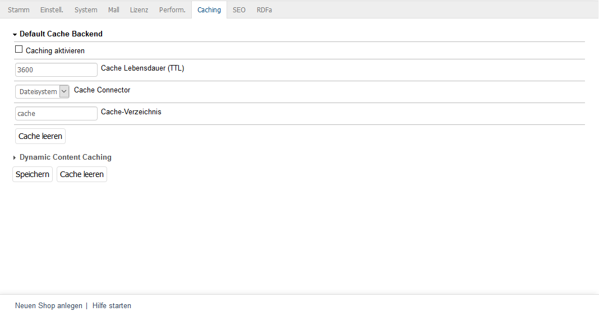

Caching settings
=====================

All caching settings can be configured in the OXID eShop Admin panel. Go to :menuselection:`Master Settings --> Core Settings --> Caching`. The :guilabel:`Caching` tab is divided into three sections: :guilabel:`Default Cache Backend`, :guilabel:`Reverse Proxy` and :guilabel:`Dynamic Content Caching`. Click each of the headings to view its settings.

Default Cache Backend
---------------------
This section enables default caching. As a result, static content, such as products, categories, the category tree, volume prices, contents of CMS pages, etc., is cached. Cache connector specifies the location for the cache. You can use the file system or select Memcached if Memcached has been installed and can be used.

The default cache can also be completely cleared.

:guilabel:`Enable caching` |br|
Check this box to enable default caching.

:guilabel:`Cache lifetime (TTL)` |br|
The default value for the cache lifetime is 3,600 seconds. TTL stands for Time To Live. After this time, the cache is cleared even if it has never been used.

:guilabel:`Cache connector` |br|
Select the cache location from the list: file system or Memcached.

:guilabel:`Cache directory` |br|
Specify a directory to use for the cache. By default, this is :file:`/cache`. This input field is only displayed if file system was selected as cache connector.

:guilabel:`List of Memcached servers ([host]@[port]@[weight])` |br|
Enter the Memcached server(s). The syntax is ``[host]@[port]@[weight]`` where ``@[weight]`` is optional. If several Memcached servers are specified, you can define the load balancing using the ``@[weight]`` value. This input field is only displayed if Memcached was selected as cache connector.

Reverse Proxy
-------------
The section contains the settings for supporting a reverse proxy. Currently, OXID eShop only supports Varnish as a reverse proxy. Please note that you should use either Reverse Proxy or Dynamic Content Caching. It’s not recommended to use both types of caching in OXID eShop.

The system checks whether the Admin panel was accessed via the reverse proxy. If this is not the case, a message will be displayed. Click on :guilabel:`Test Reverse Proxy’s availability` to check whether the reverse proxy is available for the front end and whether the caching requirements are met.

The cache of the reverse proxy can be cleared for all or specific pages.

:guilabel:`Enable caching` |br|
Check this box to enable reverse proxy caching.

:guilabel:`Cache lifetime (TTL)` |br|
Duration in seconds after which the cache is cleared even if it has never been used. The default value is 3,600 seconds.

:guilabel:`Flush cache` |br|
The cache of the reverse proxy can be cleared for all pages or separately for the start page, products’ details pages or for list and details pages. Selecting “List and details pages” clears the cache for the lists of categories, manufacturers, distributors as well as for each details page from the categories.

:guilabel:`Test Reverse Proxy’s availability` |br|
Checks whether the reverse proxy is available for the front end. This will call the shop’s start page internally and search for the 'X-Varnish' header provided by Varnish. The result of the check will be displayed as a message.

Dynamic Content Caching
-----------------------
This section contains the settings for dynamic content caching, which used to be the only kind of caching in Enterprise Edition. A table provides an overview of the data requested by the cache, such as cache hits for data in the cache or cache miss for data that is no longer in the cache.

Please don’t use dynamic content caching with reverse proxy because both methods essentially cache pages and dynamic content. That could adversely affect the performance.

:guilabel:`Enable caching` |br|
Check this box if you want to use dynamic content caching.

:guilabel:`Cache lifetime (TTL)` |br|
Duration in seconds after which the cache is cleared. The default value is 3,600 seconds. After this time, the page layout becomes invalid. This information is sent via the HTTP header using the \"Age\" header value.

:guilabel:`Cacheable classes` |br|
List of classes which are cached by default: info, start, details, alist and vendorlist.

.. Intern: oxbacd, Status: