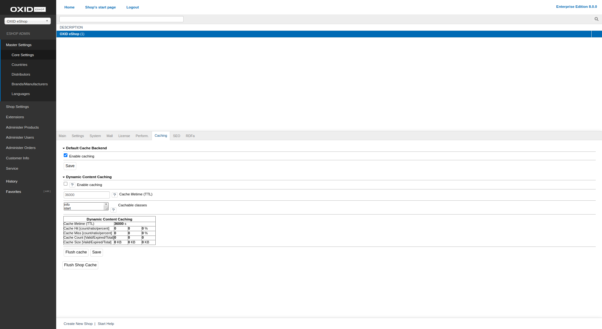

Caching settings
================

Configure the caching settings.

.. todo: the following is obsolete:
    The :guilabel:`Caching` tab (:ref:`oxbacd01`) is divided into three sections:
    * :guilabel:`Default Cache Backend`
    * :guilabel:`Reverse Proxy`
    * :guilabel:`Dynamic Content Caching`.

.. _oxbacd01:

   Fig.: Caching tab

Enabling Static Content Caching
-------------------------------

Ensure that static content, such as products, categories, the category tree, volume prices, contents of CMS pages, etc., is cached by default.

.. todo: #Ashraf: is this the correct definition of "data" cached: static content, such as products, categories, the category tree, volume prices, contents of CMS pages, etc.
.. todo: #Ashraf: Data caching seems not to be activated by default. Shouldn't it?
.. todo: default caching now obsolete ? Why is it called "default" caching, is there a non-default caching? In which case would I deactivate default caching?
.. todo: #Ahriaf: In which case is it advisiable or necessary?  In which case not?

|procedure|

1. In the OXID eShop Admin panel, choose :menuselection:`Master Settings --> Core Settings --> Caching`.
#. Under :guilabel:`Data cache`, ensure that the :guilabel:`Enable caching` checkbox is activated (:ref:`oxbacd01`, item 1).
#. Save your settings.

Enabling Dynamic Content Caching
--------------------------------

.. todo: #Ahraf: the following can be removed totally, correct?
    :guilabel:`Cache lifetime (TTL)` |br|
    The default value for the cache lifetime is 3,600 seconds. TTL stands for Time To Live. After this time, the cache is cleared even if it has never been used.
    :guilabel:`Cache connector` |br|
    Select the cache location from the list: file system or Memcached.
    :guilabel:`Cache directory` |br|
    Specify a directory to use for the cache. By default, this is :file:`/cache`. This input field is only displayed if file system was selected as cache connector.
    :guilabel:`List of Memcached servers ([host]@[port]@[weight])` |br|
    Enter the Memcached server(s). The syntax is ``[host]@[port]@[weight]`` where ``@[weight]`` is optional. If several Memcached servers are specified, you can define the load balancing using the ``@[weight]`` value. This input field is only displayed if Memcached was selected as cache connector.
    Reverse Proxy
    -------------
    The section contains the settings for supporting a reverse proxy. Currently, OXID eShop only supports Varnish as a reverse proxy. Please note that you should use either Reverse Proxy or Dynamic Content Caching. It’s not recommended to use both types of caching in OXID eShop.
    The system checks whether the Admin panel was accessed via the reverse proxy. If this is not the case, a message will be displayed. Click on :guilabel:`Test Reverse Proxy’s availability` to check whether the reverse proxy is available for the front end and whether the caching requirements are met.
    The cache of the reverse proxy can be cleared for all or specific pages.
    :guilabel:`Enable caching` |br|
    Check this box to enable reverse proxy caching.
    :guilabel:`Cache lifetime (TTL)` |br|
    Duration in seconds after which the cache is cleared even if it has never been used. The default value is 3,600 seconds.
    :guilabel:`Flush cache` |br|
    The cache of the reverse proxy can be cleared for all pages or separately for the start page, products’ details pages or for list and details pages. Selecting “List and details pages” clears the cache for the lists of categories, manufacturers, distributors as well as for each details page from the categories.
    :guilabel:`Test Reverse Proxy’s availability` |br|
    Checks whether the reverse proxy is available for the front end. This will call the shop’s start page internally and search for the 'X-Varnish' header provided by Varnish. The result of the check will be displayed as a message.

.. todo: #Ahraf: the English 7.2 docu contains a Varnish reverse proxy chapter that is removed in the German version: is it no longer relevant?

Activate dynamic content caching, which used to be the only kind of caching in Enterprise Edition.

.. todo: #Ahraf: what does it mean: "which used to be the only kind of caching in Enterprise Edition" -- is it also available in CE and PE?
.. todo: #Ahraf: How do I use the information provided in the table? What are typical values and corresponding actions? In which case would I activate dynamic caching, in which cases not, what are possible downsides?

A table provides an overview of the data requested by the cache, such as cache hits for data in the cache or cache miss for data that is no longer in the cache.

Adjust the duration and specify the content to be cached.

.. todo: #Agraf: Is the following reverse proxy thing still somehow relevant?
    Please don’t use dynamic content caching with reverse proxy because both methods essentially cache pages and dynamic content. That could adversely affect the performance.

|procedure|

1. In the OXID eShop Admin panel, choose :menuselection:`Master Settings --> Core Settings --> Caching`.
#. Under :guilabel:`Dynamic Content Caching`, ensure that the :guilabel:`Enable caching` checkbox is activated (:ref:`oxbacd01`, item 2).
#. If required, in the :guilabel:`Cache lifetime (TTL)`field, adjust the duration.

   Specify the duration in seconds after which the cache is cleared.

   The default value is 3,600 seconds. After this time, the page layout becomes invalid. This information is sent via the HTTP header using the \"Age\" header value.

   .. todo: #Ashraf: In which case would I adjust the duration?

#. In the :guilabel:`Cacheable classes` field, add custom classes to be cached.

   By default, the following classes are cached: ``info``, ``start``, ``details``, ``alist``, and ``vendorlist``.

#. Save your settings.

.. Intern: oxbacd, Status: