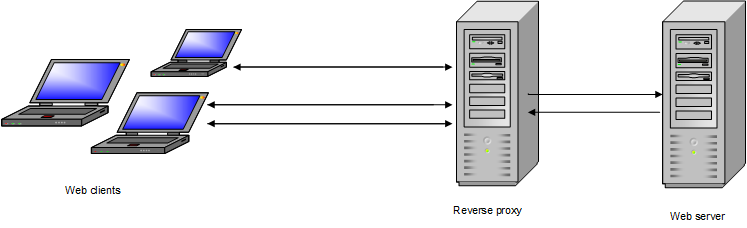

Varnish reverse proxy
=====================

Functionality
-------------
Varnish is a reverse proxy that processes incoming enquiries from web clients before the actual web server. Web pages that are delivered to web clients are for the most part compiled from cached content. Only when the cache lifetime has expired, Varnish will query content from the web server. Then, OXID eShop must read and provide the requested data from the database.

During processing, Varnish divides the individual OXID eShop pages into small sections, the so-called widgets. These are labelled as ESI tags. This allows Varnish to separately query and update dynamic page areas, such as the shopping cart or login. In addition, graphics, product and category images, stylesheet and JavaScript files are always cached.

To use Varnish for caching OXID eShop, you will need to install and configure this reverse proxy on a separate server.

-------------------------------------------------

Installation
------------
Install Varnish on a server. The software and installation guide can be found on the manufacturer's website: `http://www.varnish-cache.org <http://www.varnish-cache.org/>`_ .

-------------------------------------------------

Configuration
-------------
Varnish has its own language that can be used to configure its behaviour. Defined with VCL (Varnish Configuration Language), the configuration is translated into binary code and executed on requests from the web. The default configuration file, :file:`default.vcl` is located in the :file:`/etc/varnish` directory.

We have customised the :file:`default.vcl` configuration file for cashing OXID eShop. The definitions correspond to a default shop and should only be changed for a highly customised shop. This applies only to changes in the shop’s default behaviour through modular extensions, such as completely changed handling of products or use of own cookies. The necessary changes in the configuration file require profound knowledge of the VCL. Incorrect instructions may affect performance and allow the shop to provide data that is out of date. Using the configuration file unchanged in a highly customised shop may result in data loss and unexpected behaviour.

The :file:`servers_conf.vcl` configuration file contains the host names and IPs of the servers involved and needs to be adapted to the real system environment.

Varnish starting with version 4.0.3
^^^^^^^^^^^^^^^^^^^^^^^^^^^^^^^^^^^
Varnish version 3.0 is no longer supported because the software has reached the End-Of-Life (EOL) status since April 2015. The :file:`default.vcl` file provided now contains the configuration for Varnish starting with version 4.0.3. Please don’t use versions 4.0.0, 4.0.1 and 4.0.2 because they had issues with handling cookies that led to products not being placed in the shopping cart and customers being unable to log in to the shop.

If this behaviour takes place in your shop and you can’t upgrade to a newer version of Varnish, you should try the following workaround. This has not been explicitly tested, so please check the shop’s behaviour thoroughly before applying the change to the production environment.

In the :file:`default.vcl` configuration file, replace line 463 |br|
``set beresp.http.Set-Cookie = regsuball(beresp.http.Set-Cookie,\"(, |^)[^@][^,|$]+\",\"\");``
with the following line |br|
``set beresp.http.Set-Cookie = regsuball(beresp.http.Set-Cookie,\"(, |^)[^@]\",\"\");``

Configuration files
^^^^^^^^^^^^^^^^^^^
The two configuration files :file:`default.vcl` and :file:`servers_conf.vcl` for configuring the reverse proxy can be dragged from a repository to GitHub using Composer. The package is provided by our Satis server. To download it, the following Composer command must be executed via console in the main directory of the shop:

.. code::

  composer global config repositories.oxid-esales/varnish-configuration \
    composer https://varnish.packages.oxid-esales.com/

  composer global require oxid-esales/varnish-configuration:^v4.0.0

This protected repository can be accessed with the password that shop owners received when purchasing the high-load option. Please contact technical support if you experience any issues.

The directory :file:`/vendor/oxid-esales/varnish-configuration/` contains the files :file:`default.vcl` and :file:`servers_conf.vcl.dist`. Rename the file :file:`servers_conf.vcl.dist` to :file:`servers_conf.vcl` and replace the following placeholders:

* ``<my_shop_hostname>`` - IP/hostname of the shop backend server
* ``<my_shop_IP>`` - IP of node which is allowed to initiate flushing of cache

Copy the files to the :file:`/etc/varnish` directory. If these files have already been customised in your system, you will need to merge their contents manually. Restart Apache and Varnish.

:command:`/etc/init.d/apache2 stop` |br|
:command:`/etc/init.d/varnish restart` |br|
:command:`/etc/init.d/apache2 start`

SSL encryption
^^^^^^^^^^^^^^
Varnish processes requests from the web that use the HTTP protocol. Encrypted requests with HTTPS protocol can’t be executed through the reverse proxy. Since OXID eShop can switch to SSL encryption when user data is transferred, for example, during registration, login or in the shopping cart, a separate solution needs to be created. Currently, this can be done in two different ways. First, requests with the HTTPS protocol can be sent directly to the server with OXID eShop. This has to be implemented with server tools. Second, you can use a load balancer that forwards requests via HTTP, port 80 to Varnish and via HTTPS, port 443 directly to OXID eShop.

.. Intern: oxbacb, Status:

.. ToDo: call Composer for configuration files