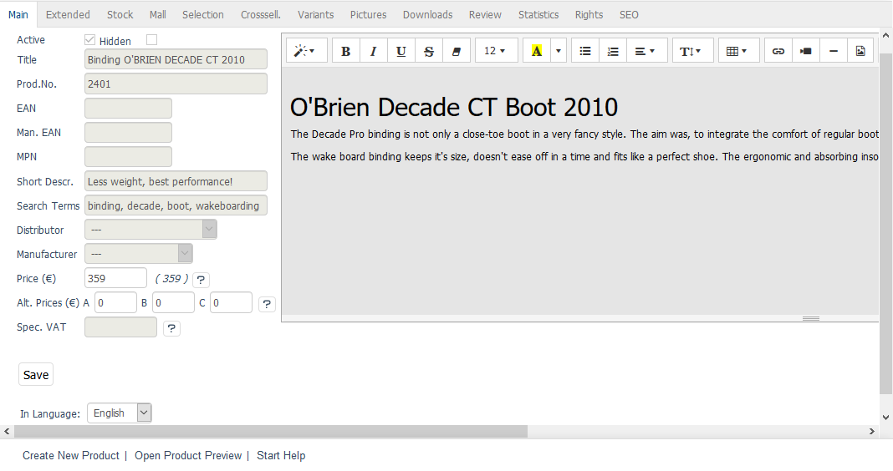

Customisation
=============

Inheritance settings specified when creating a new shop can be adjusted later on. They allow you to undo the inheritance of all products, attributes, selection lists, shipping costs, shipping cost rules, manufacturers, distributors, discounts, coupons, gift wrapping, news and links. Inheritance settings can be found in the :guilabel:`Mall` tab under :menuselection:`Master Settings --> Core Settings`. For example, if you uncheck the box :guilabel:`Inherit all products from parent shop`, the inherited products will no longer be available after you save the inheritance information.

For the most part, the content of inherited products and settings can’t be changed. However, there are some exceptions. You can change the prices for inherited products if individual prices were allowed when creating the new shop. This allows you to adjust the product’s selling price, alternative prices and scale prices. Inherited products and attributes can be assigned to categories. In this way, a different structure of the product catalogue can be implemented compared to the parent shop.

Rights and roles can also be assigned to user groups. The SEO settings of products and categories are fully editable.

Product characteristics that should be editable after inheritance can be defined in the OXID eShop :file:`config.inc.php` configuration file. To do this, the array ``aMultishopArticleFields`` needs to be expanded with the characteristics belonging to the associated database field.

Example: Besides the prices, the short description should be editable, as shown in the screenshot above.

Configuration file entry:

.. code:: php

   $this--> aMultishopArticleFields = array(\"OXPRICE\",\"OXPRICEA\",\"OXPRICEB\",\"OXPRICEC\",\"OXUPDATEPRICE\",\"OXUPDATEPRICEA\",\"OXUPDATEPRICEB\",\"OXUPDATEPRICEC\",\"OXUPDATEPRICETIME\", \"OXSHORTDESC\");

An entry for OXSHORTDESC must be created in the oxfield2shops database table.

.. code:: mysql

   ALTER TABLE oxfield2shop ADD OXSHORTDESC VARCHAR(255) NOT NULL DEFAULT '' COMMENT ‘Short description';

.. Intern: oxbags, Status: