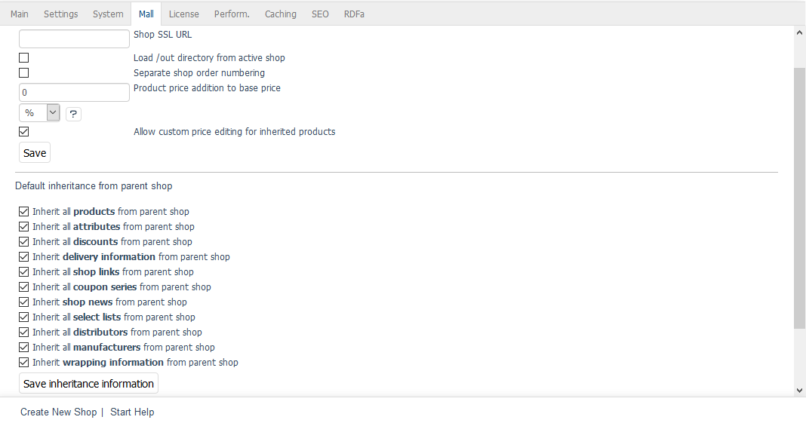

Inheritable elements
===================

Inheritable elements are assigned to one shop from another shop. The following elements can be inherited when creating a shop: products, attributes, selection lists, shipping costs, shipping cost rules, manufacturers, distributors, discounts, coupons, gift wrapping, news, and links. With some exceptions, the content of the inherited elements can’t be changed in the new shop.

Inheritance settings for a new shop can be changed at any time in the :guilabel:`Mall` tab under :menuselection:`Master Settings --> Core Settings`. If you uncheck the box for any of the inheritance settings, the inheritance will be reversed in real time.

In the parent shop, the assignment created by inheritance can also be undone at the level of individual products, attributes, selection lists, etc. For example, you can also assign products that have been newly created in the parent shop to subshops or supershops afterwards. Individual categories can be assigned to shops as well. However, this only applies to top categories (top level of the category tree) that are assigned with all their subcategories included. Products assigned to the assigned categories are retained.

In the subshop, an assignment can only be removed by deleting the product, the shipping costs or a shipping cost rule, for example. You won’t be able to create a new assignment to individual products and settings of the parent shop.

.. seealso:: :doc:`Products <../../../setup/products/products>` | :doc:`Attributes <../../../setup/attributes/attributes>` | :doc:`Selection lists <../../../setup/selection-lists/selection-lists>` | :doc:`Shipping methods <../../../setup/shipping-methods/shipping-methods>` | :doc:`Shipping cost rules <../../../setup/shipping-cost-rules/shipping-cost-rules>` | :doc:`Manufacturers <../../../setup/manufacturer/manufacturers>` | :doc:`Distributors <../../../setup/distributors/distributors>` | :doc:`Categories <../../../setup/categories/categories>`

.. Intern: oxbagp, Status: