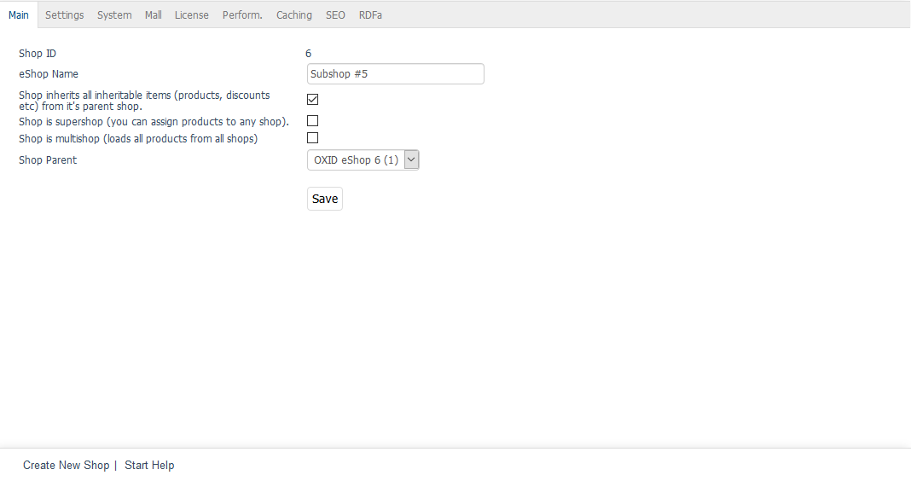

Inheritance
===========

Inheritance is an important part of the Mall function. It takes place when you check the box :guilabel:`Shop inherits all inheritable products and settings from the parent shop` when creating a new shop. Besides the products, attributes, selection lists, shipping methods, shipping cost rules, manufacturers, distributors and other elements will be passed onto the new shop. Categories are not inherited.

Inheritance settings can be changed even after you create a shop. The changes can be made shop-wide in the inheritance settings or refer to individual products, attributes, selection lists, shipping methods, shipping cost rules, manufacturers, distributors, etc. Further information can be found in :doc:`Customisation <customisation>`.

A subshop can pass on its product and settings to another subshop. You can only assign/unassign individual products and other elements to/from the subshop for which it is the parent shop. A supershop, on the other hand, can pass on its products and settings to supershops and subshops. You can assign individual products and other elements to all other shops and then unassign them. This also applies to the main shop and to subshops, for which the supershop is not the parent shop. Multishops don’t have to inherit products and settings because they display all products, manufacturers and distributors from all shops. As an option, they can inherit all categories from all shops.

Inheritance-related information that can be found in the other documents is also determined by whether you are logged in as administrator of all shops or as an administrator of a subshop, supershop or multishop. This is defined by the rights assigned under :menuselection:`Administer Users --> Users`.

-----------------------------------------------------------------------------------------

Inheritable elements
--------------------
**Contents**: Mall, Enterprise Edition, inheritance, inheritance settings, assignments, inheritable elements, products, attributes, selection lists, shipping costs, shipping cost rules, manufacturers, distributors, discounts, coupons, gift wrapping, news, links |br|
:doc:`Read article <inheritable-elements>` |link|

Non-inheritable elements
------------------------
**Contents**: Mall, Enterprise Edition, inheritance, non-heritable elements, shop configuration, assignment to promotions, CMS pages, orders |br|
:doc:`Read article <non-inheritable-elements>` |link|

Shared elements
---------------
**Contents**: Mall, Enterprise Edition, inheritance, shared elements, payment methods, countries, languages, users, user groups, reviews |br|
:doc:`Read article <shared-elements>` |link|

Customisation
-------------
**Contents**: Mall, Enterprise Edition, inheritance, customisation, inheritance settings, product price, alternative prices, scale prices, rights and roles, SEO, config.inc.php, aMultishopArticleFields, oxfield2shops |br|
:doc:`Read article <customisation>` |link|

.. seealso:: :doc:`Users <../../../operation/users/users>`

.. Intern: oxbago, Status: