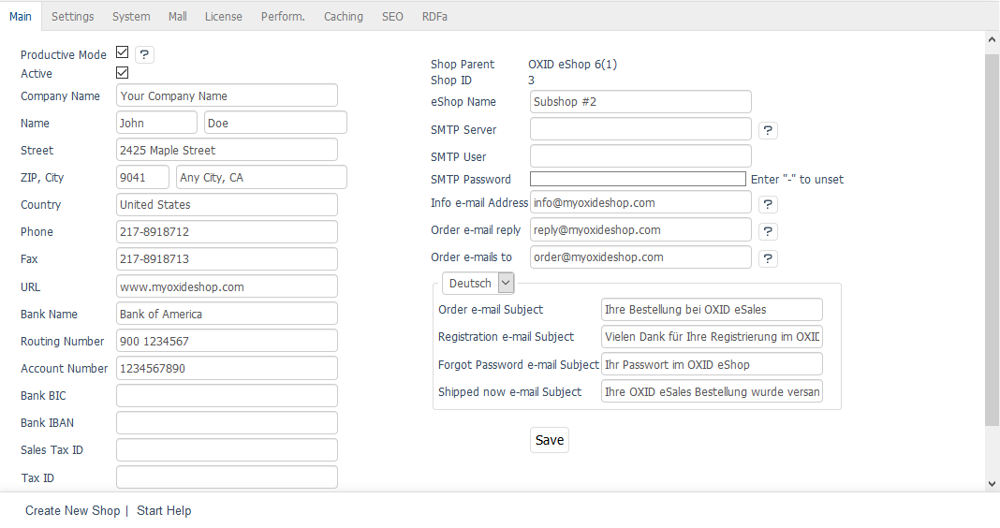

Non-inheritable elements
=========================

Non-inheritable elements are part of every subshop, supershop and multishop. They are created for each shop and can be edited and adapted to the respective shop and its requirements. When you create a new shop, its basic settings, languages, promotions and Content Management System (CMS) pages will be copied and provided as templates for the new shop.

A new shop can be configured under :menuselection:`Master Settings --> Core Settings`. The settings can be adjusted separately for each shop - from the company information and email addresses to the various system settings, performance specifications and SEO settings. The :guilabel:`License` tab is the only one that contains the Enterprise Edition license key for all shops.

Like promotions, CMS pages are non-inheritable elements. They are copied from the parent shop when you create the new shop and can be customised as required. For promotions, only the week’s special, just arrived, the category top offer, start page below (not active), the start page top offer and the top seller are copied as a template. The assigned products are not loaded and must be assigned separately. The content of promotions can only be changed in the main shop.

If a customer places an order in a subshop, supershop or multishop, the order will only be created in the respective shop and can only be processed there. The assigned order number depends on whether separate order numbers are allowed for the shop. The relevant settings can be found in the :guilabel:`Mall` tab under :menuselection:`Master Settings --> Core Settings`.

.. seealso:: :doc:`Configuration <../../../configuration/configuration>` | :doc:`Orders <../../../operation/orders/orders>`

.. Intern: oxbagq, Status: