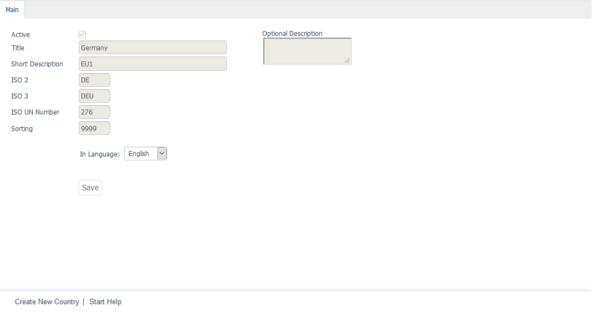

Shared elements
=================

Shared elements are payment methods, countries, users, user groups, and reviews. These are used in all shops and can only be changed by an administrator with the \"Admin\" right. Subshop, supershop or multishop administrators are not authorised to do so.

Users are only shared with all shops if the :guilabel:`Allow users from other shops` option is activated in the main shop. If this setting is not selected in the :guilabel:`Mall` tab under :menuselection:`Master Settings --> Core Settings`, each shop will manage its own users.

.. seealso:: :doc:`Configuration <../../../configuration/configuration>` | :doc:`Payment methods <../../../setup/payment-methods/payment-methods>` | :doc:`Users <../../../operation/users/users>` | :doc:`User groups <../../../operation/user-groups/user-groups>`

.. Intern: oxbagr, Status: