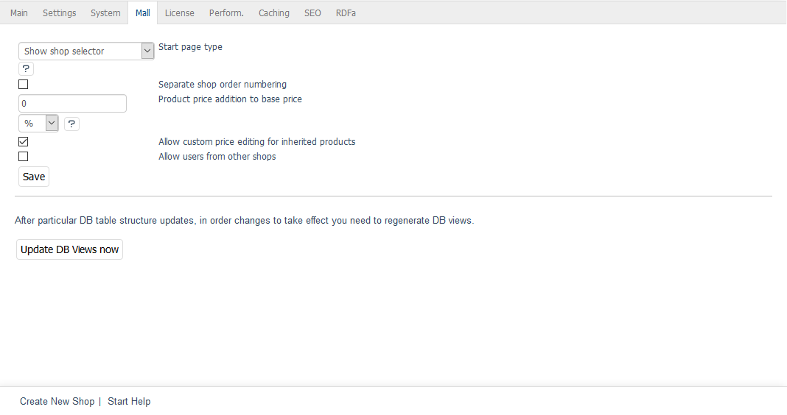

Main shop & parent shops
=======================

The shop created during the installation of OXID eShop Enterprise Edition is a special shop. The main shop not only combines different shop types but also provides two settings that affect all shops. The other settings can be found on the :guilabel:`Mall` tab of each shop.

Main shop
---------
:guilabel:`Start page type` |br|
This setting is only available in the main shop.

If your Enterprise Edition contains several shops, you can use the selection list to select what will be displayed when you click on the shop URL. The first entry :guilabel:`Show main shop front page` opens the main shop’s start page. :guilabel:`Show shop selector` opens a page where you can select the shop to be displayed. Individual shops can also be accessed via their own shop URLs, which will be explained later.

:guilabel:`Separate shop order numbering` |br|
Check this box to have orders in this shop receive order numbers from a separate number range. For shops where this setting is not selected, the order numbers will be assigned and incremented shop-wide.

:guilabel:`Product price addition to base price` |br|
In general, you can set an absolute or a percentage surcharge on product prices in your shop. Enter a percentage for a percentage surcharge and make sure to select :guilabel:`%` in the corresponding selection list. To set an absolute surcharge, please select :guilabel:`EUR` from the list and enter an amount.

:guilabel:`Allow custom price editing for inherited products` |br|
Please check this box if the shop’s products and settings should be passed onto other shops that offer products with individual prices. This will allow you to adjust product and scale prices in the respective shops. None of the other product characteristics can be changed.

:guilabel:`Allow users from other shops` |br|
This setting is only available in the main shop.

It determines whether users can log in to all shops. If this box is checked, users must be registered in only one shop, but they can use their login data and access their account in all other shops. When you create a new shop based on the parent shop, the users of the parent shop will also be copied in the process. They can be changed with appropriate administrator rights both in the parent shop and in the newly created shop. However, new customers will only be created in the shop they have registered for.

If this setting is not selected or was deselected later, the users will only be able to log in to the shop they have registered for.

Parent shops
-----------
When you create a new shop that inherits all products and settings from a previously created shop, the previous shop becomes a parent shop. The shop that passes on products, attributes, selection lists, shipping methods, shipping cost rules, manufacturers, distributors and other elements to the new shop is its parent shop. Individual products can also be assigned to any other shop from the main shop, which makes the main shop a supershop. More information about other shop types can be found in :doc:`Subshops, supershops & multishops <subshops-supershops-multishops>`.

.. seealso:: :doc:`Inheritance <inheritance/inheritance>`

.. Intern: oxbagm, Status: