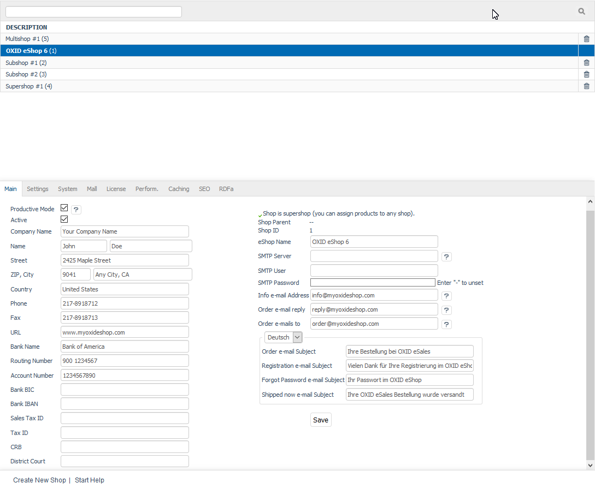

Mall function
=============

The Mall function is a feature of OXID eShop Enterprise Edition. The multi-client capability allows you to create multiple shops and build a multishop structure. The shops and their assignments to each other can be edited via the Admin panel. Shop assignments are defined upon shop creation and can later be changed and customised. Depending on the license purchased, Enterprise Edition allows you to create and edit up to 1,500 shops. This way, you can implement product-, target group- and country-specific online shops with various content, language and design.

Shops can be edited in the Admin panel. This requires shop-wide administrator rights that users receive by being granted the \"Admin\" right. In contrast, there are also administrators who only have access to a specific shop. The corresponding right can be assigned under :menuselection:`Administer Users --> Users`.

Shop lists and the input area for the shops are displayed under :menuselection:`Master Settings --> Core Settings`. After you install OXID eShop Enterprise Edition, you will see that there is only one shop in the list. To create a new shop, click on :guilabel:`Create New Shop` at the bottom of the screen.

The shop list displays the shop name followed by the shop ID in brackets. You can search for shops by using the search field above the shop list. For example, if you enter the number 1 in the search field, all shops containing 1 in the shop name will be listed. Press “Enter” or a click on the magnifying glass icon to start the search.

Click on the delete icon at the end of the line to permanently remove the shops from the database. The shop created during the installation can’t be deleted.

When you select a shop from the shop list, the shop’s information will be displayed in the input area. Shops can also be selected from the selection list located above the menu on the left side of the Admin panel. The :guilabel:`Main` tab displays the shop type, a shop parent (if any), the shop ID and the shop name. The shop name can be changed. Mall function settings can be configured in the :guilabel:`Mall` tab.

-----------------------------------------------------------------------------------------

Main shop & parent shops
------------------------
**Contents**: Mall, Enterprise Edition, main shop, parent shops, start page type, separate order numbers, surcharge percentage or absolute, individual prices, users for all shops, shop types |br|
:doc:`Read article <main-shop-parent-shops>` |link|

Subshops, supershops & multishops
----------------------------------
**Contents**: Mall, Enterprise Edition, shop types, subshop, supershop, multishop, create new shop, URL, SSL URL, top-level domain, second-level domain, subdomain, /out directory, separate order numbers, surcharge percentage or absolute, individual prices |br|
:doc:`Read article <subshops-supershops-multishops>` |link|

Inheritance
---------
**Contents**: Mall, Enterprise Edition, inheritance, inheritable elements, non-inheritable elements, shared elements, inheritance settings, assignments, customisation, product prices, config.inc.php, aMultishopArticleFields, oxfield2shops |br|
:doc:`Read article <inheritance/inheritance>` |link|

.. seealso:: :doc:`Configuration <../../configuration/configuration>`

.. Intern: oxbaeu, Status: