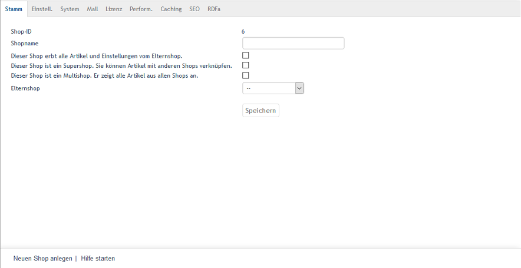

Subshops, supershops & multishops
==================================

When you create a shop, you will need to define which shop type the new shop is part of and whether it should inherit products, attributes, selection lists, shipping methods, shipping cost rules, manufacturers, distributors and other elements from a parent shop. Available shop types are subshop, supershop and multishop.

*Subshop* is a shop without any special features. It can inherit products and settings from a parent shop and pass them on to new shops. Products, attributes, selection lists and other items can only be assigned to subshops for which the shop is a parent shop.

*Supershop* can also inherit products and settings from a parent shop and pass them on to new shops. In addition, supershop allows you to assign products, attributes, selection lists, etc. to each shop. This also applies to the main shop and to subshops, for which the supershop is not the parent shop.

*Multishop* comes without the inheritance feature because it displays all products, manufacturers and distributors from all shops. It is the only shop type that can load all categories from other shops.

A new shop can be created under :menuselection:`Master Settings --> Core Settings` Use the function at the bottom of the screen.

:guilabel:`Shop ID` |br|
The shops will automatically receive a number, starting with shop ID 1 for the main shop.

:guilabel:`eShop Name` |br|
Enter the name for the new shop.

:guilabel:`Shop inherits all inheritable items (products, discounts etc) from it's parent shop.` |br|
If this box is checked, the new shop will inherit products, attributes, selection lists as well as other elements and settings from the parent shop. This needs to have the :guilabel:`Shop Parent` selection list selected.

:guilabel:`This shop is supershop. That means, products can be linked to other shops.` |br|
Check this box to create a supershop.

:guilabel:`This shop is multishop. It shows all products from all shops.` |br|
Check this box to create a multishop shop type.

If you don’t select supershop or multishop as shop type when creating a new shop, a subshop will be created.

Settings for the shop’s Mall function can be configured under :menuselection:`Master Settings --> Core Settings` in the :guilabel:`Mall` tab. They are almost identical for all shop types. The only difference is that for the multishop, there is the option to load all categories from all shops. If products, attributes, selection lists and other elements and settings were inherited from a parent shop, the tab will also display the inheritance settings.

.. image:: ../../media/screenshots/oxbagn02.png
   :alt: Multishop - Mall tab
   :class: with-shadow
   :height: 334
   :width: 650

:guilabel:`Shop URL` |br|
Specify a web address at which the shop can be reached. The top-level domain (TLD), the second-level domain, the subdomain or any combination thereof for this URL must be different from those of the other Enterprise Edition shops. The protocol must be specified as well.

Example: ``http://de.exampleshop.com``, ``http://en.exampleshop.com``, ``http://www.exampleshop.com``

Structuring the various shops using paths in the URL is impossible. If no URL is specified, the shop will be addressed using the ``shp`` URL parameter.

:guilabel:`Shop SSL URL` |br|
A web address for the encrypted access to the shop. See the above comments on the URL.

:guilabel:`Load /out directory from active shop` |br|
Check this box if, for example, you want to load the product photos using the URL of the active shop. Without this box checked, the product photos and other resources from the :file:`/out` directory will be loaded using the URL of the main shop.

:guilabel:`Separate shop order numbering` |br|
Check this box to have orders in this shop receive order numbers from a separate number range. For shops where this setting is not selected, the order numbers will be assigned and incremented shop-wide.

:guilabel:`Product price addition to base price` |br|
In general, you can set an absolute or a percentage surcharge on product prices in your shop. Enter a percentage for a percentage surcharge and make sure to select :guilabel:`%` in the corresponding selection list. To set an absolute surcharge, please select :guilabel:`EUR` from the list and enter an amount.

:guilabel:`Allow custom price editing for inherited products` |br|
Please check this box if the shop’s products and settings should be passed onto other shops that offer products with individual prices. This will allow you to adjust product and scale prices in the respective shops. None of the other product characteristics can be changed.

.. Intern: oxbagn, Status: