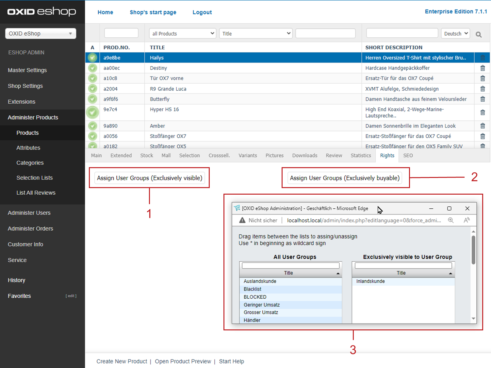
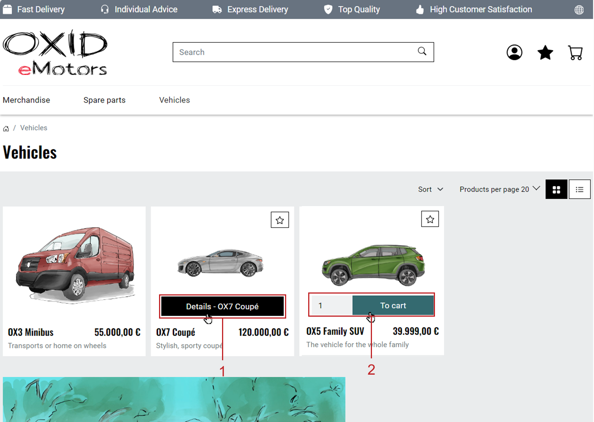
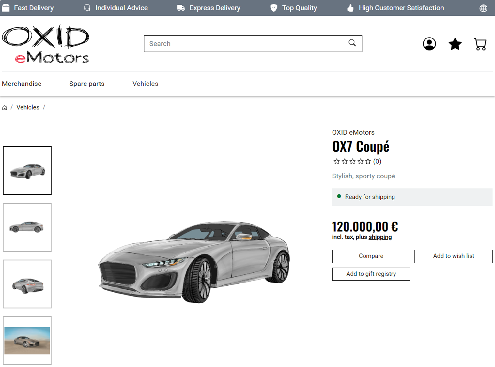

Rights and Roles
================

A feature of the Enterprise Edition is the rights and roles management.

Use rights and roles to control access to visible elements and available functions of the OXID eShop for individual users and user groups.

We distinguish between rights and roles for the actual shop (:emphasis:`frontend`) and the administration area (:emphasis:`backend`).

A :emphasis:`right` governs access to specific functions, such as articles and categories or the display of certain sections of an article’s detail page.

:emphasis:`Roles` combine multiple rights and are assigned to users and user groups.

Defining the Scope of Rights and Roles
--------------------------------------

Restrict the scope of rights and roles management as needed.

By default, no restrictions are enabled (``$this->blUseRightsRoles = 3``).

|procedure|

1. Open the configuration file :file:`config.inc.php`.
#. Configure the ``$this->blUseRightsRoles`` parameter.

   You have the following options:

   * 0 – Rights management disabled
   * 1 – Backend only
   * 2 – Frontend only
   * 3 – Backend and frontend

Assigning Rights and Roles for the Shop (Frontend)
--------------------------------------------------

Assign different permissions for the shop.

Define the permissions in the administration area:

* in the article and category management

  as well as

* under :menuselection:`Users --> Manage Users --> Shop Roles`

.. important::

  **Principle of Selective Rights Restriction**

  By default, all visitors to your OXID eShop have full access.

  A right is only restricted once at least one role explicitly includes that right, and at least one user group is assigned to that role.

  The assigned user group does not have to contain any users. For example, you could create a user group *Vollzugriff* and assign it to the corresponding role *Vollzugriff*, in which all rights are activated.

  In the first step, all rights are restricted and can then be selectively re-enabled for specific user groups via appropriate roles.

Restricting Visibility of Articles and Categories
^^^^^^^^^^^^^^^^^^^^^^^^^^^^^^^^^^^^^^^^^^^^^^^^^

.. todo: #SB: What is the typical use case?

Define that only specific user groups are allowed to :emphasis:`view` certain articles and categories.

|procedure|

1. Under :guilabel:`Manage Products`, choose the desired article or category.
#. Choose the :guilabel:`Rights` tab.
#. Choose the :guilabel:`Assign user groups (Visible to selected only)` button (:ref:`oxbaev03`, Pos. 1) and assign the desired user groups (:ref:`oxbaev03`, Pos. 3).

.. _oxbaev03:

   Fig.: Restricting article/category visibility or purchase

|result|

Only users who belong to the assigned user groups will be able to view the respective articles and categories after logging into the shop.

These parts of the catalog will not be visible to all other users and user groups.

Restricting Purchase of Articles and Categories
^^^^^^^^^^^^^^^^^^^^^^^^^^^^^^^^^^^^^^^^^^^^^^^

.. todo: #SB: What is the typical use case?

Define that specific articles and categories are only purchasable by certain user groups.

|procedure|

1. Under :guilabel:`Manage Products`, choose the desired article or category.
#. Choose the :guilabel:`Rights` tab.
#. Choose the :guilabel:`Assign user groups (Purchasable by selected only)` button (:ref:`oxbaev03`, Pos. 2) and assign the desired user groups (:ref:`oxbaev03`, Pos. 3).

|result|

For users without the required permissions, the :guilabel:`To Cart` button is :emphasis:`not shown` in the article list (:ref:`oxbaev01`, Pos. 2).

With the :guilabel:`Details` button (:ref:`oxbaev01`, Pos. 1), these users can only view the article detail page.

.. _oxbaev01:

   Fig.: Article list with and without add-to-cart button

The :guilabel:`To Cart` button is also missing in the detail view if the user is not logged in or does not belong to the authorized user group (:ref:`oxbaev02`).

.. _oxbaev02:

   Fig.: Article detail page without add-to-cart button

Controlling Access to Functions and Sections of the Detail Page
^^^^^^^^^^^^^^^^^^^^^^^^^^^^^^^^^^^^^^^^^^^^^^^^^^^^^^^^^^^^^^^

Assign rights and roles that apply to the entire product catalog.

The shop is delivered with the following rights for the frontend, which can be combined into roles and assigned to specific user groups (:ref:`oxbaev10`, Pos. 1):

* Add articles to the cart (:code:`TOBASKET`)
* Show article price (:code:`SHOWARTICLEPRICE`)
* Show short description of the article (:code:`SHOWSHORTDESCRIPTION`)
* Show long description of the article (:code:`SHOWLONGDESCRIPTION`)

In this example, you decide to hide the :guilabel:`To Cart` button for users who are not logged in ("guests").

|procedure|

1. Create a role that you will later assign to all user groups.

   Background: User groups contain users. Users are visitors to your OXID eShop who have an email address and use it to log in.

   All other visitors to your OXID eShop are guests. Guests differ from users in that they do not log in.

   a. Choose :menuselection:`Users --> Manage Users --> Shop Roles`
   #. In the :guilabel:`Title` field, enter the name of the role, for example :technicalname:`angemeldet`, check :guilabel:`Active`, and save.

      .. _oxbaev10:

      .. figure:: ../media/screenshots/oxbaev10.png
         :alt: Creating a new role
         :width: 650
         :class: with-shadow

         Fig.: Creating a new role

      So-called ident parameters are displayed (:ref:`oxbaev10`, Pos. 1).

   #. Choose the ident parameter you want to control.

      In this example, you want the cart button to be shown to logged-in users, but hidden from guests (non-logged-in users).

      Therefore, check the box for :guilabel:`TOBASKET (tobasket;basket)` (:ref:`oxbaev10`, Pos. 2), and save your settings.

      The result of this configuration:

      The user groups to which the role :technicalname:`angemeldet` is assigned will have the right :technicalname:`TOBASKET`. For them, the :guilabel:`To Cart` button is visible.

      For all other user groups, the right :technicalname:`TOBASKET` is disabled.

      General rule: All rights apply by default unless they are restricted.

      In this example, the ident parameters that control the long and short descriptions and the price (:ref:`oxbaev10`, Pos. 3) are not explicitly assigned to any role, so they apply to all users, including guests.

#. To apply your settings, assign user groups to the role.

   a. On the :guilabel:`Users` tab, choose the button :guilabel:`Assign user groups`.
   #. In this example, assign :emphasis:`all` user groups (:ref:`oxbaev11`).

      Background: Guests are not users and are therefore not included in any user group.

      .. _oxbaev11:

      .. figure:: ../media/screenshots/oxbaev11.png
         :alt: Assigning user groups to a role
         :width: 650
         :class: with-shadow

         Fig.: Assigning user groups to a role

|result|

Check the result by viewing a product in your OXID eShop.

   * Logged-in users will see the :guilabel:`To Cart` button (:ref:`oxbaev12`, Pos. 1).

     .. _oxbaev12:

     .. figure:: ../media/screenshots/oxbaev12.png
        :alt: Cart button for logged-in users
        :width: 650
        :class: with-shadow

        Fig.: Cart button for logged-in users

   * Guests (not logged-in visitors) will not see the :guilabel:`To Cart` button (:ref:`oxbaev13`).

     .. _oxbaev13:

     .. figure:: ../media/screenshots/oxbaev13.png
        :alt: No cart button for guests
        :width: 650
        :class: with-shadow

        Fig.: No cart button for guests

   * The result is not as expected?

     Clear your browser cache and try again.

Assigning Rights and Roles for the Administration Area (Backend)
----------------------------------------------------------------

Define roles and rights for the administration area as well.

This allows you to reflect different responsibilities in the management of the OXID eShop.

Use roles to control access to menus, submenus, and tabs.

Roles can allow varying levels of access to navigation menus, submenus, and even individual tabs in the input area.

This way, each administrator gets their customized admin view.

|procedure|

1. Under :menuselection:`Users --> Manage Users --> Admin Roles`, create a new role.
#. Activate the desired rights (:ref:`oxbaev05`).

   .. _oxbaev05:

   .. figure::  ../media/screenshots/oxbaev05.png
      :alt: Defining access rules for navigation elements
      :width: 650
      :class: with-shadow

      Fig.: Defining access rules for navigation elements

#. On the :guilabel:`Objects` tab, define access to categories and products.

   For example, control who can create, edit, or delete articles and categories globally, and—if needed—at the level of each individual control (fields, checkboxes, or options) in the input area.

   To open the selection menu, choose the arrow icon (:ref:`oxbaev06`, Pos. 1).

   .. _oxbaev06:

   .. figure::  ../media/screenshots/oxbaev06.png
      :alt: Specifying access rules for categories
      :width: 650
      :class: with-shadow

      Fig.: Specifying access rules for categories

   In our example, you control access to the controls for describing categories (:ref:`oxbaev07`, Pos. 1).

   .. _oxbaev07:

   .. figure::  ../media/screenshots/oxbaev07.png
      :alt: Example: Controls for describing categories
      :width: 650
      :class: with-shadow

      Fig.: Example: Controls for describing categories

#. On the :guilabel:`Users` tab, assign the relevant users or user groups to the role.

.. Intern: oxbaev, Status:
