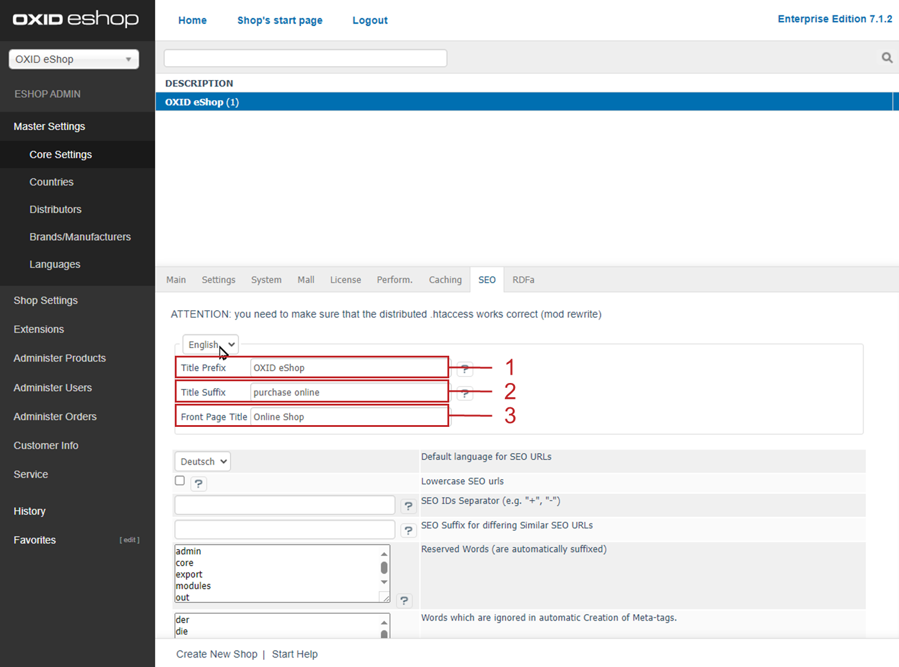
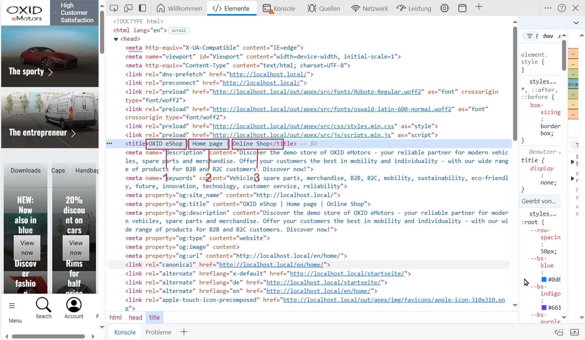
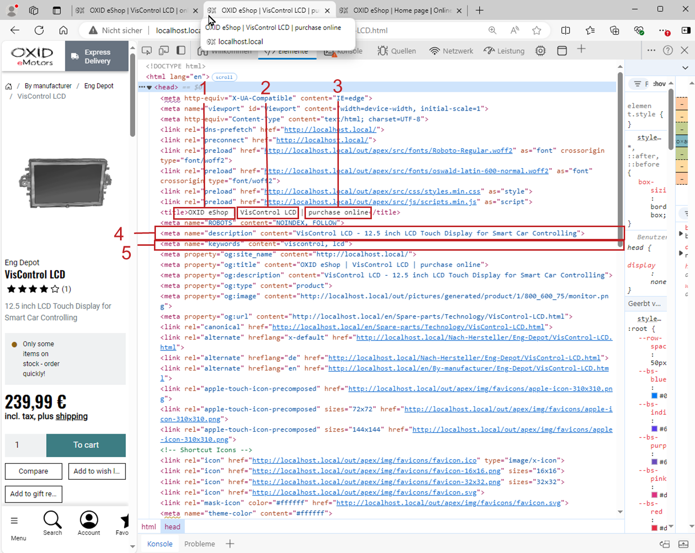
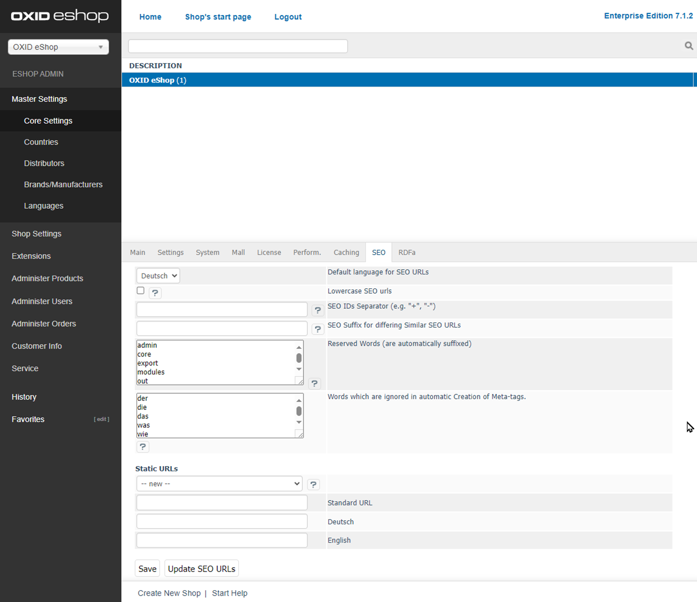
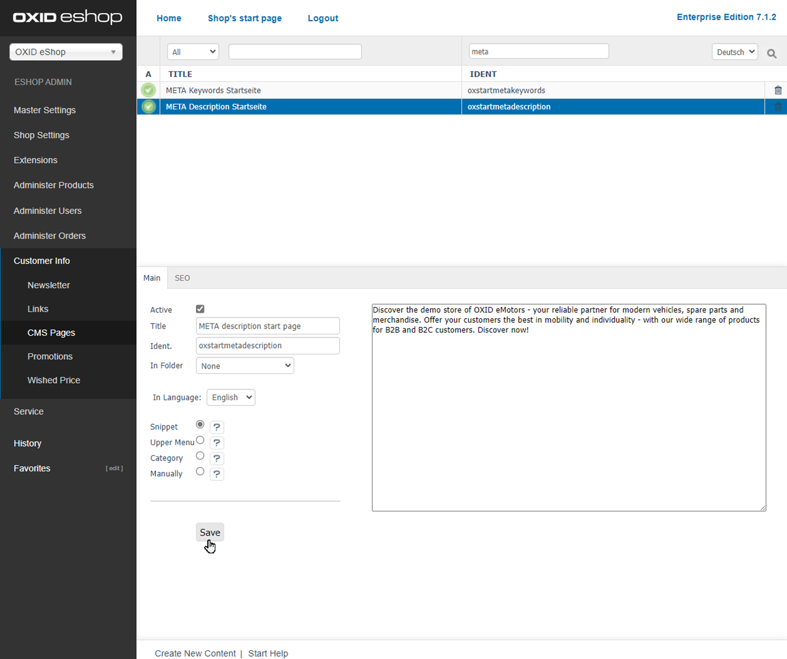
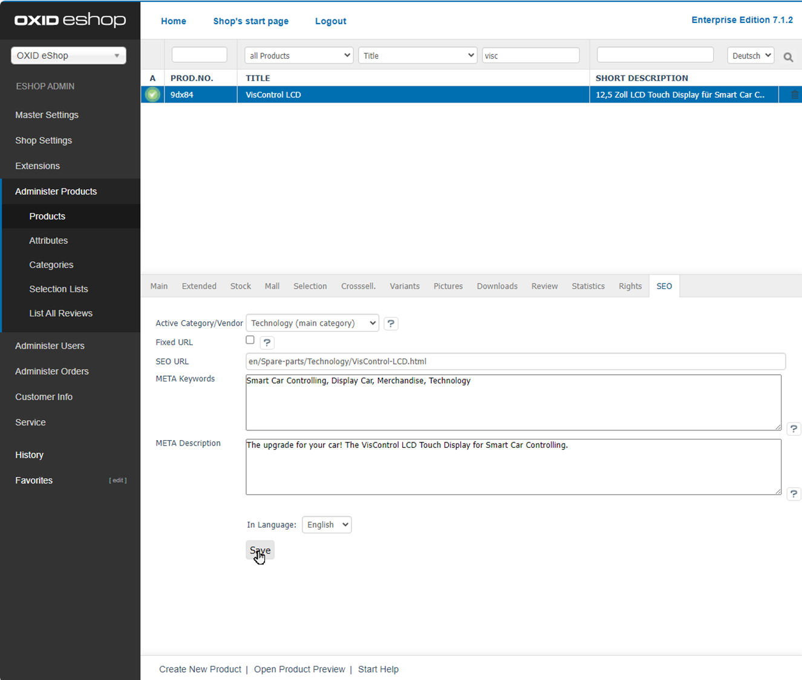

SEO Settings
============

Optimise your OXID eShop for search engines by configuring page titles, URLs, and metadata.

|background|

Many customers access your shop via search engines. To improve your shop’s visibility, configure the following SEO settings.

OXID eShop supports Search Engine Optimization (SEO) and automatically generates “speaking URLs” for categories and products. It considers reserved words, special characters, and the languages used in your shop.

As a shop owner, you can adjust the following settings to define SEO-relevant content:

* Page title
* URL structure
* Metadata (:ref:`oxbabi01`)

Configure these values individually for each shop language.

Defining Page Titles
--------------------

The page title appears in some browser title bars and is used when saving a page as a bookmark or favourite.

Search engines evaluate the page title as one of the most important indicators of a page’s content. They extract information from it to understand the purpose of a webpage.

Except for the shop’s start page, all page titles are automatically generated from the product or category title and extended with a prefix and suffix.

Example title structure (:ref:`oxbabi01`, Pos. 1, 2, 3): OXID eShop | VisControl LCD | purchase online

.. todo: Define how title structure behaves on the start page: OXDEV-6802

|procedure|

1. Go to :menuselection:`Master Settings --> Core Settings --> SEO`.
2. Make sure the correct language is selected.
3. Configure the following settings:

   * :guilabel:`Title Prefix` (:ref:`oxbabi01`, Pos. 1): Text added *before* the generated title part.

     Recommendation: Use your shop’s name. Example from the demo shop: "OXID eShop".

   * :guilabel:`Title Suffix` (:ref:`oxbabi01`, Pos. 2): Text appended to the generated title part.

     Example from the demo shop: "purchase online".

   * :guilabel:`Front Page Title` (:ref:`oxbabi01`, Pos. 1): Define the page title for the start page.

     Use a concise phrase describing your shop offering.

.. _oxbabi01:

   Fig.: Defining metadata: Page title

|result|

The system inserts the page title into the HTML ``<title>`` tag.

This works differently for the start page compared to other pages:

The start page title consists of the prefix (:ref:`oxbabi02`, Pos. 1) and the defined start page title (:ref:`oxbabi02`, Pos. 3). The middle part `Startseite` (:ref:`oxbabi02`, Pos. 2) is static and always included.

The suffix is :emphasis:`not` used on the start page. Demo example: "Online Shop".

.. _oxbabi02:

   Fig.: Start page title

Other pages use a structure consisting of prefix (:ref:`oxbabi03`, Pos. 1), dynamic title (e.g. product name), and suffix (:ref:`oxbabi03`, Pos. 3).

.. _oxbabi03:

   Fig.: Title and metadata of a subpage

Generating Speaking URLs
------------------------

“Speaking URLs” are another important element of SEO.

Instead of showing technical URLs with parameters, OXID eShop rewrites them to include category and product names. This improves both search engine visibility and user-friendliness.

Example:

* Internal URL: ``www.yourshopurl.com/index.php?cl=details&anid=f4f73033cf5045525644042325355732&cnid=fadcb6dd70b9f6248efa425bd159684e``
* Speaking URL: ``www.yourshopurl.com/by-manufacturer/eng-depot/VisControl-LCD.html``

|procedure|

To configure speaking URLs, do the following:

1. Go to :menuselection:`Master Settings --> Core Settings --> SEO`.

   Like title settings, SEO URLs are language-dependent. Ensure the correct language is selected.

   * :guilabel:`Default language for SEO URLs`: The default language will not include a language prefix (e.g., "de", "en") in the URL. Other languages will.

   * :guilabel:`SEO IDs Separator (e.g. "+", "-")`: Separator for multi-word category or product names. Default is a hyphen.

     Example: ``.../multi-word-category/multi-word-product.html``

   * :guilabel:`SEO Suffix for differing Similar SEO URLs`: Prevents duplicate URLs for identical titles in the same category by appending a suffix.

     Default: ``-oxid``

   * :guilabel:`Characters that will be replaced in SEO URLs`: Define replacement characters for special characters (e.g., Ü => Ue). Each mapping must be entered in a separate line.

   * :guilabel:`Reserved Words (are automatically suffixed)`: Prevents conflicts with internal shop routes (e.g., ``/admin``). A suffix is automatically added to such URLs.

   * :guilabel:`Words which are ignored in automatic Creation of Meta-tags`: Words that are ignored when auto-generating meta tags from descriptions.

   * :guilabel:`Static URLs`: You can define static URLs to replace internal parameter-based ones. You may edit or create them in multiple languages.

.. _oxbabi04:

   Fig.: Configuring SEO URL settings

2. Save your settings.
3. To apply the changes, click :guilabel:`Recalculate SEO URLs`.

Maintaining Metadata
--------------------

While metadata is no longer a major ranking factor, it still improves how your shop pages appear in search results. That’s why you should manage them manually.

There are two types of metadata:

* Metadata for the start page
* Metadata for categories and products

These include the HTML meta description (:ref:`oxbabi03`, Pos. 4) and meta keywords (:ref:`oxbabi03`, Pos. 5).

Metadata for the Start Page
^^^^^^^^^^^^^^^^^^^^^^^^^^^

|procedure|

1. Go to :menuselection:`Customer Info --> CMS Pages`.
2. Select the CMS pages for the start page:

   * For the meta description: ``META Description Startseite`` (Ident: ``oxstartmetadescription``) (:ref:`oxbabi05`)
   * For the meta keywords: ``META Keywords Startseite`` (Ident: ``oxstartmetakeywords``)

3. Enter the metadata in the :guilabel:`Main` tab.
4. Save your settings.

.. _oxbabi05:

   Fig.: Example: Meta description for the start page

Metadata for Categories and Products
^^^^^^^^^^^^^^^^^^^^^^^^^^^^^^^^^^^^

By default, OXID eShop generates meta tags for categories and products based on their descriptions.

You can override these with your own descriptions and keywords for each product or category.

|procedure|

1. Select a product or category.
2. Enter the metadata in the :guilabel:`SEO` tab (:ref:`oxbabi06`).
3. Save your settings.

.. _oxbabi06:

   Fig.: Example: Defining metadata for a product

|result|

The defined metadata will be embedded in the corresponding page (:ref:`oxbabi03`, Pos. 4, 5).

.. Intern: oxbabi, Status: transL
