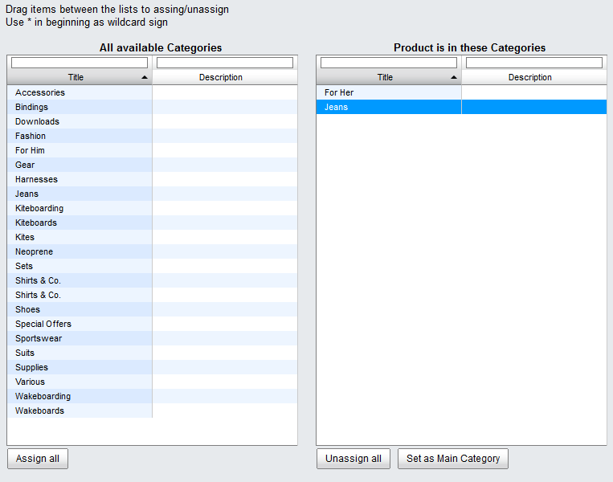

Main category of a product
=============================
A product can be assigned to any number of categories. In this case, one of the categories must be defined as the main category. This is necessary to allow the shop to decide in certain situations, in which category the product should be displayed. For example, if the customer accesses a product via the shop’s search or using the tags, it will be displayed in the defined main category.

The so-called duplicate content is also important. A product that appears in multiple categories has multiple URLs. These point to the product’s details page and would therefore present identical content. Search engines like Google, Bing and Yahoo! want to list search results for their users without any redundancies. The solution is canonical tags or canonical links that refer to the original page if the content is the same. In OXID eShop, this is the product’s details page with the main category in the URL.

In OXID eShop, canonical tags are also set for just one category. If no main category has been defined, the category to which the product was assigned first will be used.

Example from the page source text of a product in a demo shop:

``\<link rel=\"canonical\"href=\"http://demoshop.oxid-esales.com/pe/Kiteboarding/Trapeze/Trapez-ION-MADTRIXX.html\"\>``

Setting the main category of a product

* Go to :menuselection:`Administer Products --> Products`.
* Select the desired product from the product list.
* Click on :guilabel:`Assign Categories` in the :guilabel:`Extended` tab.
* Specify the main category if the product appears in multiple categories.
* To do this, highlight the required category in the right-hand list.
* Click on :guilabel:`Set as Main Category`.
* Close the assignment window.

.. seealso:: :doc:`Products - Extended tab <../artikel/registerkarte-erweitert>` | `Canonical link <http://de.wikipedia.org/wiki/Canonical_Link>`_ (Wikipedia)

.. Intern: oxbafp, Status: