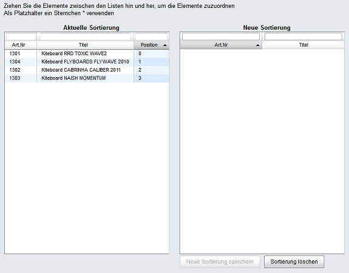
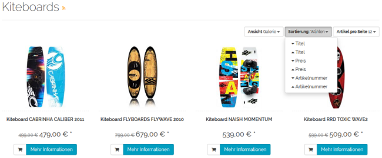

Sortierung von Artikeln
***********************
Die Reihenfolge, in der Artikel in einer Kategorie angezeigt werden, kann festgelegt werden. Dafür gibt es die Schnellsortierung auf Basis eines einzelnen Artikelmerkmals auf- oder absteigend und die manuelle Sortierung. Darüber hinaus können Sie den Kunden Ihres OXID eShop ermöglichen, die Artikel einer Kategorie nach vorgegebenen Kriterien zu sortieren.

Die Schnellsortierung basiert auf einer Einstellung bei der Kategorie. Aus einer Dropdown-Liste kann ein Artikelmerkmal, wie beispielsweise :guilabel:`Titel`, :guilabel:`Preis` oder :guilabel:`Angelegt am` ausgewählt werden. Zusätzlich muss festgelegt werden, ob die Artikel nach diesem Artikelmerkmal auf- oder absteigend sortiert werden sollen.

* Gehen Sie zu :menuselection:`Artikel verwalten --> Kategorien`.
* Wählen Sie die gewünschte Kategorie aus der Kategorieliste.
* Öffnen Sie die Dropdown-Liste :guilabel:`Schnellsortierung` auf der Registerkarte :guilabel:`Stamm`.
* Wählen Sie ein Artikelmerkmal für die Schnellsortierung aus.
* Aktivieren Sie :guilabel:`asc` oder :guilabel:`desc` für eine aufsteigende oder eine absteigende Sortierung.
* Speichern Sie die Einstellungen.

Mit der manuellen Sortierung können die Artikel einer Kategorie in eine ganz bestimmte Reihenfolge gebracht werden.

* Gehen Sie zu :menuselection:`Artikel verwalten --> Kategorien`.
* Wählen Sie die gewünschte Kategorie aus der Kategorieliste.
* Betätigen Sie die Schaltfläche :guilabel:`Artikel sortieren` auf der Registerkarte :guilabel:`Sortierung`.
* Verschieben Sie alle Artikel per Drag \& Drop in die rechte Liste des Zuordnungsfensters.
* Bringen Sie die Artikel damit in eine geänderte Reihenfolge.
* Speichern Sie die neue Sortierung.

In der linken Liste wird die nun aktuelle Sortierung angezeigt. Die Artikel haben in der Positionsspalte die für die Sortierung zuständigen Werte.

Mit einer Einstellung in den Stammdaten können Sie festlegen, ob und wonach Ihre Kunden in Kategorien sortieren dürfen.

* Gehen Sie zu :menuselection:`Stammdaten --> Grundeinstellungen`.
* Öffnen Sie die Registerkarte :guilabel:`Einstell.` und wählen Sie den Abschnitt :guilabel:`Artikel`.
* Aktivieren Sie das Kontrollkästchen :guilabel:`Benutzer können Artikellisten sortieren`.
* Legen Sie die Felder für die Sortierung fest.
* Speichern Sie die Einstellungen.

Die Felder, nach denen Artikel sortiert werden können, entsprechen den Datenbankfeldern der Tabelle *oxarticles* . Jedes Feld muss in einer Zeile stehen.

Der Screenshot zeigt als Beispiel, dass Artikel außer nach Name und Preis auch nach der Artikelnummer sortiert werden können. Dafür wurde in den Stammdaten den standardmäßig eingetragenen Feldern *oxtitle*  und *oxvarprice*  das Feld *oxartnum*  hinzugefügt.

.. seealso:: `Kategorien - Registerkarte Stamm <../kategorien/registerkarte-stamm>`_ | `Kategorien - Registerkarte Sortierung <../kategorien/registerkarte-sortierung>`_